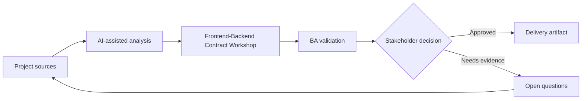

# Frontend-Backend Contract Workshop

<div class="case-meta">
  <span>Cross-functional BA Collaboration</span>
  <span>Contract workshops</span>
  <span>Project use case</span>
</div>

## Project context

Frontend needs data and behavior for a new dashboard, backend is still designing APIs, and product wants delivery estimates. Misalignment could create rework. In a real delivery environment, this work usually appears under time pressure: stakeholders want clarity, delivery needs a backlog, QA needs testable behavior, and operations needs a process that can survive exceptions. The BA uses AI here to accelerate analysis and synthesis, but the BA remains accountable for evidence, business meaning, stakeholder decisioning, and artifact quality.

## BA challenge

The BA must facilitate a contract workshop that aligns screen behavior, API contract, error handling, data semantics, and test responsibilities. The practical difficulty is that AI can make early material look more complete than it is. A strong BA keeps the output reviewable by separating source-backed facts, assumptions, unsupported claims, decision gaps, and recommended next actions. The objective is not to make the document longer; it is to make the project decision clearer and safer.

## Where AI fits

<div class="ba-workbench-panel">
AI is useful in this use case when it is constrained to analysis support, pattern detection, structured drafting, and critique. It should not approve scope, invent policy, decide business trade-offs, or replace accountable stakeholder judgment.
</div>

- Generate agenda and contract questions from screen and API notes.
- Identify missing data fields, state behavior, and error handling.
- Draft contract decision log and dependency list.
- Create follow-up acceptance criteria.

## Inputs to prepare

- Screen behavior matrix
- API draft
- Data glossary
- Error taxonomy
- Open technical questions

A BA should label these inputs before using AI: source owner, source date, approval status, sensitivity level, and whether the source is fact, opinion, policy, draft, or historical evidence. This preparation prevents the model from treating every input as equally current and authoritative.

## BA workflow

1. Prepare source pack with UI states, data needs, and API draft.
2. Ask AI to generate workshop questions and dependency risks.
3. Facilitate decisions on fields, validation, errors, pagination, and states.
4. Record contract decisions, owners, and unresolved gaps.
5. Update UI stories and API requirements after workshop.
6. Create contract test scenarios for QA.

The workflow works best as a staged AI collaboration: first organize the evidence, then ask for analysis, then create the artifact, then run a critique pass. The BA should keep a visible decision log throughout the process so that AI-generated suggestions do not silently become approved scope.

## Diagram



## Deliverables

| Deliverable | What it contains | Owner | Done signal |
| --- | --- | --- | --- |
| Workshop agenda | Decision topics, questions, evidence, and required owners | BA | Workshop is decision-focused |
| Contract decision log | Field, rule, error, owner, decision, and open item | BA and tech lead | Decisions are traceable |
| Updated UI/API artifacts | Story criteria, API behavior, and schema updates | BA | Artifacts stay aligned |
| Contract test list | Scenario, request, response, error, and expected UI | QA | Contract is testable |

These deliverables should be treated as BA-owned artifacts. AI can draft them, but the BA must validate source support, stakeholder meaning, traceability, and whether the artifact is ready for handoff.

## Prompt to try

```text
Act as a senior AI-aware Business Analyst. Help me apply the "Frontend-Backend Contract Workshop" use case to my project. First ask for source evidence and constraints. Then create a structured analysis with project context, assumptions, AI-fit boundary, workflow steps, deliverables, risks, controls, open questions, and stakeholder decisions. Do not invent policy, thresholds, or approvals.
```

## Review checklist

- Every AI-produced statement is tied to a source, assumption, or validation question.
- The BA has separated drafting assistance from business approval.
- Workflow steps identify the human owner for decisions, review, and exceptions.
- Deliverables are traceable to project inputs and can be reviewed by QA, product, or operations.
- Risk controls are practical enough to be used in a real project meeting.
- Success metric: Frontend and backend leave the workshop with aligned contract decisions and test scenarios.

## Risks and controls

| Risk | Why it matters | BA control |
| --- | --- | --- |
| Meeting without decisions | Workshop may become discussion only | Use decision agenda and owner list |
| Field ambiguity | Frontend and backend may use same word differently | Define field meaning and examples |
| Error gap | Contract may ignore negative cases | Include error taxonomy |
| Artifact divergence | Decisions may not update stories and API docs | Update artifacts immediately |

The key control is to make uncertainty visible. If evidence is weak, the output should create a validation question or decision item, not a final requirement. If the artifact influences delivery, release, compliance, customer experience, or operational workload, the BA should require explicit human review before handoff.
