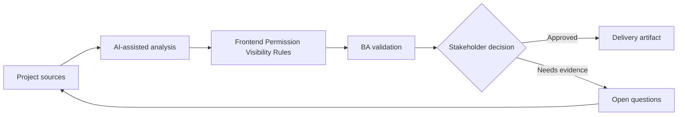

# Frontend Permission Visibility Rules

<div class="case-meta">
  <span>Frontend, UI, and UX</span>
  <span>Permissioned UI</span>
  <span>Project use case</span>
</div>

## Project context

An admin console has multiple roles: viewer, editor, approver, auditor, and tenant admin. The backend enforces permissions, but frontend behavior for hidden, disabled, and read-only controls is undefined. In a real delivery environment, this work usually appears under time pressure: stakeholders want clarity, delivery needs a backlog, QA needs testable behavior, and operations needs a process that can survive exceptions. The BA uses AI here to accelerate analysis and synthesis, but the BA remains accountable for evidence, business meaning, stakeholder decisioning, and artifact quality.

## BA challenge

The BA must specify how permissions appear in UI without weakening security. Users need clarity, but the frontend must never become the source of truth for authorization. The practical difficulty is that AI can make early material look more complete than it is. A strong BA keeps the output reviewable by separating source-backed facts, assumptions, unsupported claims, decision gaps, and recommended next actions. The objective is not to make the document longer; it is to make the project decision clearer and safer.

## Where AI fits

<div class="ba-workbench-panel">
AI is useful in this use case when it is constrained to analysis support, pattern detection, structured drafting, and critique. It should not approve scope, invent policy, decide business trade-offs, or replace accountable stakeholder judgment.
</div>

- Generate role-control visibility matrix.
- Identify actions that should be hidden, disabled, or read-only.
- Draft copy for unavailable actions.
- Map frontend visibility to backend authorization checks.

## Inputs to prepare

- RBAC matrix
- Admin screen design
- Backend authorization rules
- Audit policy
- User support notes

A BA should label these inputs before using AI: source owner, source date, approval status, sensitivity level, and whether the source is fact, opinion, policy, draft, or historical evidence. This preparation prevents the model from treating every input as equally current and authoritative.

## BA workflow

1. List roles, screens, controls, actions, and data fields.
2. Ask AI to create role-control visibility matrix.
3. Review which unavailable controls should be hidden versus disabled.
4. Align every UI rule with backend authorization and audit needs.
5. Write acceptance criteria for role switching and unauthorized deep links.
6. Create QA cases for each role and blocked action.

The workflow works best as a staged AI collaboration: first organize the evidence, then ask for analysis, then create the artifact, then run a critique pass. The BA should keep a visible decision log throughout the process so that AI-generated suggestions do not silently become approved scope.

## Diagram



## Deliverables

| Deliverable | What it contains | Owner | Done signal |
| --- | --- | --- | --- |
| Role-control visibility matrix | Role, screen, control, hidden/disabled/read-only rule, and reason | BA | UI behavior matches role rules |
| Authorization trace map | UI control to backend permission and audit event | Backend lead | Frontend and backend align |
| Unavailable action copy | Disabled reason, tooltip, support path, and role guidance | UX | Users understand limits |
| Permission QA matrix | Role, action, expected UI, expected API result, and audit | QA | Permission behavior is tested end to end |

These deliverables should be treated as BA-owned artifacts. AI can draft them, but the BA must validate source support, stakeholder meaning, traceability, and whether the artifact is ready for handoff.

## Prompt to try

```text
Act as a senior AI-aware Business Analyst. Help me apply the "Frontend Permission Visibility Rules" use case to my project. First ask for source evidence and constraints. Then create a structured analysis with project context, assumptions, AI-fit boundary, workflow steps, deliverables, risks, controls, open questions, and stakeholder decisions. Do not invent policy, thresholds, or approvals.
```

## Review checklist

- Every AI-produced statement is tied to a source, assumption, or validation question.
- The BA has separated drafting assistance from business approval.
- Workflow steps identify the human owner for decisions, review, and exceptions.
- Deliverables are traceable to project inputs and can be reviewed by QA, product, or operations.
- Risk controls are practical enough to be used in a real project meeting.
- Success metric: Permissioned UI behavior is understandable to users and aligned with backend authorization controls.

## Risks and controls

| Risk | Why it matters | BA control |
| --- | --- | --- |
| Security by UI | Frontend hiding is not authorization | Trace every action to backend permission |
| User confusion | Hidden actions may make users think feature is missing | Choose hidden or disabled deliberately |
| Deep link bypass | Users may access unauthorized routes | Specify route guard and backend rejection |
| Role drift | RBAC changes may not update UI | Maintain permission matrix as source artifact |

The key control is to make uncertainty visible. If evidence is weak, the output should create a validation question or decision item, not a final requirement. If the artifact influences delivery, release, compliance, customer experience, or operational workload, the BA should require explicit human review before handoff.
