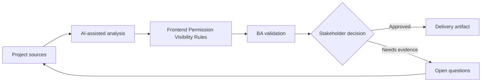

# Frontend Permission Visibility Rules

<div class="case-meta">
  <span>Frontend, UI, and UX</span>
  <span>Permissioned UI</span>
  <span>Project use case</span>
</div>

## Project context

An admin console has multiple roles: viewer, editor, approver, auditor, and tenant admin. The backend enforces permissions, but frontend behavior for hidden, disabled, and read-only controls is undefined. In Permissioned UI, this work usually starts when screen behavior, accessibility, design states, analytics, and user feedback must become implementable requirements. The BA should treat RBAC matrix and Admin screen design as evidence to organize, not as raw material for an unconstrained AI answer. The goal is to make the next decision clearer for the people who own the outcome.

## BA challenge

The BA must specify how permissions appear in UI without weakening security. Users need clarity, but the frontend must never become the source of truth for authorization. For Frontend Permission Visibility Rules, the practical difficulty is missing states and unmeasurable UX. AI can accelerate UI-state analysis, content critique, accessibility review, event taxonomy, and edge-case discovery, but the BA must still expose assumptions, missing approvals, and the point where stakeholder judgment is required.

## Where AI fits

<div class="ba-workbench-panel">
AI fits this Frontend, UI, and UX use case when it is constrained to UI-state analysis, content critique, accessibility review, event taxonomy, and edge-case discovery. A useful first AI task is: Generate role-control visibility matrix. AI should not approve scope, invent policy, bypass wireframes, design tokens, user journeys, analytics questions, and accessibility expectations, or turn a draft into a final decision.
</div>

- Generate role-control visibility matrix.
- Identify actions that should be hidden, disabled, or read-only.
- Draft copy for unavailable actions.
- Map frontend visibility to backend authorization checks.

## Inputs to prepare

- RBAC matrix
- Admin screen design
- Backend authorization rules
- Audit policy
- User support notes

Before prompting for Frontend Permission Visibility Rules, label each input by owner, date, approval status, sensitivity, and role in the decision. The most important evidence lens is wireframes, design tokens, user journeys, analytics questions, and accessibility expectations; without it, AI may rank old notes, draft designs, and approved rules as if they had equal authority.

## BA workflow

1. List roles, screens, controls, actions, and data fields.
2. Ask AI to create role-control visibility matrix.
3. Review which unavailable controls should be hidden versus disabled.
4. Align every UI rule with backend authorization and audit needs.
5. Write acceptance criteria for role switching and unauthorized deep links.
6. Create QA cases for each role and blocked action.

Run the workflow as screen-state review before frontend build: start with "List roles, screens, controls, actions, and data fields.", then keep a visible decision log as the artifact moves toward Role-control visibility matrix. This prevents AI suggestions from silently becoming backlog, design, release, or operational commitments.

## Diagram



## Deliverables

| Deliverable | What it contains | Owner | Done signal |
| --- | --- | --- | --- |
| Role-control visibility matrix | Role, screen, control, hidden/disabled/read-only rule, and reason | BA | UI behavior matches role rules |
| Authorization trace map | UI control to backend permission and audit event | Backend lead | Frontend and backend align |
| Unavailable action copy | Disabled reason, tooltip, support path, and role guidance | UX | Users understand limits |
| Permission QA matrix | Role, action, expected UI, expected API result, and audit | QA | Permission behavior is tested end to end |

Treat Role-control visibility matrix as a BA-owned frontend requirement specification. AI may draft structure, but the BA must validate whether "UI behavior matches role rules" is actually true, whether the artifact is traceable to source evidence, and whether the receiving team can act on it.

## Prompt to try

```text
Act as a senior AI-aware Business Analyst. Help me apply the "Frontend Permission Visibility Rules" use case to my project. First ask for source evidence and constraints. Then create a structured analysis with project context, assumptions, AI-fit boundary, workflow steps, deliverables, risks, controls, open questions, and stakeholder decisions. Do not invent policy, thresholds, or approvals.
```

## Review checklist

- RBAC matrix is labeled with owner, date, approval status, and sensitivity.
- Role-control visibility matrix traces to source evidence and has a named human owner.
- The AI task stays inside UI-state analysis, content critique, accessibility review, event taxonomy, and edge-case discovery and does not approve scope or policy.
- The "Security by UI" risk has a practical control: Trace every action to backend permission.
- Open assumptions are converted into validation questions or stakeholder decisions.
- Success metric: Permissioned UI behavior is understandable to users and aligned with backend authorization controls.

## Risks and controls

| Risk | Why it matters | BA control |
| --- | --- | --- |
| Security by UI | Frontend hiding is not authorization | Trace every action to backend permission |
| User confusion | Hidden actions may make users think feature is missing | Choose hidden or disabled deliberately |
| Deep link bypass | Users may access unauthorized routes | Specify route guard and backend rejection |
| Role drift | RBAC changes may not update UI | Maintain permission matrix as source artifact |

The main control for the "Security by UI" risk is explicit human accountability: Trace every action to backend permission. If evidence is weak, the output should create a validation question or decision item, not a final requirement.
