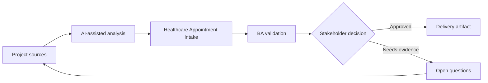

# Healthcare Appointment Intake

<div class="case-meta">
  <span>Domain project scenarios</span>
  <span>Healthcare operations</span>
  <span>Project use case</span>
</div>

## Project context

A clinic network wants to improve appointment intake and routing. Patients submit symptoms, preferred times, insurance information, and referral details before scheduling. In Healthcare operations, this work usually starts when domain policies, operational exceptions, and regulatory expectations shape what the product can safely do. The BA should treat Scheduling workflow and Insurance and referral rules as evidence to organize, not as raw material for an unconstrained AI answer. The goal is to make the next decision clearer for the people who own the outcome.

## BA challenge

The BA must specify intake support without turning AI into a medical decision maker. The system can structure information and route requests, but clinical triage, emergency guidance, privacy, and consent require strict boundaries. For Healthcare Appointment Intake, the practical difficulty is policy hallucination and exception blindness. AI can accelerate domain-rule extraction, exception mapping, safe-message drafting, and owner review, but the BA must still expose assumptions, missing approvals, and the point where stakeholder judgment is required.

## Where AI fits

<div class="ba-workbench-panel">
AI fits this Domain project scenarios use case when it is constrained to domain-rule extraction, exception mapping, safe-message drafting, and owner review. A useful first AI task is: Structure patient-provided information into intake fields. AI should not approve scope, invent policy, bypass policy sources, operational samples, compliance constraints, and domain-owner decisions, or turn a draft into a final decision.
</div>

- Structure patient-provided information into intake fields.
- Detect missing insurance, referral, or scheduling information.
- Generate routing suggestions with uncertainty labels.
- Draft safe messaging and escalation triggers.

## Inputs to prepare

- Scheduling workflow
- Insurance and referral rules
- Privacy requirements
- Clinic specialty list
- Current intake forms

Before prompting for Healthcare Appointment Intake, label each input by owner, date, approval status, sensitivity, and role in the decision. The most important evidence lens is policy sources, operational samples, compliance constraints, and domain-owner decisions; without it, AI may rank old notes, draft designs, and approved rules as if they had equal authority.

## BA workflow

1. Define what the assistant may and may not infer from patient text.
2. Ask AI to map intake fields and missing information prompts.
3. Specify routing suggestions as administrative support, not diagnosis.
4. Add emergency and clinical escalation messaging approved by clinical owners.
5. Design privacy, consent, and data retention requirements.
6. Create evaluation cases with incomplete, urgent, and sensitive scenarios.

Run the workflow as domain validation before implementation detail: start with "Define what the assistant may and may not infer from patient text.", then keep a visible decision log as the artifact moves toward Intake field schema. This prevents AI suggestions from silently becoming backlog, design, release, or operational commitments.

## Diagram



## Deliverables

| Deliverable | What it contains | Owner | Done signal |
| --- | --- | --- | --- |
| Intake field schema | Field, source, validation, sensitivity, and required status | BA | Fields are privacy reviewed |
| Routing rule matrix | Administrative routing cues, confidence, fallback, and owner | Clinic operations | Routing avoids clinical diagnosis |
| Safe messaging set | Missing info, urgent warning, privacy notice, and escalation | Clinical owner | Messages are approved |
| Evaluation cases | Incomplete, urgent, routine, and sensitive examples | QA and clinical reviewer | Safety cases are tested |

Treat Intake field schema as a BA-owned domain-specific requirement pack. AI may draft structure, but the BA must validate whether "Fields are privacy reviewed" is actually true, whether the artifact is traceable to source evidence, and whether the receiving team can act on it.

## Prompt to try

```text
Act as a senior AI-aware Business Analyst. Help me apply the "Healthcare Appointment Intake" use case to my project. First ask for source evidence and constraints. Then create a structured analysis with project context, assumptions, AI-fit boundary, workflow steps, deliverables, risks, controls, open questions, and stakeholder decisions. Do not invent policy, thresholds, or approvals.
```

## Review checklist

- Scheduling workflow is labeled with owner, date, approval status, and sensitivity.
- Intake field schema traces to source evidence and has a named human owner.
- The AI task stays inside domain-rule extraction, exception mapping, safe-message drafting, and owner review and does not approve scope or policy.
- The "Clinical overreach" risk has a practical control: Limit scope to intake and approved escalation.
- Open assumptions are converted into validation questions or stakeholder decisions.
- Success metric: Appointment intake becomes clearer and faster while clinical decisions remain outside AI scope.

## Risks and controls

| Risk | Why it matters | BA control |
| --- | --- | --- |
| Clinical overreach | AI may appear to diagnose or triage clinically | Limit scope to intake and approved escalation |
| Privacy violation | Health data is sensitive and regulated | Specify consent, retention, access, and audit |
| Unsafe delay | Urgent symptoms may be treated as normal scheduling | Use approved emergency messaging and escalation |
| Insurance confusion | Incorrect routing can delay care | Validate insurance and referral rules |

The main control for the "Clinical overreach" risk is explicit human accountability: Limit scope to intake and approved escalation. If evidence is weak, the output should create a validation question or decision item, not a final requirement.
