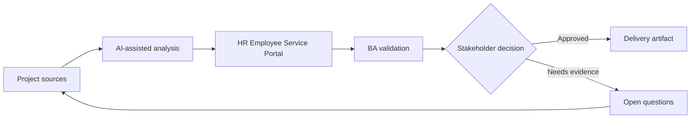

# HR Employee Service Portal

<div class="case-meta">
  <span>Domain project scenarios</span>
  <span>HR service delivery</span>
  <span>Project use case</span>
</div>

## Project context

HR wants a portal where employees can request letters, ask policy questions, update personal information, and track case status. Current requests are handled through email and shared mailboxes. In HR service delivery, this work usually starts when domain policies, operational exceptions, and regulatory expectations shape what the product can safely do. The BA should treat HR mailbox samples and Policy documents as evidence to organize, not as raw material for an unconstrained AI answer. The goal is to make the next decision clearer for the people who own the outcome.

## BA challenge

The BA must define service catalog, request forms, approval rules, privacy boundaries, knowledge search, case status, and escalation. AI can improve self-service, but HR policy answers and personal data changes need controls. For HR Employee Service Portal, the practical difficulty is policy hallucination and exception blindness. AI can accelerate domain-rule extraction, exception mapping, safe-message drafting, and owner review, but the BA must still expose assumptions, missing approvals, and the point where stakeholder judgment is required.

## Where AI fits

<div class="ba-workbench-panel">
AI fits this Domain project scenarios use case when it is constrained to domain-rule extraction, exception mapping, safe-message drafting, and owner review. A useful first AI task is: Cluster historical HR emails into service categories. AI should not approve scope, invent policy, bypass policy sources, operational samples, compliance constraints, and domain-owner decisions, or turn a draft into a final decision.
</div>

- Cluster historical HR emails into service categories.
- Draft request forms and required fields.
- Generate policy assistant requirements with source and fallback rules.
- Identify privacy and role-based access scenarios.

## Inputs to prepare

- HR mailbox samples
- Policy documents
- Service catalog drafts
- Approval rules
- Employee data privacy policy

Before prompting for HR Employee Service Portal, label each input by owner, date, approval status, sensitivity, and role in the decision. The most important evidence lens is policy sources, operational samples, compliance constraints, and domain-owner decisions; without it, AI may rank old notes, draft designs, and approved rules as if they had equal authority.

## BA workflow

1. Analyze historical requests and cluster service categories.
2. Ask AI to propose request form fields and missing rules per service.
3. Define service catalog with eligibility, SLA, owner, and required evidence.
4. Specify policy-answering behavior with citations and fallback to HR.
5. Review personal data changes for privacy and approval needs.
6. Publish service portal requirements and support transition plan.

Run the workflow as domain validation before implementation detail: start with "Analyze historical requests and cluster service categories.", then keep a visible decision log as the artifact moves toward Service catalog. This prevents AI suggestions from silently becoming backlog, design, release, or operational commitments.

## Diagram



## Deliverables

| Deliverable | What it contains | Owner | Done signal |
| --- | --- | --- | --- |
| Service catalog | Service, eligibility, fields, SLA, owner, and escalation | HR operations | Employees know where to go |
| Request form specification | Field, validation, evidence, permission, and status messages | BA | Forms reduce back-and-forth |
| Policy assistant rules | Source, citation, fallback, and conflict behavior | HR policy owner | Answers are grounded |
| Privacy matrix | Employee data, role access, audit, and approval | Security and HR | Sensitive data is protected |

Treat Service catalog as a BA-owned domain-specific requirement pack. AI may draft structure, but the BA must validate whether "Employees know where to go" is actually true, whether the artifact is traceable to source evidence, and whether the receiving team can act on it.

## Prompt to try

```text
Act as a senior AI-aware Business Analyst. Help me apply the "HR Employee Service Portal" use case to my project. First ask for source evidence and constraints. Then create a structured analysis with project context, assumptions, AI-fit boundary, workflow steps, deliverables, risks, controls, open questions, and stakeholder decisions. Do not invent policy, thresholds, or approvals.
```

## Review checklist

- HR mailbox samples is labeled with owner, date, approval status, and sensitivity.
- Service catalog traces to source evidence and has a named human owner.
- The AI task stays inside domain-rule extraction, exception mapping, safe-message drafting, and owner review and does not approve scope or policy.
- The "Mailbox pattern bias" risk has a practical control: Validate service catalog with HR owners.
- Open assumptions are converted into validation questions or stakeholder decisions.
- Success metric: Employees can complete common HR requests through structured self-service with clear status and privacy controls.

## Risks and controls

| Risk | Why it matters | BA control |
| --- | --- | --- |
| Mailbox pattern bias | Historical emails reflect current confusion, not ideal service design | Validate service catalog with HR owners |
| Policy hallucination | Assistant may answer from stale or wrong policy | Use RAG source controls and citations |
| Privacy exposure | Employee data changes are sensitive | Define access, audit, and approval |
| Poor adoption | Employees may continue emailing HR | Add status visibility and clear service routing |

The main control for the "Mailbox pattern bias" risk is explicit human accountability: Validate service catalog with HR owners. If evidence is weak, the output should create a validation question or decision item, not a final requirement.
