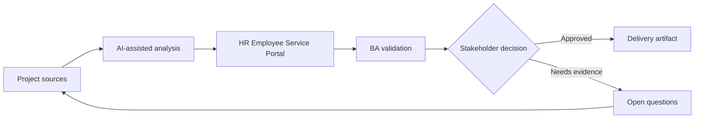

# HR Employee Service Portal

<div class="case-meta">
  <span>Domain project scenarios</span>
  <span>HR service delivery</span>
  <span>Project use case</span>
</div>

## Project context

HR wants a portal where employees can request letters, ask policy questions, update personal information, and track case status. Current requests are handled through email and shared mailboxes. In a real delivery environment, this work usually appears under time pressure: stakeholders want clarity, delivery needs a backlog, QA needs testable behavior, and operations needs a process that can survive exceptions. The BA uses AI here to accelerate analysis and synthesis, but the BA remains accountable for evidence, business meaning, stakeholder decisioning, and artifact quality.

## BA challenge

The BA must define service catalog, request forms, approval rules, privacy boundaries, knowledge search, case status, and escalation. AI can improve self-service, but HR policy answers and personal data changes need controls. The practical difficulty is that AI can make early material look more complete than it is. A strong BA keeps the output reviewable by separating source-backed facts, assumptions, unsupported claims, decision gaps, and recommended next actions. The objective is not to make the document longer; it is to make the project decision clearer and safer.

## Where AI fits

<div class="ba-workbench-panel">
AI is useful in this use case when it is constrained to analysis support, pattern detection, structured drafting, and critique. It should not approve scope, invent policy, decide business trade-offs, or replace accountable stakeholder judgment.
</div>

- Cluster historical HR emails into service categories.
- Draft request forms and required fields.
- Generate policy assistant requirements with source and fallback rules.
- Identify privacy and role-based access scenarios.

## Inputs to prepare

- HR mailbox samples
- Policy documents
- Service catalog drafts
- Approval rules
- Employee data privacy policy

A BA should label these inputs before using AI: source owner, source date, approval status, sensitivity level, and whether the source is fact, opinion, policy, draft, or historical evidence. This preparation prevents the model from treating every input as equally current and authoritative.

## BA workflow

1. Analyze historical requests and cluster service categories.
2. Ask AI to propose request form fields and missing rules per service.
3. Define service catalog with eligibility, SLA, owner, and required evidence.
4. Specify policy-answering behavior with citations and fallback to HR.
5. Review personal data changes for privacy and approval needs.
6. Publish service portal requirements and support transition plan.

The workflow works best as a staged AI collaboration: first organize the evidence, then ask for analysis, then create the artifact, then run a critique pass. The BA should keep a visible decision log throughout the process so that AI-generated suggestions do not silently become approved scope.

## Diagram



## Deliverables

| Deliverable | What it contains | Owner | Done signal |
| --- | --- | --- | --- |
| Service catalog | Service, eligibility, fields, SLA, owner, and escalation | HR operations | Employees know where to go |
| Request form specification | Field, validation, evidence, permission, and status messages | BA | Forms reduce back-and-forth |
| Policy assistant rules | Source, citation, fallback, and conflict behavior | HR policy owner | Answers are grounded |
| Privacy matrix | Employee data, role access, audit, and approval | Security and HR | Sensitive data is protected |

These deliverables should be treated as BA-owned artifacts. AI can draft them, but the BA must validate source support, stakeholder meaning, traceability, and whether the artifact is ready for handoff.

## Prompt to try

```text
Act as a senior AI-aware Business Analyst. Help me apply the "HR Employee Service Portal" use case to my project. First ask for source evidence and constraints. Then create a structured analysis with project context, assumptions, AI-fit boundary, workflow steps, deliverables, risks, controls, open questions, and stakeholder decisions. Do not invent policy, thresholds, or approvals.
```

## Review checklist

- Every AI-produced statement is tied to a source, assumption, or validation question.
- The BA has separated drafting assistance from business approval.
- Workflow steps identify the human owner for decisions, review, and exceptions.
- Deliverables are traceable to project inputs and can be reviewed by QA, product, or operations.
- Risk controls are practical enough to be used in a real project meeting.
- Success metric: Employees can complete common HR requests through structured self-service with clear status and privacy controls.

## Risks and controls

| Risk | Why it matters | BA control |
| --- | --- | --- |
| Mailbox pattern bias | Historical emails reflect current confusion, not ideal service design | Validate service catalog with HR owners |
| Policy hallucination | Assistant may answer from stale or wrong policy | Use RAG source controls and citations |
| Privacy exposure | Employee data changes are sensitive | Define access, audit, and approval |
| Poor adoption | Employees may continue emailing HR | Add status visibility and clear service routing |

The key control is to make uncertainty visible. If evidence is weak, the output should create a validation question or decision item, not a final requirement. If the artifact influences delivery, release, compliance, customer experience, or operational workload, the BA should require explicit human review before handoff.
