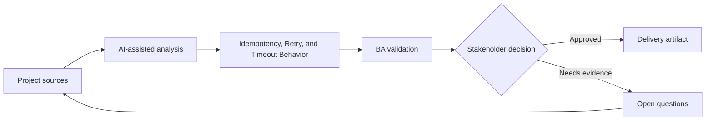

# Idempotency, Retry, and Timeout Behavior

<div class="case-meta">
  <span>Backend and API</span>
  <span>Reliability behavior</span>
  <span>Project use case</span>
</div>

## Project context

A payment initiation API can be called multiple times because users double-click, browsers retry, and network requests time out. Duplicate processing would create financial and support risk. In a real delivery environment, this work usually appears under time pressure: stakeholders want clarity, delivery needs a backlog, QA needs testable behavior, and operations needs a process that can survive exceptions. The BA uses AI here to accelerate analysis and synthesis, but the BA remains accountable for evidence, business meaning, stakeholder decisioning, and artifact quality.

## BA challenge

The BA must specify reliability behavior in business terms: what counts as duplicate, when retry is safe, what users see during timeout, and how operations reconcile uncertain outcomes. The practical difficulty is that AI can make early material look more complete than it is. A strong BA keeps the output reviewable by separating source-backed facts, assumptions, unsupported claims, decision gaps, and recommended next actions. The objective is not to make the document longer; it is to make the project decision clearer and safer.

## Where AI fits

<div class="ba-workbench-panel">
AI is useful in this use case when it is constrained to analysis support, pattern detection, structured drafting, and critique. It should not approve scope, invent policy, decide business trade-offs, or replace accountable stakeholder judgment.
</div>

- Generate duplicate and timeout scenarios.
- Draft idempotency behavior table with user and backend outcomes.
- Identify unclear retry ownership across frontend, backend, and external providers.
- Create support and reconciliation questions.

## Inputs to prepare

- Payment workflow
- API contract
- External provider rules
- Support process
- Audit and reconciliation requirements

A BA should label these inputs before using AI: source owner, source date, approval status, sensitivity level, and whether the source is fact, opinion, policy, draft, or historical evidence. This preparation prevents the model from treating every input as equally current and authoritative.

## BA workflow

1. Define business consequences of duplicate, delayed, and unknown outcomes.
2. Ask AI to generate retry, timeout, and duplicate scenarios.
3. Specify idempotency key behavior and duplicate response rules.
4. Define user messaging for processing, timeout, success, failure, and unknown states.
5. Review reconciliation and support process with operations.
6. Add API and UI acceptance criteria for retry behavior.

The workflow works best as a staged AI collaboration: first organize the evidence, then ask for analysis, then create the artifact, then run a critique pass. The BA should keep a visible decision log throughout the process so that AI-generated suggestions do not silently become approved scope.

## Diagram



## Deliverables

| Deliverable | What it contains | Owner | Done signal |
| --- | --- | --- | --- |
| Reliability behavior matrix | Scenario, duplicate rule, API behavior, UI message, and operation action | BA | Retry outcomes are clear |
| Idempotency requirement | Key source, validity window, duplicate response, and audit | Backend | Duplicate processing is prevented |
| Timeout messaging spec | User state, message, next action, and support path | UX and BA | Users understand uncertain outcomes |
| Reconciliation playbook | Unknown state, investigation, owner, SLA, and correction path | Operations | Operations can resolve exceptions |

These deliverables should be treated as BA-owned artifacts. AI can draft them, but the BA must validate source support, stakeholder meaning, traceability, and whether the artifact is ready for handoff.

## Prompt to try

```text
Act as a senior AI-aware Business Analyst. Help me apply the "Idempotency, Retry, and Timeout Behavior" use case to my project. First ask for source evidence and constraints. Then create a structured analysis with project context, assumptions, AI-fit boundary, workflow steps, deliverables, risks, controls, open questions, and stakeholder decisions. Do not invent policy, thresholds, or approvals.
```

## Review checklist

- Every AI-produced statement is tied to a source, assumption, or validation question.
- The BA has separated drafting assistance from business approval.
- Workflow steps identify the human owner for decisions, review, and exceptions.
- Deliverables are traceable to project inputs and can be reviewed by QA, product, or operations.
- Risk controls are practical enough to be used in a real project meeting.
- Success metric: Duplicate and uncertain outcomes are prevented or handled through defined API, UI, and operations behavior.

## Risks and controls

| Risk | Why it matters | BA control |
| --- | --- | --- |
| Duplicate transaction | Users may be charged twice or records may duplicate | Define idempotency and duplicate response |
| False failure | Timeout may hide successful processing | Create unknown-state messaging and reconciliation |
| Retry storm | Aggressive retry can overload services | Specify retry limits and ownership |
| Support confusion | Agents may not know transaction truth | Provide audit and reconciliation playbook |

The key control is to make uncertainty visible. If evidence is weak, the output should create a validation question or decision item, not a final requirement. If the artifact influences delivery, release, compliance, customer experience, or operational workload, the BA should require explicit human review before handoff.
