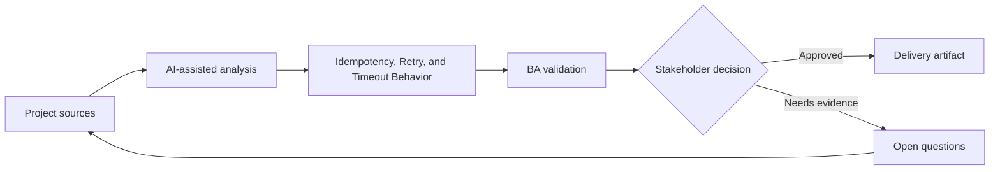

# Idempotency, Retry, and Timeout Behavior

<div class="case-meta">
  <span>Backend and API</span>
  <span>Reliability behavior</span>
  <span>Backend/API refinement</span>
  <span>Practitioner</span>
  <span>Reliability behavior matrix</span>
  <span>Project use case</span>
</div>

## Project context

A payment initiation API can be called multiple times because users double-click, browsers retry, and network requests time out. Duplicate processing would create financial and support risk. In Reliability behavior, this work usually starts when API contracts, permissions, errors, audit, and operational behavior must be explicit enough for backend delivery. The BA should treat Payment workflow and API contract as evidence to organize, not as raw material for an unconstrained AI answer. The goal is to make the next decision clearer for the people who own the outcome.

## BA challenge

The BA must specify reliability behavior in business terms: what counts as duplicate, when retry is safe, what users see during timeout, and how operations reconcile uncertain outcomes. For Idempotency, Retry, and Timeout Behavior, the practical difficulty is ambiguous service behavior and security gaps. AI can accelerate contract critique, rule extraction, error taxonomy, permission review, and NFR gap detection, but the BA must still expose assumptions, missing approvals, and the point where stakeholder judgment is required.

## Where AI fits

<div class="ba-workbench-panel">
AI fits this Backend and API use case when it is constrained to contract critique, rule extraction, error taxonomy, permission review, and NFR gap detection. A useful first AI task is: Generate duplicate and timeout scenarios. AI should not approve scope, invent policy, bypass API draft, data model, auth rules, error samples, audit policy, and integration needs, or turn a draft into a final decision.
</div>

- Generate duplicate and timeout scenarios.
- Draft idempotency behavior table with user and backend outcomes.
- Identify unclear retry ownership across frontend, backend, and external providers.
- Create support and reconciliation questions.

## Inputs to prepare

- Payment workflow
- API contract
- External provider rules
- Support process
- Audit and reconciliation requirements

Before prompting for Idempotency, Retry, and Timeout Behavior, label each input by owner, date, approval status, sensitivity, and role in the decision. The most important evidence lens is API draft, data model, auth rules, error samples, audit policy, and integration needs; without it, AI may rank old notes, draft designs, and approved rules as if they had equal authority.

## BA workflow

1. Define business consequences of duplicate, delayed, and unknown outcomes.
2. Ask AI to generate retry, timeout, and duplicate scenarios.
3. Specify idempotency key behavior and duplicate response rules.
4. Define user messaging for processing, timeout, success, failure, and unknown states.
5. Review reconciliation and support process with operations.
6. Add API and UI acceptance criteria for retry behavior.

Run the workflow as contract validation before implementation: start with "Define business consequences of duplicate, delayed, and unknown outcomes.", then keep a visible decision log as the artifact moves toward Reliability behavior matrix. This prevents AI suggestions from silently becoming backlog, design, release, or operational commitments.

## Diagram



## Deliverables

| Deliverable | What it contains | Owner | Done signal |
| --- | --- | --- | --- |
| Reliability behavior matrix | Scenario, duplicate rule, API behavior, UI message, and operation action | BA | Retry outcomes are clear |
| Idempotency requirement | Key source, validity window, duplicate response, and audit | Backend | Duplicate processing is prevented |
| Timeout messaging spec | User state, message, next action, and support path | UX and BA | Users understand uncertain outcomes |
| Reconciliation playbook | Unknown state, investigation, owner, SLA, and correction path | Operations | Operations can resolve exceptions |

Treat Reliability behavior matrix as a BA-owned backend behavior contract. AI may draft structure, but the BA must validate whether "Retry outcomes are clear" is actually true, whether the artifact is traceable to source evidence, and whether the receiving team can act on it.

## Prompt to try

```text
Act as a senior AI-aware Business Analyst. Help me apply the "Idempotency, Retry, and Timeout Behavior" use case to my project. First ask for source evidence and constraints. Then create a structured analysis with project context, assumptions, AI-fit boundary, workflow steps, deliverables, risks, controls, open questions, and stakeholder decisions. Do not invent policy, thresholds, or approvals.
```

## Review checklist

- Payment workflow is labeled with owner, date, approval status, and sensitivity.
- Reliability behavior matrix traces to source evidence and has a named human owner.
- The AI task stays inside contract critique, rule extraction, error taxonomy, permission review, and NFR gap detection and does not approve scope or policy.
- The "Duplicate transaction" risk has a practical control: Define idempotency and duplicate response.
- Open assumptions are converted into validation questions or stakeholder decisions.
- Success metric: Duplicate and uncertain outcomes are prevented or handled through defined API, UI, and operations behavior.

## Risks and controls

| Risk | Why it matters | BA control |
| --- | --- | --- |
| Duplicate transaction | Users may be charged twice or records may duplicate | Define idempotency and duplicate response |
| False failure | Timeout may hide successful processing | Create unknown-state messaging and reconciliation |
| Retry storm | Aggressive retry can overload services | Specify retry limits and ownership |
| Support confusion | Agents may not know transaction truth | Provide audit and reconciliation playbook |

The main control for the "Duplicate transaction" risk is explicit human accountability: Define idempotency and duplicate response. If evidence is weak, the output should create a validation question or decision item, not a final requirement.
