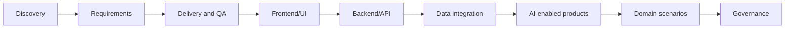

# Project Use Cases

A practical library of 70+ project use cases showing how software Business Analysts can apply AI across discovery, requirements, frontend/UI, backend/API, data integration, delivery, AI-enabled products, domain workflows, and governance.

Use these pages as working playbooks. Pick a use case close to your project, copy the prompt, prepare source evidence, and adapt the deliverables to your team.

## Browse by group

<a class="group-card" href="#discovery-and-alignment"><strong>Discovery and alignment</strong>5 use cases</a>
<a class="group-card" href="#requirements-and-backlog"><strong>Requirements and backlog</strong>5 use cases</a>
<a class="group-card" href="#delivery-and-qa"><strong>Delivery and QA</strong>5 use cases</a>
<a class="group-card" href="#ai-enabled-product-use-cases"><strong>AI-enabled product use cases</strong>5 use cases</a>
<a class="group-card" href="#domain-project-scenarios"><strong>Domain project scenarios</strong>6 use cases</a>
<a class="group-card" href="#governance-and-adoption"><strong>Governance and adoption</strong>4 use cases</a>
<a class="group-card" href="#frontend-ui-and-ux"><strong>Frontend, UI, and UX</strong>13 use cases</a>
<a class="group-card" href="#backend-and-api"><strong>Backend and API</strong>12 use cases</a>
<a class="group-card" href="#data-and-integration"><strong>Data and Integration</strong>8 use cases</a>
<a class="group-card" href="#cross-functional-ba-collaboration"><strong>Cross-functional BA Collaboration</strong>8 use cases</a>

## Filter by project context

  

    <strong>By project phase</strong>
    
<a href="#discovery-and-alignment">Discovery</a><a href="#requirements-and-backlog">Refinement</a><a href="#delivery-and-qa">Delivery validation</a><a href="#ai-enabled-product-use-cases">AI product design</a><a href="#domain-project-scenarios">Domain workflow</a><a href="#governance-and-adoption">Governance</a><a href="#frontend-ui-and-ux">Frontend/UI refinement</a><a href="#backend-and-api">Backend/API refinement</a><a href="#data-and-integration">Data and integration</a><a href="#cross-functional-ba-collaboration">Cross-functional alignment</a>

  

  

    <strong>By difficulty</strong>
    
CoreAdvancedPractitioner

  

  

    <strong>By BA collaboration group</strong>
    
<a href="#discovery-and-alignment">Discovery and alignment</a><a href="#requirements-and-backlog">Requirements and backlog</a><a href="#delivery-and-qa">Delivery and QA</a><a href="#ai-enabled-product-use-cases">AI-enabled product use cases</a><a href="#domain-project-scenarios">Domain project scenarios</a><a href="#governance-and-adoption">Governance and adoption</a><a href="#frontend-ui-and-ux">Frontend, UI, and UX</a><a href="#backend-and-api">Backend and API</a><a href="#data-and-integration">Data and Integration</a><a href="#cross-functional-ba-collaboration">Cross-functional BA Collaboration</a>

  

## Use case map

<section class="usecase-section"><h2 id="discovery-and-alignment">Discovery and alignment</h2>

<a class="case-card" data-phase="discovery" data-difficulty="core" data-artifact="discovery-synthesis-pack" href="./stakeholder-discovery-from-messy-notes/">Discovery and alignment<strong>Stakeholder Discovery From Messy Notes</strong><small>Cross-functional product discovery</small>
<b>Discovery</b><b>Core</b><b>Discovery synthesis pack</b>
<em>The next workshop resolves the highest-risk conflicts and produces named owners for every open decision.</em></a>
<a class="case-card" data-phase="discovery" data-difficulty="core" data-artifact="scope-framing-canvas" href="./project-kickoff-scope-framing/">Discovery and alignment<strong>Project Kickoff Scope Framing</strong><small>Project initiation</small>
<b>Discovery</b><b>Core</b><b>Scope framing canvas</b>
<em>The project kickoff produces a signed scope frame that delivery, product, and operations can use for prioritization.</em></a>
<a class="case-card" data-phase="discovery" data-difficulty="core" data-artifact="current-state-process-map" href="./current-state-process-mapping/">Discovery and alignment<strong>Current-State Process Mapping</strong><small>Operations analysis</small>
<b>Discovery</b><b>Core</b><b>Current-state process map</b>
<em>The validated process map identifies delay points and decision gaps that can be prioritized for redesign.</em></a>
<a class="case-card" data-phase="discovery" data-difficulty="core" data-artifact="gap-analysis-matrix" href="./legacy-modernization-gap-analysis/">Discovery and alignment<strong>Legacy Modernization Gap Analysis</strong><small>Legacy system modernization</small>
<b>Discovery</b><b>Core</b><b>Gap analysis matrix</b>
<em>Migration scope separates must-keep behavior from redesign and retire decisions with evidence.</em></a>
<a class="case-card" data-phase="discovery" data-difficulty="core" data-artifact="research-synthesis-memo" href="./market-competitor-research-synthesis/">Discovery and alignment<strong>Market and Competitor Research Synthesis</strong><small>Product strategy</small>
<b>Discovery</b><b>Core</b><b>Research synthesis memo</b>
<em>Roadmap discussion uses validated hypotheses and evidence strength instead of generic competitor feature lists.</em></a>

</section>
<section class="usecase-section"><h2 id="requirements-and-backlog">Requirements and backlog</h2>

<a class="case-card" data-phase="refinement" data-difficulty="core" data-artifact="story-split-map" href="./user-story-splitting-for-sprint/">Requirements and backlog<strong>User Story Splitting for Sprint Readiness</strong><small>Agile delivery</small>
<b>Refinement</b><b>Core</b><b>Story split map</b>
<em>Sprint planning receives stories that QA and developers can estimate, test, and release in meaningful increments.</em></a>
<a class="case-card" data-phase="refinement" data-difficulty="core" data-artifact="acceptance-criteria-matrix" href="./acceptance-criteria-edge-cases/">Requirements and backlog<strong>Acceptance Criteria and Edge Case Expansion</strong><small>Requirements quality</small>
<b>Refinement</b><b>Core</b><b>Acceptance criteria matrix</b>
<em>QA can convert acceptance criteria into test cases without asking for hidden business rules.</em></a>
<a class="case-card" data-phase="refinement" data-difficulty="core" data-artifact="brd-or-srs-outline" href="./brd-srs-drafting-review/">Requirements and backlog<strong>BRD and SRS Drafting Review</strong><small>Formal requirements documentation</small>
<b>Refinement</b><b>Core</b><b>BRD or SRS outline</b>
<em>The BRD or SRS is faster to draft but still traceable, reviewable, and approved through the correct owners.</em></a>
<a class="case-card" data-phase="refinement" data-difficulty="core" data-artifact="nfr-workshop-pack" href="./nfr-risk-workshop/">Requirements and backlog<strong>NFR and Risk Workshop Preparation</strong><small>Quality attributes</small>
<b>Refinement</b><b>Core</b><b>NFR workshop pack</b>
<em>Quality attributes become measurable requirements and design inputs before architecture is committed.</em></a>
<a class="case-card" data-phase="refinement" data-difficulty="core" data-artifact="traceability-matrix" href="./traceability-matrix-for-release/">Requirements and backlog<strong>Traceability Matrix for Release Readiness</strong><small>Release governance</small>
<b>Refinement</b><b>Core</b><b>Traceability matrix</b>
<em>Release sign-off is based on visible coverage and accepted exceptions, not scattered artifact confidence.</em></a>

</section>
<section class="usecase-section"><h2 id="delivery-and-qa">Delivery and QA</h2>

<a class="case-card" data-phase="delivery-validation" data-difficulty="core" data-artifact="defect-classification-board" href="./defect-triage-root-cause/">Delivery and QA<strong>Defect Triage and Root-Cause Analysis</strong><small>Defect management</small>
<b>Delivery validation</b><b>Core</b><b>Defect classification board</b>
<em>Triage decisions become faster while root causes remain evidence-based and actionable.</em></a>
<a class="case-card" data-phase="delivery-validation" data-difficulty="core" data-artifact="scenario-coverage-matrix" href="./test-scenario-generation/">Delivery and QA<strong>Test Scenario Generation From Requirements</strong><small>QA collaboration</small>
<b>Delivery validation</b><b>Core</b><b>Scenario coverage matrix</b>
<em>QA receives scenario coverage that is traceable, prioritized, and aligned to business rules.</em></a>
<a class="case-card" data-phase="delivery-validation" data-difficulty="core" data-artifact="impact-matrix" href="./change-impact-analysis/">Delivery and QA<strong>Change Impact Analysis</strong><small>Change control</small>
<b>Delivery validation</b><b>Core</b><b>Impact matrix</b>
<em>The team accepts, defers, or splits the change with visible impact and artifact owners.</em></a>
<a class="case-card" data-phase="delivery-validation" data-difficulty="core" data-artifact="readiness-dashboard" href="./release-readiness-check/">Delivery and QA<strong>Release Readiness Check</strong><small>Release management</small>
<b>Delivery validation</b><b>Core</b><b>Readiness dashboard</b>
<em>The go-live meeting uses a shared evidence-based readiness brief instead of fragmented status updates.</em></a>
<a class="case-card" data-phase="delivery-validation" data-difficulty="core" data-artifact="incident-synthesis" href="./production-incident-requirement-feedback/">Delivery and QA<strong>Production Incident to Requirement Feedback</strong><small>Continuous improvement</small>
<b>Delivery validation</b><b>Core</b><b>Incident synthesis</b>
<em>Production incidents become evidence-backed backlog improvements and better future requirement questions.</em></a>

</section>
<section class="usecase-section"><h2 id="ai-enabled-product-use-cases">AI-enabled product use cases</h2>

<a class="case-card" data-phase="ai-product-design" data-difficulty="advanced" data-artifact="knowledge-contract" href="./rag-policy-assistant-requirements/">AI-enabled product use cases<strong>RAG Policy Assistant Requirements</strong><small>Knowledge assistant</small>
<b>AI product design</b><b>Advanced</b><b>Knowledge contract</b>
<em>The assistant answers only from trusted sources, cites evidence, respects access, and escalates safely.</em></a>
<a class="case-card" data-phase="ai-product-design" data-difficulty="advanced" data-artifact="triage-taxonomy" href="./ai-ticket-triage-specification/">AI-enabled product use cases<strong>AI Ticket Triage Specification</strong><small>Support automation</small>
<b>AI product design</b><b>Advanced</b><b>Triage taxonomy</b>
<em>Ticket routing improves SLA performance while low-confidence and high-risk cases receive human review.</em></a>
<a class="case-card" data-phase="ai-product-design" data-difficulty="advanced" data-artifact="extraction-schema" href="./ai-document-ocr-intake/">AI-enabled product use cases<strong>AI Document OCR Intake</strong><small>Document automation</small>
<b>AI product design</b><b>Advanced</b><b>Extraction schema</b>
<em>Document handling becomes faster while sensitive decisions remain reviewable and evidence-backed.</em></a>
<a class="case-card" data-phase="ai-product-design" data-difficulty="advanced" data-artifact="recommendation-canvas" href="./ai-recommendation-explanation/">AI-enabled product use cases<strong>AI Recommendation Explanation</strong><small>Decision support</small>
<b>AI product design</b><b>Advanced</b><b>Recommendation canvas</b>
<em>Users understand recommendations, retain decision control, and provide feedback that improves the product.</em></a>
<a class="case-card" data-phase="ai-product-design" data-difficulty="advanced" data-artifact="intent-catalog" href="./ai-chatbot-human-handoff/">AI-enabled product use cases<strong>AI Chatbot Human Handoff</strong><small>Customer support</small>
<b>AI product design</b><b>Advanced</b><b>Intent catalog</b>
<em>The chatbot reduces simple workload while complex or risky cases reach humans with context and accountability.</em></a>

</section>
<section class="usecase-section"><h2 id="domain-project-scenarios">Domain project scenarios</h2>

<a class="case-card" data-phase="domain-workflow" data-difficulty="core" data-artifact="loan-journey-map" href="./loan-origination-journey/">Domain project scenarios<strong>Loan Origination Journey Modernization</strong><small>Banking and lending</small>
<b>Domain workflow</b><b>Core</b><b>Loan journey map</b>
<em>The modernized loan journey is faster for customers while credit decisions remain explainable and compliant.</em></a>
<a class="case-card" data-phase="domain-workflow" data-difficulty="core" data-artifact="claim-intake-flow" href="./insurance-claim-intake/">Domain project scenarios<strong>Insurance Claim Intake Automation</strong><small>Insurance</small>
<b>Domain workflow</b><b>Core</b><b>Claim intake flow</b>
<em>Claim intake becomes faster and clearer while coverage and fraud decisions remain human-governed.</em></a>
<a class="case-card" data-phase="domain-workflow" data-difficulty="core" data-artifact="return-eligibility-matrix" href="./ecommerce-return-refund/">Domain project scenarios<strong>E-commerce Return and Refund Flow</strong><small>E-commerce</small>
<b>Domain workflow</b><b>Core</b><b>Return eligibility matrix</b>
<em>Customers can complete eligible returns with fewer support contacts and clearer refund expectations.</em></a>
<a class="case-card" data-phase="domain-workflow" data-difficulty="core" data-artifact="intake-field-schema" href="./healthcare-appointment-intake/">Domain project scenarios<strong>Healthcare Appointment Intake</strong><small>Healthcare operations</small>
<b>Domain workflow</b><b>Core</b><b>Intake field schema</b>
<em>Appointment intake becomes clearer and faster while clinical decisions remain outside AI scope.</em></a>
<a class="case-card" data-phase="domain-workflow" data-difficulty="core" data-artifact="service-catalog" href="./hr-employee-service-portal/">Domain project scenarios<strong>HR Employee Service Portal</strong><small>HR service delivery</small>
<b>Domain workflow</b><b>Core</b><b>Service catalog</b>
<em>Employees can complete common HR requests through structured self-service with clear status and privacy controls.</em></a>
<a class="case-card" data-phase="domain-workflow" data-difficulty="core" data-artifact="exception-taxonomy" href="./finance-reconciliation-exception/">Domain project scenarios<strong>Finance Reconciliation Exception Workflow</strong><small>Finance operations</small>
<b>Domain workflow</b><b>Core</b><b>Exception taxonomy</b>
<em>Exception resolution becomes faster while finance decisions remain controlled and auditable.</em></a>

</section>
<section class="usecase-section"><h2 id="governance-and-adoption">Governance and adoption</h2>

<a class="case-card" data-phase="governance" data-difficulty="advanced" data-artifact="vendor-scorecard" href="./vendor-selection-ai-tool/">Governance and adoption<strong>Vendor Selection for an AI Tool</strong><small>Vendor evaluation</small>
<b>Governance</b><b>Advanced</b><b>Vendor scorecard</b>
<em>Vendor selection is driven by BA workflow value, verified controls, and pilot evidence.</em></a>
<a class="case-card" data-phase="governance" data-difficulty="advanced" data-artifact="ai-data-use-matrix" href="./data-privacy-ai-assessment/">Governance and adoption<strong>Data Privacy Assessment for AI Use</strong><small>Privacy and compliance</small>
<b>Governance</b><b>Advanced</b><b>AI data-use matrix</b>
<em>BA teams use AI with clear data boundaries, approved tools, and practical privacy controls.</em></a>
<a class="case-card" data-phase="governance" data-difficulty="advanced" data-artifact="use-case-portfolio" href="./ba-ai-adoption-playbook/">Governance and adoption<strong>BA AI Adoption Playbook</strong><small>BA practice leadership</small>
<b>Governance</b><b>Advanced</b><b>Use-case portfolio</b>
<em>The BA practice adopts AI through shared patterns, review gates, and measurable quality improvement.</em></a>
<a class="case-card" data-phase="governance" data-difficulty="advanced" data-artifact="use-case-scoring-matrix" href="./portfolio-use-case-prioritization/">Governance and adoption<strong>AI Use Case Portfolio Prioritization</strong><small>Portfolio management</small>
<b>Governance</b><b>Advanced</b><b>Use-case scoring matrix</b>
<em>Leadership funds AI pilots based on value, feasibility, data readiness, and risk, not hype.</em></a>

</section>
<section class="usecase-section"><h2 id="frontend-ui-and-ux">Frontend, UI, and UX</h2>

<a class="case-card" data-phase="frontend-ui-refinement" data-difficulty="practitioner" data-artifact="ui-behavior-matrix" href="./figma-design-handoff-requirements/">Frontend, UI, and UX<strong>Figma Design Handoff to Requirements</strong><small>Design handoff</small>
<b>Frontend/UI refinement</b><b>Practitioner</b><b>UI behavior matrix</b>
<em>The design handoff becomes a testable UI specification with clear state behavior and backend dependencies.</em></a>
<a class="case-card" data-phase="frontend-ui-refinement" data-difficulty="practitioner" data-artifact="state-action-matrix" href="./screen-state-behavior-specification/">Frontend, UI, and UX<strong>Screen State Behavior Specification</strong><small>Screen behavior</small>
<b>Frontend/UI refinement</b><b>Practitioner</b><b>State-action matrix</b>
<em>Frontend, backend, and QA use one shared state behavior matrix for implementation and testing.</em></a>
<a class="case-card" data-phase="frontend-ui-refinement" data-difficulty="practitioner" data-artifact="validation-matrix" href="./complex-form-validation-rules/">Frontend, UI, and UX<strong>Complex Form Validation Rules</strong><small>Forms and validation</small>
<b>Frontend/UI refinement</b><b>Practitioner</b><b>Validation matrix</b>
<em>Form validation is implemented consistently across frontend, backend, and QA with traceable business rules.</em></a>
<a class="case-card" data-phase="frontend-ui-refinement" data-difficulty="practitioner" data-artifact="ui-state-matrix" href="./empty-loading-error-state-requirements/">Frontend, UI, and UX<strong>Empty, Loading, and Error State Requirements</strong><small>UI states</small>
<b>Frontend/UI refinement</b><b>Practitioner</b><b>UI state matrix</b>
<em>Users receive clear state-specific guidance and QA covers non-happy-path UI behavior.</em></a>
<a class="case-card" data-phase="frontend-ui-refinement" data-difficulty="practitioner" data-artifact="responsive-behavior-matrix" href="./responsive-mobile-ui-behavior/">Frontend, UI, and UX<strong>Responsive and Mobile UI Behavior</strong><small>Responsive design</small>
<b>Frontend/UI refinement</b><b>Practitioner</b><b>Responsive behavior matrix</b>
<em>Responsive UI behavior is explicit enough for design, frontend, and QA to validate across devices.</em></a>
<a class="case-card" data-phase="frontend-ui-refinement" data-difficulty="practitioner" data-artifact="accessibility-criteria-set" href="./accessibility-acceptance-criteria/">Frontend, UI, and UX<strong>Accessibility Acceptance Criteria</strong><small>Accessibility</small>
<b>Frontend/UI refinement</b><b>Practitioner</b><b>Accessibility criteria set</b>
<em>Accessibility is represented as testable behavior in user stories before frontend implementation starts.</em></a>
<a class="case-card" data-phase="frontend-ui-refinement" data-difficulty="practitioner" data-artifact="component-behavior-spec" href="./design-system-component-requirements/">Frontend, UI, and UX<strong>Design System Component Requirements</strong><small>Design systems</small>
<b>Frontend/UI refinement</b><b>Practitioner</b><b>Component behavior spec</b>
<em>Reusable components have clear behavior boundaries and product teams can adopt them consistently.</em></a>
<a class="case-card" data-phase="frontend-ui-refinement" data-difficulty="practitioner" data-artifact="message-catalog" href="./ux-microcopy-error-message-review/">Frontend, UI, and UX<strong>UX Microcopy and Error Message Review</strong><small>UX writing</small>
<b>Frontend/UI refinement</b><b>Practitioner</b><b>Message catalog</b>
<em>UI copy becomes accurate, recoverable, testable, and ready for localization.</em></a>
<a class="case-card" data-phase="frontend-ui-refinement" data-difficulty="practitioner" data-artifact="task-to-navigation-map" href="./navigation-user-flow-analysis/">Frontend, UI, and UX<strong>Navigation and User Flow Analysis</strong><small>User flows</small>
<b>Frontend/UI refinement</b><b>Practitioner</b><b>Task-to-navigation map</b>
<em>Navigation choices are backed by user tasks, role rules, and testable flow behavior.</em></a>
<a class="case-card" data-phase="frontend-ui-refinement" data-difficulty="practitioner" data-artifact="analytics-event-spec" href="./frontend-analytics-event-requirements/">Frontend, UI, and UX<strong>Frontend Analytics Event Requirements</strong><small>Product analytics</small>
<b>Frontend/UI refinement</b><b>Practitioner</b><b>Analytics event spec</b>
<em>Frontend instrumentation produces decision-ready product data without violating privacy.</em></a>
<a class="case-card" data-phase="frontend-ui-refinement" data-difficulty="practitioner" data-artifact="localization-requirement-matrix" href="./localization-i18n-ui-requirements/">Frontend, UI, and UX<strong>Localization and i18n UI Requirements</strong><small>Localization</small>
<b>Frontend/UI refinement</b><b>Practitioner</b><b>Localization requirement matrix</b>
<em>Localized UI behavior is testable before market rollout and avoids hardcoded assumptions.</em></a>
<a class="case-card" data-phase="frontend-ui-refinement" data-difficulty="practitioner" data-artifact="visual-qa-matrix" href="./visual-regression-qa-handoff/">Frontend, UI, and UX<strong>Visual Regression and UI QA Handoff</strong><small>Visual QA</small>
<b>Frontend/UI refinement</b><b>Practitioner</b><b>Visual QA matrix</b>
<em>Visual QA focuses on user-impacting regressions across critical pages, components, and supported viewports.</em></a>
<a class="case-card" data-phase="frontend-ui-refinement" data-difficulty="practitioner" data-artifact="role-control-visibility-matrix" href="./frontend-permission-visibility-rules/">Frontend, UI, and UX<strong>Frontend Permission Visibility Rules</strong><small>Permissioned UI</small>
<b>Frontend/UI refinement</b><b>Practitioner</b><b>Role-control visibility matrix</b>
<em>Permissioned UI behavior is understandable to users and aligned with backend authorization controls.</em></a>

</section>
<section class="usecase-section"><h2 id="backend-and-api">Backend and API</h2>

<a class="case-card" data-phase="backend-api-refinement" data-difficulty="practitioner" data-artifact="api-behavior-spec" href="./api-contract-requirements/">Backend and API<strong>API Contract Requirements</strong><small>API contracts</small>
<b>Backend/API refinement</b><b>Practitioner</b><b>API behavior spec</b>
<em>Frontend and backend integrate against a contract that is traceable to business behavior.</em></a>
<a class="case-card" data-phase="backend-api-refinement" data-difficulty="practitioner" data-artifact="schema-review-table" href="./request-response-schema-review/">Backend and API<strong>Request and Response Schema Review</strong><small>Schema design</small>
<b>Backend/API refinement</b><b>Practitioner</b><b>Schema review table</b>
<em>API schema fields are understandable, testable, and aligned to business concepts.</em></a>
<a class="case-card" data-phase="backend-api-refinement" data-difficulty="practitioner" data-artifact="error-taxonomy" href="./api-error-code-taxonomy/">Backend and API<strong>API Error Code and Message Taxonomy</strong><small>Error handling</small>
<b>Backend/API refinement</b><b>Practitioner</b><b>Error taxonomy</b>
<em>API errors become consistent product behavior that frontend, QA, and support can use.</em></a>
<a class="case-card" data-phase="backend-api-refinement" data-difficulty="practitioner" data-artifact="rbac-matrix" href="./auth-authorization-rbac-rules/">Backend and API<strong>Authentication, Authorization, and RBAC Rules</strong><small>Authorization</small>
<b>Backend/API refinement</b><b>Practitioner</b><b>RBAC matrix</b>
<em>RBAC behavior is enforceable by backend, understandable in UI, and testable by QA.</em></a>
<a class="case-card" data-phase="backend-api-refinement" data-difficulty="practitioner" data-artifact="reliability-behavior-matrix" href="./idempotency-retry-timeout-behavior/">Backend and API<strong>Idempotency, Retry, and Timeout Behavior</strong><small>Reliability behavior</small>
<b>Backend/API refinement</b><b>Practitioner</b><b>Reliability behavior matrix</b>
<em>Duplicate and uncertain outcomes are prevented or handled through defined API, UI, and operations behavior.</em></a>
<a class="case-card" data-phase="backend-api-refinement" data-difficulty="practitioner" data-artifact="event-catalog" href="./webhook-event-requirements/">Backend and API<strong>Webhook and Event-Driven Requirements</strong><small>Event-driven integration</small>
<b>Backend/API refinement</b><b>Practitioner</b><b>Event catalog</b>
<em>Event-driven integration has clear semantics, reliability behavior, and partner-ready documentation.</em></a>
<a class="case-card" data-phase="backend-api-refinement" data-difficulty="practitioner" data-artifact="backend-rule-matrix" href="./backend-validation-business-rules/">Backend and API<strong>Backend Validation and Business Rules</strong><small>Business rules</small>
<b>Backend/API refinement</b><b>Practitioner</b><b>Backend rule matrix</b>
<em>Backend validation is authoritative, source-backed, and aligned with frontend guidance.</em></a>
<a class="case-card" data-phase="backend-api-refinement" data-difficulty="practitioner" data-artifact="batch-process-spec" href="./batch-job-scheduled-process/">Backend and API<strong>Batch Job and Scheduled Process Requirements</strong><small>Scheduled processing</small>
<b>Backend/API refinement</b><b>Practitioner</b><b>Batch process spec</b>
<em>Scheduled backend work has clear business rules, monitoring, rerun behavior, and operational ownership.</em></a>
<a class="case-card" data-phase="backend-api-refinement" data-difficulty="practitioner" data-artifact="audit-event-catalog" href="./audit-log-operational-logging/">Backend and API<strong>Audit Log and Operational Logging Requirements</strong><small>Audit and observability</small>
<b>Backend/API refinement</b><b>Practitioner</b><b>Audit event catalog</b>
<em>Sensitive backend actions produce audit evidence and operational logs that support compliance and support work.</em></a>
<a class="case-card" data-phase="backend-api-refinement" data-difficulty="practitioner" data-artifact="change-impact-matrix" href="./api-versioning-compatibility/">Backend and API<strong>API Versioning and Backward Compatibility</strong><small>API lifecycle</small>
<b>Backend/API refinement</b><b>Practitioner</b><b>Change impact matrix</b>
<em>API changes ship with clear compatibility behavior, migration support, and partner impact visibility.</em></a>
<a class="case-card" data-phase="backend-api-refinement" data-difficulty="practitioner" data-artifact="integration-dependency-map" href="./integration-failure-fallback-behavior/">Backend and API<strong>Integration Failure and Fallback Behavior</strong><small>Integration resilience</small>
<b>Backend/API refinement</b><b>Practitioner</b><b>Integration dependency map</b>
<em>Integration failures have defined user, backend, support, and operations behavior before launch.</em></a>
<a class="case-card" data-phase="backend-api-refinement" data-difficulty="practitioner" data-artifact="freshness-requirement-matrix" href="./caching-rate-limit-requirements/">Backend and API<strong>Caching and Rate Limit Requirements</strong><small>Performance controls</small>
<b>Backend/API refinement</b><b>Practitioner</b><b>Freshness requirement matrix</b>
<em>Caching and rate limits improve performance without hiding freshness or customer impact trade-offs.</em></a>

</section>
<section class="usecase-section"><h2 id="data-and-integration">Data and Integration</h2>

<a class="case-card" data-phase="data-and-integration" data-difficulty="advanced" data-artifact="data-mapping-matrix" href="./data-mapping-transformation-rules/">Data and Integration<strong>Data Mapping and Transformation Rules</strong><small>Data mapping</small>
<b>Data and integration</b><b>Advanced</b><b>Data mapping matrix</b>
<em>Integration mapping is driven by business semantics and validated with realistic data cases.</em></a>
<a class="case-card" data-phase="data-and-integration" data-difficulty="advanced" data-artifact="state-model" href="./entity-lifecycle-state-machine/">Data and Integration<strong>Entity Lifecycle and State Machine</strong><small>Entity lifecycle</small>
<b>Data and integration</b><b>Advanced</b><b>State model</b>
<em>Lifecycle behavior is shared across UI, backend, APIs, reporting, and operations.</em></a>
<a class="case-card" data-phase="data-and-integration" data-difficulty="advanced" data-artifact="field-definition-catalog" href="./database-field-business-rule-alignment/">Data and Integration<strong>Database Field and Business Rule Alignment</strong><small>Data model alignment</small>
<b>Data and integration</b><b>Advanced</b><b>Field definition catalog</b>
<em>Database fields are tied to business rules before implementation and migration decisions are visible.</em></a>
<a class="case-card" data-phase="data-and-integration" data-difficulty="advanced" data-artifact="metric-definition-catalog" href="./reporting-dashboard-metric-definition/">Data and Integration<strong>Reporting and Dashboard Metric Definition</strong><small>Reporting</small>
<b>Data and integration</b><b>Advanced</b><b>Metric definition catalog</b>
<em>Dashboard metrics become decision-ready because definitions, sources, and limitations are explicit.</em></a>
<a class="case-card" data-phase="data-and-integration" data-difficulty="advanced" data-artifact="search-behavior-spec" href="./search-filter-sort-requirements/">Data and Integration<strong>Search, Filter, and Sort Requirements</strong><small>Search experience</small>
<b>Data and integration</b><b>Advanced</b><b>Search behavior spec</b>
<em>Search and filtering behavior is precise enough to implement, test, and explain to users.</em></a>
<a class="case-card" data-phase="data-and-integration" data-difficulty="advanced" data-artifact="notification-rule-matrix" href="./notification-trigger-template-rules/">Data and Integration<strong>Notification Trigger and Template Rules</strong><small>Notifications</small>
<b>Data and integration</b><b>Advanced</b><b>Notification rule matrix</b>
<em>Notifications are triggered, worded, routed, and monitored according to clear business rules.</em></a>
<a class="case-card" data-phase="data-and-integration" data-difficulty="advanced" data-artifact="file-behavior-matrix" href="./file-upload-download-behavior/">Data and Integration<strong>File Upload and Download Behavior</strong><small>Files and documents</small>
<b>Data and integration</b><b>Advanced</b><b>File behavior matrix</b>
<em>File handling is safe, recoverable, permission-aware, and testable across UI and backend.</em></a>
<a class="case-card" data-phase="data-and-integration" data-difficulty="advanced" data-artifact="integration-inventory" href="./external-system-integration-mapping/">Data and Integration<strong>External System Integration Mapping</strong><small>External integrations</small>
<b>Data and integration</b><b>Advanced</b><b>Integration inventory</b>
<em>External integrations have clear data, failure, ownership, and escalation behavior.</em></a>

</section>
<section class="usecase-section"><h2 id="cross-functional-ba-collaboration">Cross-functional BA Collaboration</h2>

<a class="case-card" data-phase="cross-functional-alignment" data-difficulty="practitioner" data-artifact="refinement-prep-pack" href="./ba-developer-refinement-ai/">Cross-functional BA Collaboration<strong>BA-Developer Refinement With AI</strong><small>BA and developers</small>
<b>Cross-functional alignment</b><b>Practitioner</b><b>Refinement prep pack</b>
<em>Refinement meetings spend more time deciding and less time discovering missing requirement basics.</em></a>
<a class="case-card" data-phase="cross-functional-alignment" data-difficulty="practitioner" data-artifact="qa-handoff-matrix" href="./ba-qa-test-handoff-ai/">Cross-functional BA Collaboration<strong>BA-QA Test Handoff With AI</strong><small>BA and QA</small>
<b>Cross-functional alignment</b><b>Practitioner</b><b>QA handoff matrix</b>
<em>QA receives source-backed, prioritized scenarios with expected results and test data needs.</em></a>
<a class="case-card" data-phase="cross-functional-alignment" data-difficulty="practitioner" data-artifact="ba-ux-critique-checklist" href="./ba-ux-critique-loop/">Cross-functional BA Collaboration<strong>BA-UX Critique Loop</strong><small>BA and UX</small>
<b>Cross-functional alignment</b><b>Practitioner</b><b>BA-UX critique checklist</b>
<em>BA and UX reviews produce clearer design decisions without losing user-centered intent.</em></a>
<a class="case-card" data-phase="cross-functional-alignment" data-difficulty="practitioner" data-artifact="nfr-decision-table" href="./ba-tech-lead-nfr-review/">Cross-functional BA Collaboration<strong>BA-Tech Lead NFR Review</strong><small>BA and architecture</small>
<b>Cross-functional alignment</b><b>Practitioner</b><b>NFR decision table</b>
<em>Technical quality concerns become measurable business decisions and delivery requirements.</em></a>
<a class="case-card" data-phase="cross-functional-alignment" data-difficulty="practitioner" data-artifact="decision-memo" href="./product-tradeoff-decision-memo/">Cross-functional BA Collaboration<strong>Product Trade-off Decision Memo</strong><small>Product decisions</small>
<b>Cross-functional alignment</b><b>Practitioner</b><b>Decision memo</b>
<em>Product trade-offs become explicit, evidence-backed, and traceable to follow-up metrics.</em></a>
<a class="case-card" data-phase="cross-functional-alignment" data-difficulty="practitioner" data-artifact="issue-to-requirement-analysis" href="./production-issue-ui-api-requirement-update/">Cross-functional BA Collaboration<strong>Production Issue to UI/API Requirement Update</strong><small>Production feedback</small>
<b>Cross-functional alignment</b><b>Practitioner</b><b>Issue-to-requirement analysis</b>
<em>Production issues become clearer UI/API requirements and stronger regression coverage.</em></a>
<a class="case-card" data-phase="cross-functional-alignment" data-difficulty="practitioner" data-artifact="workshop-agenda" href="./frontend-backend-contract-workshop/">Cross-functional BA Collaboration<strong>Frontend-Backend Contract Workshop</strong><small>Contract workshops</small>
<b>Cross-functional alignment</b><b>Practitioner</b><b>Workshop agenda</b>
<em>Frontend and backend leave the workshop with aligned contract decisions and test scenarios.</em></a>
<a class="case-card" data-phase="cross-functional-alignment" data-difficulty="practitioner" data-artifact="end-to-end-trace-matrix" href="./design-to-api-end-to-end-traceability/">Cross-functional BA Collaboration<strong>Design-to-API End-to-End Traceability</strong><small>Traceability</small>
<b>Cross-functional alignment</b><b>Practitioner</b><b>End-to-end trace matrix</b>
<em>Critical feature behavior is traceable from design through API, data, analytics, and tests.</em></a>

</section>
