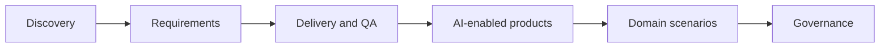

# Project Use Cases

A practical library of project use cases showing how software Business Analysts can apply AI across discovery, requirements, delivery, AI-enabled products, domain workflows, and governance.

Use these pages as working playbooks. Pick a use case close to your project, copy the prompt, prepare source evidence, and adapt the deliverables to your team.

## Use case map

<section class="usecase-section"><h2>Discovery and alignment</h2>

<a class="case-card" href="./stakeholder-discovery-from-messy-notes/">Cross-functional product discovery<strong>Stakeholder Discovery From Messy Notes</strong><em>The next workshop resolves the highest-risk conflicts and produces named owners for every open decision.</em></a>
<a class="case-card" href="./project-kickoff-scope-framing/">Project initiation<strong>Project Kickoff Scope Framing</strong><em>The project kickoff produces a signed scope frame that delivery, product, and operations can use for prioritization.</em></a>
<a class="case-card" href="./current-state-process-mapping/">Operations analysis<strong>Current-State Process Mapping</strong><em>The validated process map identifies delay points and decision gaps that can be prioritized for redesign.</em></a>
<a class="case-card" href="./legacy-modernization-gap-analysis/">Legacy system modernization<strong>Legacy Modernization Gap Analysis</strong><em>Migration scope separates must-keep behavior from redesign and retire decisions with evidence.</em></a>
<a class="case-card" href="./market-competitor-research-synthesis/">Product strategy<strong>Market and Competitor Research Synthesis</strong><em>Roadmap discussion uses validated hypotheses and evidence strength instead of generic competitor feature lists.</em></a>

</section>
<section class="usecase-section"><h2>Requirements and backlog</h2>

<a class="case-card" href="./user-story-splitting-for-sprint/">Agile delivery<strong>User Story Splitting for Sprint Readiness</strong><em>Sprint planning receives stories that QA and developers can estimate, test, and release in meaningful increments.</em></a>
<a class="case-card" href="./acceptance-criteria-edge-cases/">Requirements quality<strong>Acceptance Criteria and Edge Case Expansion</strong><em>QA can convert acceptance criteria into test cases without asking for hidden business rules.</em></a>
<a class="case-card" href="./brd-srs-drafting-review/">Formal requirements documentation<strong>BRD and SRS Drafting Review</strong><em>The BRD or SRS is faster to draft but still traceable, reviewable, and approved through the correct owners.</em></a>
<a class="case-card" href="./nfr-risk-workshop/">Quality attributes<strong>NFR and Risk Workshop Preparation</strong><em>Quality attributes become measurable requirements and design inputs before architecture is committed.</em></a>
<a class="case-card" href="./traceability-matrix-for-release/">Release governance<strong>Traceability Matrix for Release Readiness</strong><em>Release sign-off is based on visible coverage and accepted exceptions, not scattered artifact confidence.</em></a>

</section>
<section class="usecase-section"><h2>Delivery and QA</h2>

<a class="case-card" href="./defect-triage-root-cause/">Defect management<strong>Defect Triage and Root-Cause Analysis</strong><em>Triage decisions become faster while root causes remain evidence-based and actionable.</em></a>
<a class="case-card" href="./test-scenario-generation/">QA collaboration<strong>Test Scenario Generation From Requirements</strong><em>QA receives scenario coverage that is traceable, prioritized, and aligned to business rules.</em></a>
<a class="case-card" href="./change-impact-analysis/">Change control<strong>Change Impact Analysis</strong><em>The team accepts, defers, or splits the change with visible impact and artifact owners.</em></a>
<a class="case-card" href="./release-readiness-check/">Release management<strong>Release Readiness Check</strong><em>The go-live meeting uses a shared evidence-based readiness brief instead of fragmented status updates.</em></a>
<a class="case-card" href="./production-incident-requirement-feedback/">Continuous improvement<strong>Production Incident to Requirement Feedback</strong><em>Production incidents become evidence-backed backlog improvements and better future requirement questions.</em></a>

</section>
<section class="usecase-section"><h2>AI-enabled product use cases</h2>

<a class="case-card" href="./rag-policy-assistant-requirements/">Knowledge assistant<strong>RAG Policy Assistant Requirements</strong><em>The assistant answers only from trusted sources, cites evidence, respects access, and escalates safely.</em></a>
<a class="case-card" href="./ai-ticket-triage-specification/">Support automation<strong>AI Ticket Triage Specification</strong><em>Ticket routing improves SLA performance while low-confidence and high-risk cases receive human review.</em></a>
<a class="case-card" href="./ai-document-ocr-intake/">Document automation<strong>AI Document OCR Intake</strong><em>Document handling becomes faster while sensitive decisions remain reviewable and evidence-backed.</em></a>
<a class="case-card" href="./ai-recommendation-explanation/">Decision support<strong>AI Recommendation Explanation</strong><em>Users understand recommendations, retain decision control, and provide feedback that improves the product.</em></a>
<a class="case-card" href="./ai-chatbot-human-handoff/">Customer support<strong>AI Chatbot Human Handoff</strong><em>The chatbot reduces simple workload while complex or risky cases reach humans with context and accountability.</em></a>

</section>
<section class="usecase-section"><h2>Domain project scenarios</h2>

<a class="case-card" href="./loan-origination-journey/">Banking and lending<strong>Loan Origination Journey Modernization</strong><em>The modernized loan journey is faster for customers while credit decisions remain explainable and compliant.</em></a>
<a class="case-card" href="./insurance-claim-intake/">Insurance<strong>Insurance Claim Intake Automation</strong><em>Claim intake becomes faster and clearer while coverage and fraud decisions remain human-governed.</em></a>
<a class="case-card" href="./ecommerce-return-refund/">E-commerce<strong>E-commerce Return and Refund Flow</strong><em>Customers can complete eligible returns with fewer support contacts and clearer refund expectations.</em></a>
<a class="case-card" href="./healthcare-appointment-intake/">Healthcare operations<strong>Healthcare Appointment Intake</strong><em>Appointment intake becomes clearer and faster while clinical decisions remain outside AI scope.</em></a>
<a class="case-card" href="./hr-employee-service-portal/">HR service delivery<strong>HR Employee Service Portal</strong><em>Employees can complete common HR requests through structured self-service with clear status and privacy controls.</em></a>
<a class="case-card" href="./finance-reconciliation-exception/">Finance operations<strong>Finance Reconciliation Exception Workflow</strong><em>Exception resolution becomes faster while finance decisions remain controlled and auditable.</em></a>

</section>
<section class="usecase-section"><h2>Governance and adoption</h2>

<a class="case-card" href="./vendor-selection-ai-tool/">Vendor evaluation<strong>Vendor Selection for an AI Tool</strong><em>Vendor selection is driven by BA workflow value, verified controls, and pilot evidence.</em></a>
<a class="case-card" href="./data-privacy-ai-assessment/">Privacy and compliance<strong>Data Privacy Assessment for AI Use</strong><em>BA teams use AI with clear data boundaries, approved tools, and practical privacy controls.</em></a>
<a class="case-card" href="./ba-ai-adoption-playbook/">BA practice leadership<strong>BA AI Adoption Playbook</strong><em>The BA practice adopts AI through shared patterns, review gates, and measurable quality improvement.</em></a>
<a class="case-card" href="./portfolio-use-case-prioritization/">Portfolio management<strong>AI Use Case Portfolio Prioritization</strong><em>Leadership funds AI pilots based on value, feasibility, data readiness, and risk, not hype.</em></a>

</section>
