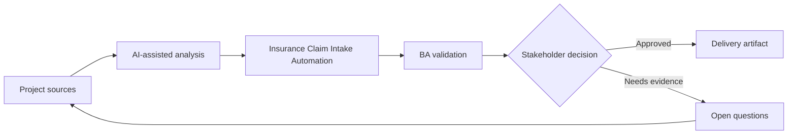

# Insurance Claim Intake Automation

<div class="case-meta">
  <span>Domain project scenarios</span>
  <span>Insurance</span>
  <span>Project use case</span>
</div>

## Project context

An insurer wants to digitize claim intake for property claims. Customers submit claim details, photos, invoices, and incident descriptions, while claims handlers need triage, missing information detection, and fraud risk cues. In a real delivery environment, this work usually appears under time pressure: stakeholders want clarity, delivery needs a backlog, QA needs testable behavior, and operations needs a process that can survive exceptions. The BA uses AI here to accelerate analysis and synthesis, but the BA remains accountable for evidence, business meaning, stakeholder decisioning, and artifact quality.

## BA challenge

The BA must specify an intake flow that improves speed without making unsupported claim decisions. AI can summarize claim narratives and detect missing documents, but coverage decisions and fraud escalation need clear controls. The practical difficulty is that AI can make early material look more complete than it is. A strong BA keeps the output reviewable by separating source-backed facts, assumptions, unsupported claims, decision gaps, and recommended next actions. The objective is not to make the document longer; it is to make the project decision clearer and safer.

## Where AI fits

<div class="ba-workbench-panel">
AI is useful in this use case when it is constrained to analysis support, pattern detection, structured drafting, and critique. It should not approve scope, invent policy, decide business trade-offs, or replace accountable stakeholder judgment.
</div>

- Extract claim facts from customer narratives and attachments.
- Identify missing information and document gaps.
- Generate triage categories and escalation triggers.
- Draft handler summary with evidence and uncertainty labels.

## Inputs to prepare

- Claim forms
- Coverage policy
- Document checklist
- Fraud indicators
- Claims handler workflow

A BA should label these inputs before using AI: source owner, source date, approval status, sensitivity level, and whether the source is fact, opinion, policy, draft, or historical evidence. This preparation prevents the model from treating every input as equally current and authoritative.

## BA workflow

1. Map customer submission and handler triage journey.
2. Ask AI to draft extraction fields and missing information rules.
3. Specify confidence behavior for extracted facts and document completeness.
4. Define triage categories, fraud risk cues, and human review triggers.
5. Design customer follow-up messages for missing evidence.
6. Create evaluation cases for typical, incomplete, and suspicious claims.

The workflow works best as a staged AI collaboration: first organize the evidence, then ask for analysis, then create the artifact, then run a critique pass. The BA should keep a visible decision log throughout the process so that AI-generated suggestions do not silently become approved scope.

## Diagram



## Deliverables

| Deliverable | What it contains | Owner | Done signal |
| --- | --- | --- | --- |
| Claim intake flow | Customer steps, document upload, triage, review, and follow-up | BA | Journey covers incomplete submissions |
| Extraction and summary schema | Claim facts, source evidence, confidence, and uncertainty | Claims operations | Handler sees evidence labels |
| Missing information rules | Required document, condition, customer message, and SLA | Claims owner | Requests are specific and fair |
| Escalation matrix | Trigger, risk level, queue, reviewer, and audit record | Risk owner | Suspicious cases have controlled path |

These deliverables should be treated as BA-owned artifacts. AI can draft them, but the BA must validate source support, stakeholder meaning, traceability, and whether the artifact is ready for handoff.

## Prompt to try

```text
Act as a senior AI-aware Business Analyst. Help me apply the "Insurance Claim Intake Automation" use case to my project. First ask for source evidence and constraints. Then create a structured analysis with project context, assumptions, AI-fit boundary, workflow steps, deliverables, risks, controls, open questions, and stakeholder decisions. Do not invent policy, thresholds, or approvals.
```

## Review checklist

- Every AI-produced statement is tied to a source, assumption, or validation question.
- The BA has separated drafting assistance from business approval.
- Workflow steps identify the human owner for decisions, review, and exceptions.
- Deliverables are traceable to project inputs and can be reviewed by QA, product, or operations.
- Risk controls are practical enough to be used in a real project meeting.
- Success metric: Claim intake becomes faster and clearer while coverage and fraud decisions remain human-governed.

## Risks and controls

| Risk | Why it matters | BA control |
| --- | --- | --- |
| Unsupported denial | AI may imply claim outcome before handler review | Separate intake support from coverage decision |
| Evidence mismatch | Photos or invoices may not support claim narrative | Require source-linked fact extraction |
| Customer frustration | Generic missing-info messages create repeat contact | Generate specific, policy-backed requests |
| Fraud overflagging | False positives can harm customer trust | Use human review and reason codes |

The key control is to make uncertainty visible. If evidence is weak, the output should create a validation question or decision item, not a final requirement. If the artifact influences delivery, release, compliance, customer experience, or operational workload, the BA should require explicit human review before handoff.
