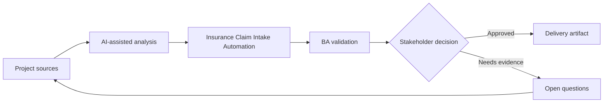

# Insurance Claim Intake Automation

<div class="case-meta">
  <span>Domain project scenarios</span>
  <span>Insurance</span>
  <span>Project use case</span>
</div>

## Project context

An insurer wants to digitize claim intake for property claims. Customers submit claim details, photos, invoices, and incident descriptions, while claims handlers need triage, missing information detection, and fraud risk cues. In Insurance, this work usually starts when domain policies, operational exceptions, and regulatory expectations shape what the product can safely do. The BA should treat Claim forms and Coverage policy as evidence to organize, not as raw material for an unconstrained AI answer. The goal is to make the next decision clearer for the people who own the outcome.

## BA challenge

The BA must specify an intake flow that improves speed without making unsupported claim decisions. AI can summarize claim narratives and detect missing documents, but coverage decisions and fraud escalation need clear controls. For Insurance Claim Intake Automation, the practical difficulty is policy hallucination and exception blindness. AI can accelerate domain-rule extraction, exception mapping, safe-message drafting, and owner review, but the BA must still expose assumptions, missing approvals, and the point where stakeholder judgment is required.

## Where AI fits

<div class="ba-workbench-panel">
AI fits this Domain project scenarios use case when it is constrained to domain-rule extraction, exception mapping, safe-message drafting, and owner review. A useful first AI task is: Extract claim facts from customer narratives and attachments. AI should not approve scope, invent policy, bypass policy sources, operational samples, compliance constraints, and domain-owner decisions, or turn a draft into a final decision.
</div>

- Extract claim facts from customer narratives and attachments.
- Identify missing information and document gaps.
- Generate triage categories and escalation triggers.
- Draft handler summary with evidence and uncertainty labels.

## Inputs to prepare

- Claim forms
- Coverage policy
- Document checklist
- Fraud indicators
- Claims handler workflow

Before prompting for Insurance Claim Intake Automation, label each input by owner, date, approval status, sensitivity, and role in the decision. The most important evidence lens is policy sources, operational samples, compliance constraints, and domain-owner decisions; without it, AI may rank old notes, draft designs, and approved rules as if they had equal authority.

## BA workflow

1. Map customer submission and handler triage journey.
2. Ask AI to draft extraction fields and missing information rules.
3. Specify confidence behavior for extracted facts and document completeness.
4. Define triage categories, fraud risk cues, and human review triggers.
5. Design customer follow-up messages for missing evidence.
6. Create evaluation cases for typical, incomplete, and suspicious claims.

Run the workflow as domain validation before implementation detail: start with "Map customer submission and handler triage journey.", then keep a visible decision log as the artifact moves toward Claim intake flow. This prevents AI suggestions from silently becoming backlog, design, release, or operational commitments.

## Diagram



## Deliverables

| Deliverable | What it contains | Owner | Done signal |
| --- | --- | --- | --- |
| Claim intake flow | Customer steps, document upload, triage, review, and follow-up | BA | Journey covers incomplete submissions |
| Extraction and summary schema | Claim facts, source evidence, confidence, and uncertainty | Claims operations | Handler sees evidence labels |
| Missing information rules | Required document, condition, customer message, and SLA | Claims owner | Requests are specific and fair |
| Escalation matrix | Trigger, risk level, queue, reviewer, and audit record | Risk owner | Suspicious cases have controlled path |

Treat Claim intake flow as a BA-owned domain-specific requirement pack. AI may draft structure, but the BA must validate whether "Journey covers incomplete submissions" is actually true, whether the artifact is traceable to source evidence, and whether the receiving team can act on it.

## Prompt to try

```text
Act as a senior AI-aware Business Analyst. Help me apply the "Insurance Claim Intake Automation" use case to my project. First ask for source evidence and constraints. Then create a structured analysis with project context, assumptions, AI-fit boundary, workflow steps, deliverables, risks, controls, open questions, and stakeholder decisions. Do not invent policy, thresholds, or approvals.
```

## Review checklist

- Claim forms is labeled with owner, date, approval status, and sensitivity.
- Claim intake flow traces to source evidence and has a named human owner.
- The AI task stays inside domain-rule extraction, exception mapping, safe-message drafting, and owner review and does not approve scope or policy.
- The "Unsupported denial" risk has a practical control: Separate intake support from coverage decision.
- Open assumptions are converted into validation questions or stakeholder decisions.
- Success metric: Claim intake becomes faster and clearer while coverage and fraud decisions remain human-governed.

## Risks and controls

| Risk | Why it matters | BA control |
| --- | --- | --- |
| Unsupported denial | AI may imply claim outcome before handler review | Separate intake support from coverage decision |
| Evidence mismatch | Photos or invoices may not support claim narrative | Require source-linked fact extraction |
| Customer frustration | Generic missing-info messages create repeat contact | Generate specific, policy-backed requests |
| Fraud overflagging | False positives can harm customer trust | Use human review and reason codes |

The main control for the "Unsupported denial" risk is explicit human accountability: Separate intake support from coverage decision. If evidence is weak, the output should create a validation question or decision item, not a final requirement.
