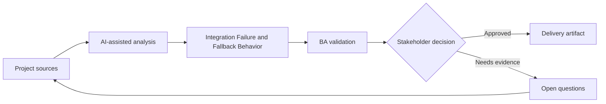

# Integration Failure and Fallback Behavior

<div class="case-meta">
  <span>Backend and API</span>
  <span>Integration resilience</span>
  <span>Project use case</span>
</div>

## Project context

A checkout flow depends on payment, tax, shipping, and inventory services. When one service fails, the current requirement only says show an error. In Integration resilience, this work usually starts when API contracts, permissions, errors, audit, and operational behavior must be explicit enough for backend delivery. The BA should treat Integration map and Checkout journey as evidence to organize, not as raw material for an unconstrained AI answer. The goal is to make the next decision clearer for the people who own the outcome.

## BA challenge

The BA must specify business-safe fallback behavior for integration failures. Different failures need different user messages, retries, manual paths, and operational alerts. For Integration Failure and Fallback Behavior, the practical difficulty is ambiguous service behavior and security gaps. AI can accelerate contract critique, rule extraction, error taxonomy, permission review, and NFR gap detection, but the BA must still expose assumptions, missing approvals, and the point where stakeholder judgment is required.

## Where AI fits

<div class="ba-workbench-panel">
AI fits this Backend and API use case when it is constrained to contract critique, rule extraction, error taxonomy, permission review, and NFR gap detection. A useful first AI task is: Generate integration failure scenarios by service dependency. AI should not approve scope, invent policy, bypass API draft, data model, auth rules, error samples, audit policy, and integration needs, or turn a draft into a final decision.
</div>

- Generate integration failure scenarios by service dependency.
- Draft fallback behavior matrix and user messaging.
- Identify retry, manual process, and alert needs.
- Create QA cases for service outage and partial failure.

## Inputs to prepare

- Integration map
- Checkout journey
- Service SLAs
- Manual operations process
- Support scripts

Before prompting for Integration Failure and Fallback Behavior, label each input by owner, date, approval status, sensitivity, and role in the decision. The most important evidence lens is API draft, data model, auth rules, error samples, audit policy, and integration needs; without it, AI may rank old notes, draft designs, and approved rules as if they had equal authority.

## BA workflow

1. Map dependencies by user step and business impact.
2. Ask AI to generate failure and partial failure scenarios.
3. Define fallback for each service: retry, block, degrade, manual review, or notify.
4. Review customer messaging and operational alert paths.
5. Add acceptance criteria for outage, timeout, and partial response.
6. Create support and monitoring requirements.

Run the workflow as contract validation before implementation: start with "Map dependencies by user step and business impact.", then keep a visible decision log as the artifact moves toward Integration dependency map. This prevents AI suggestions from silently becoming backlog, design, release, or operational commitments.

## Diagram



## Deliverables

| Deliverable | What it contains | Owner | Done signal |
| --- | --- | --- | --- |
| Integration dependency map | Service, user step, data, SLA, failure impact, and owner | BA and architect | Dependencies are visible |
| Fallback behavior matrix | Failure type, user message, retry, manual path, alert, and owner | BA | Failures have safe behavior |
| Support runbook requirements | Known failure, customer guidance, escalation, and resolution | Support | Support can respond |
| Failure test scenarios | Timeout, outage, partial response, bad data, and retry | QA | Resilience behavior is tested |

Treat Integration dependency map as a BA-owned backend behavior contract. AI may draft structure, but the BA must validate whether "Dependencies are visible" is actually true, whether the artifact is traceable to source evidence, and whether the receiving team can act on it.

## Prompt to try

```text
Act as a senior AI-aware Business Analyst. Help me apply the "Integration Failure and Fallback Behavior" use case to my project. First ask for source evidence and constraints. Then create a structured analysis with project context, assumptions, AI-fit boundary, workflow steps, deliverables, risks, controls, open questions, and stakeholder decisions. Do not invent policy, thresholds, or approvals.
```

## Review checklist

- Integration map is labeled with owner, date, approval status, and sensitivity.
- Integration dependency map traces to source evidence and has a named human owner.
- The AI task stays inside contract critique, rule extraction, error taxonomy, permission review, and NFR gap detection and does not approve scope or policy.
- The "Generic failure handling" risk has a practical control: Tailor fallback by service and impact.
- Open assumptions are converted into validation questions or stakeholder decisions.
- Success metric: Integration failures have defined user, backend, support, and operations behavior before launch.

## Risks and controls

| Risk | Why it matters | BA control |
| --- | --- | --- |
| Generic failure handling | All failures may block users unnecessarily | Tailor fallback by service and impact |
| Unsafe continuation | Proceeding may create financial or data risk | Define block versus degrade decisions |
| No operational alert | Failures may continue unnoticed | Specify monitoring and owner |
| Support unprepared | Agents may not know workaround | Create support runbook requirements |

The main control for the "Generic failure handling" risk is explicit human accountability: Tailor fallback by service and impact. If evidence is weak, the output should create a validation question or decision item, not a final requirement.
