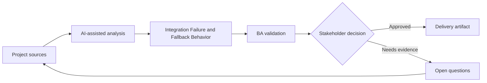

# Integration Failure and Fallback Behavior

<div class="case-meta">
  <span>Backend and API</span>
  <span>Integration resilience</span>
  <span>Project use case</span>
</div>

## Project context

A checkout flow depends on payment, tax, shipping, and inventory services. When one service fails, the current requirement only says show an error. In a real delivery environment, this work usually appears under time pressure: stakeholders want clarity, delivery needs a backlog, QA needs testable behavior, and operations needs a process that can survive exceptions. The BA uses AI here to accelerate analysis and synthesis, but the BA remains accountable for evidence, business meaning, stakeholder decisioning, and artifact quality.

## BA challenge

The BA must specify business-safe fallback behavior for integration failures. Different failures need different user messages, retries, manual paths, and operational alerts. The practical difficulty is that AI can make early material look more complete than it is. A strong BA keeps the output reviewable by separating source-backed facts, assumptions, unsupported claims, decision gaps, and recommended next actions. The objective is not to make the document longer; it is to make the project decision clearer and safer.

## Where AI fits

<div class="ba-workbench-panel">
AI is useful in this use case when it is constrained to analysis support, pattern detection, structured drafting, and critique. It should not approve scope, invent policy, decide business trade-offs, or replace accountable stakeholder judgment.
</div>

- Generate integration failure scenarios by service dependency.
- Draft fallback behavior matrix and user messaging.
- Identify retry, manual process, and alert needs.
- Create QA cases for service outage and partial failure.

## Inputs to prepare

- Integration map
- Checkout journey
- Service SLAs
- Manual operations process
- Support scripts

A BA should label these inputs before using AI: source owner, source date, approval status, sensitivity level, and whether the source is fact, opinion, policy, draft, or historical evidence. This preparation prevents the model from treating every input as equally current and authoritative.

## BA workflow

1. Map dependencies by user step and business impact.
2. Ask AI to generate failure and partial failure scenarios.
3. Define fallback for each service: retry, block, degrade, manual review, or notify.
4. Review customer messaging and operational alert paths.
5. Add acceptance criteria for outage, timeout, and partial response.
6. Create support and monitoring requirements.

The workflow works best as a staged AI collaboration: first organize the evidence, then ask for analysis, then create the artifact, then run a critique pass. The BA should keep a visible decision log throughout the process so that AI-generated suggestions do not silently become approved scope.

## Diagram



## Deliverables

| Deliverable | What it contains | Owner | Done signal |
| --- | --- | --- | --- |
| Integration dependency map | Service, user step, data, SLA, failure impact, and owner | BA and architect | Dependencies are visible |
| Fallback behavior matrix | Failure type, user message, retry, manual path, alert, and owner | BA | Failures have safe behavior |
| Support runbook requirements | Known failure, customer guidance, escalation, and resolution | Support | Support can respond |
| Failure test scenarios | Timeout, outage, partial response, bad data, and retry | QA | Resilience behavior is tested |

These deliverables should be treated as BA-owned artifacts. AI can draft them, but the BA must validate source support, stakeholder meaning, traceability, and whether the artifact is ready for handoff.

## Prompt to try

```text
Act as a senior AI-aware Business Analyst. Help me apply the "Integration Failure and Fallback Behavior" use case to my project. First ask for source evidence and constraints. Then create a structured analysis with project context, assumptions, AI-fit boundary, workflow steps, deliverables, risks, controls, open questions, and stakeholder decisions. Do not invent policy, thresholds, or approvals.
```

## Review checklist

- Every AI-produced statement is tied to a source, assumption, or validation question.
- The BA has separated drafting assistance from business approval.
- Workflow steps identify the human owner for decisions, review, and exceptions.
- Deliverables are traceable to project inputs and can be reviewed by QA, product, or operations.
- Risk controls are practical enough to be used in a real project meeting.
- Success metric: Integration failures have defined user, backend, support, and operations behavior before launch.

## Risks and controls

| Risk | Why it matters | BA control |
| --- | --- | --- |
| Generic failure handling | All failures may block users unnecessarily | Tailor fallback by service and impact |
| Unsafe continuation | Proceeding may create financial or data risk | Define block versus degrade decisions |
| No operational alert | Failures may continue unnoticed | Specify monitoring and owner |
| Support unprepared | Agents may not know workaround | Create support runbook requirements |

The key control is to make uncertainty visible. If evidence is weak, the output should create a validation question or decision item, not a final requirement. If the artifact influences delivery, release, compliance, customer experience, or operational workload, the BA should require explicit human review before handoff.
