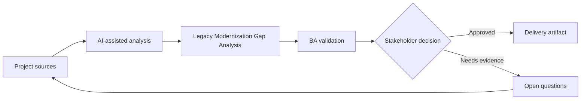

# Legacy Modernization Gap Analysis

<div class="case-meta">
  <span>Discovery and alignment</span>
  <span>Legacy system modernization</span>
  <span>Project use case</span>
</div>

## Project context

A company replaces a legacy back-office system with a modern web platform. The legacy system has undocumented rules, batch jobs, manual overrides, and reports that business users still depend on. In a real delivery environment, this work usually appears under time pressure: stakeholders want clarity, delivery needs a backlog, QA needs testable behavior, and operations needs a process that can survive exceptions. The BA uses AI here to accelerate analysis and synthesis, but the BA remains accountable for evidence, business meaning, stakeholder decisioning, and artifact quality.

## BA challenge

The BA must discover functional gaps between current behavior and target capability without blindly cloning the legacy system. AI can mine documents and transcripts, but the BA must distinguish business-critical rules from obsolete workaround behavior. The practical difficulty is that AI can make early material look more complete than it is. A strong BA keeps the output reviewable by separating source-backed facts, assumptions, unsupported claims, decision gaps, and recommended next actions. The objective is not to make the document longer; it is to make the project decision clearer and safer.

## Where AI fits

<div class="ba-workbench-panel">
AI is useful in this use case when it is constrained to analysis support, pattern detection, structured drafting, and critique. It should not approve scope, invent policy, decide business trade-offs, or replace accountable stakeholder judgment.
</div>

- Compare legacy feature lists with target epics.
- Extract hidden rules from SOPs and user interviews.
- Classify gaps as must-keep, redesign, retire, or investigate.
- Generate migration questions for business and technical owners.

## Inputs to prepare

- Legacy screen inventory
- SOPs and user guides
- Report list
- Target-state epics
- Interview transcripts

A BA should label these inputs before using AI: source owner, source date, approval status, sensitivity level, and whether the source is fact, opinion, policy, draft, or historical evidence. This preparation prevents the model from treating every input as equally current and authoritative.

## BA workflow

1. Create a capability map for current and target systems.
2. Ask AI to identify missing rules, reports, roles, and integrations.
3. Classify each gap by business impact and modernization intent.
4. Validate must-keep rules with process owners.
5. Mark obsolete workarounds separately from real requirements.
6. Produce a gap decision board for scope and migration planning.

The workflow works best as a staged AI collaboration: first organize the evidence, then ask for analysis, then create the artifact, then run a critique pass. The BA should keep a visible decision log throughout the process so that AI-generated suggestions do not silently become approved scope.

## Diagram



## Deliverables

| Deliverable | What it contains | Owner | Done signal |
| --- | --- | --- | --- |
| Gap analysis matrix | Current behavior, target behavior, gap type, impact, and decision | BA | Every high-impact gap has disposition |
| Rule inventory | Hidden business rules and source evidence | BA | Rules have owner and validation status |
| Report dependency list | Reports, consumers, purpose, and replacement path | Product owner | Critical reports have migration plan |
| Modernization decision board | Keep, redesign, retire, investigate decisions | Sponsor | Decisions are approved before build |

These deliverables should be treated as BA-owned artifacts. AI can draft them, but the BA must validate source support, stakeholder meaning, traceability, and whether the artifact is ready for handoff.

## Prompt to try

```text
Act as a senior AI-aware Business Analyst. Help me apply the "Legacy Modernization Gap Analysis" use case to my project. First ask for source evidence and constraints. Then create a structured analysis with project context, assumptions, AI-fit boundary, workflow steps, deliverables, risks, controls, open questions, and stakeholder decisions. Do not invent policy, thresholds, or approvals.
```

## Review checklist

- Every AI-produced statement is tied to a source, assumption, or validation question.
- The BA has separated drafting assistance from business approval.
- Workflow steps identify the human owner for decisions, review, and exceptions.
- Deliverables are traceable to project inputs and can be reviewed by QA, product, or operations.
- Risk controls are practical enough to be used in a real project meeting.
- Success metric: Migration scope separates must-keep behavior from redesign and retire decisions with evidence.

## Risks and controls

| Risk | Why it matters | BA control |
| --- | --- | --- |
| Legacy cloning | The team may rebuild obsolete workarounds | Classify each behavior by business value and current relevance |
| Rule loss | Undocumented rules may disappear during migration | Extract rules from SOPs, tickets, and interviews |
| Report surprise | Users may rely on reports not listed in scope | Inventory reports and consumers early |
| Decision delay | Unclear gaps can block sprint planning | Use decision board with owner and due date |

The key control is to make uncertainty visible. If evidence is weak, the output should create a validation question or decision item, not a final requirement. If the artifact influences delivery, release, compliance, customer experience, or operational workload, the BA should require explicit human review before handoff.
