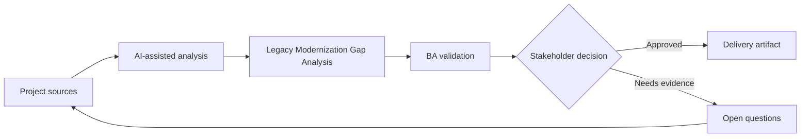

# Legacy Modernization Gap Analysis

<div class="case-meta">
  <span>Discovery and alignment</span>
  <span>Legacy system modernization</span>
  <span>Discovery</span>
  <span>Core</span>
  <span>Gap analysis matrix</span>
  <span>Project use case</span>
</div>

## Project context

A company replaces a legacy back-office system with a modern web platform. The legacy system has undocumented rules, batch jobs, manual overrides, and reports that business users still depend on. In Legacy system modernization, this work usually starts when stakeholders describe the same problem from different incentives and levels of detail. The BA should treat Legacy screen inventory and SOPs and user guides as evidence to organize, not as raw material for an unconstrained AI answer. The goal is to make the next decision clearer for the people who own the outcome.

## BA challenge

The BA must discover functional gaps between current behavior and target capability without blindly cloning the legacy system. AI can mine documents and transcripts, but the BA must distinguish business-critical rules from obsolete workaround behavior. For Legacy Modernization Gap Analysis, the practical difficulty is false consensus and invented scope. AI can accelerate sensemaking, contradiction detection, question generation, and workshop preparation, but the BA must still expose assumptions, missing approvals, and the point where stakeholder judgment is required.

## Where AI fits

<div class="ba-workbench-panel">
AI fits this Discovery and alignment use case when it is constrained to sensemaking, contradiction detection, question generation, and workshop preparation. A useful first AI task is: Compare legacy feature lists with target epics. AI should not approve scope, invent policy, bypass speaker attribution, decision authority, and source freshness, or turn a draft into a final decision.
</div>

- Compare legacy feature lists with target epics.
- Extract hidden rules from SOPs and user interviews.
- Classify gaps as must-keep, redesign, retire, or investigate.
- Generate migration questions for business and technical owners.

## Inputs to prepare

- Legacy screen inventory
- SOPs and user guides
- Report list
- Target-state epics
- Interview transcripts

Before prompting for Legacy Modernization Gap Analysis, label each input by owner, date, approval status, sensitivity, and role in the decision. The most important evidence lens is speaker attribution, decision authority, and source freshness; without it, AI may rank old notes, draft designs, and approved rules as if they had equal authority.

## BA workflow

1. Create a capability map for current and target systems.
2. Ask AI to identify missing rules, reports, roles, and integrations.
3. Classify each gap by business impact and modernization intent.
4. Validate must-keep rules with process owners.
5. Mark obsolete workarounds separately from real requirements.
6. Produce a gap decision board for scope and migration planning.

Run the workflow as evidence grouping before solution discussion: start with "Create a capability map for current and target systems.", then keep a visible decision log as the artifact moves toward Gap analysis matrix. This prevents AI suggestions from silently becoming backlog, design, release, or operational commitments.

## Diagram



## Deliverables

| Deliverable | What it contains | Owner | Done signal |
| --- | --- | --- | --- |
| Gap analysis matrix | Current behavior, target behavior, gap type, impact, and decision | BA | Every high-impact gap has disposition |
| Rule inventory | Hidden business rules and source evidence | BA | Rules have owner and validation status |
| Report dependency list | Reports, consumers, purpose, and replacement path | Product owner | Critical reports have migration plan |
| Modernization decision board | Keep, redesign, retire, investigate decisions | Sponsor | Decisions are approved before build |

Treat Gap analysis matrix as a BA-owned alignment artifact. AI may draft structure, but the BA must validate whether "Every high-impact gap has disposition" is actually true, whether the artifact is traceable to source evidence, and whether the receiving team can act on it.

## Prompt to try

```text
Act as a senior AI-aware Business Analyst. Help me apply the "Legacy Modernization Gap Analysis" use case to my project. First ask for source evidence and constraints. Then create a structured analysis with project context, assumptions, AI-fit boundary, workflow steps, deliverables, risks, controls, open questions, and stakeholder decisions. Do not invent policy, thresholds, or approvals.
```

## Review checklist

- Legacy screen inventory is labeled with owner, date, approval status, and sensitivity.
- Gap analysis matrix traces to source evidence and has a named human owner.
- The AI task stays inside sensemaking, contradiction detection, question generation, and workshop preparation and does not approve scope or policy.
- The "Legacy cloning" risk has a practical control: Classify each behavior by business value and current relevance.
- Open assumptions are converted into validation questions or stakeholder decisions.
- Success metric: Migration scope separates must-keep behavior from redesign and retire decisions with evidence.

## Risks and controls

| Risk | Why it matters | BA control |
| --- | --- | --- |
| Legacy cloning | The team may rebuild obsolete workarounds | Classify each behavior by business value and current relevance |
| Rule loss | Undocumented rules may disappear during migration | Extract rules from SOPs, tickets, and interviews |
| Report surprise | Users may rely on reports not listed in scope | Inventory reports and consumers early |
| Decision delay | Unclear gaps can block sprint planning | Use decision board with owner and due date |

The main control for the "Legacy cloning" risk is explicit human accountability: Classify each behavior by business value and current relevance. If evidence is weak, the output should create a validation question or decision item, not a final requirement.
