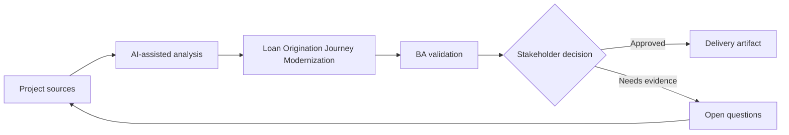

# Loan Origination Journey Modernization

<div class="case-meta">
  <span>Domain project scenarios</span>
  <span>Banking and lending</span>
  <span>Domain workflow</span>
  <span>Core</span>
  <span>Loan journey map</span>
  <span>Project use case</span>
</div>

## Project context

A bank modernizes loan origination for small business customers. The project covers eligibility, document upload, risk assessment, approval workflow, customer notifications, and audit evidence. In Banking and lending, this work usually starts when domain policies, operational exceptions, and regulatory expectations shape what the product can safely do. The BA should treat Credit policy and Loan application forms as evidence to organize, not as raw material for an unconstrained AI answer. The goal is to make the next decision clearer for the people who own the outcome.

## BA challenge

The BA must coordinate regulated requirements across customer experience, credit policy, compliance, operations, and technology. AI can accelerate analysis, but every rule must be source-backed and every automated decision must have review and audit controls. For Loan Origination Journey Modernization, the practical difficulty is policy hallucination and exception blindness. AI can accelerate domain-rule extraction, exception mapping, safe-message drafting, and owner review, but the BA must still expose assumptions, missing approvals, and the point where stakeholder judgment is required.

## Where AI fits

<div class="ba-workbench-panel">
AI fits this Domain project scenarios use case when it is constrained to domain-rule extraction, exception mapping, safe-message drafting, and owner review. A useful first AI task is: Map the end-to-end customer and operations journey. AI should not approve scope, invent policy, bypass policy sources, operational samples, compliance constraints, and domain-owner decisions, or turn a draft into a final decision.
</div>

- Map the end-to-end customer and operations journey.
- Extract credit policy rules and document requirements.
- Generate exception scenarios for manual review and escalation.
- Draft traceable requirements for eligibility, notifications, and audit.

## Inputs to prepare

- Credit policy
- Loan application forms
- Operations SOP
- Regulatory guidance
- Customer complaint themes

Before prompting for Loan Origination Journey Modernization, label each input by owner, date, approval status, sensitivity, and role in the decision. The most important evidence lens is policy sources, operational samples, compliance constraints, and domain-owner decisions; without it, AI may rank old notes, draft designs, and approved rules as if they had equal authority.

## BA workflow

1. Build a journey map across customer, system, credit analyst, and operations roles.
2. Ask AI to extract policy rules and required documents with source IDs.
3. Identify decision points that need human review or audit.
4. Draft requirements for eligibility checks, document intake, status visibility, and notifications.
5. Review policy and compliance claims with accountable owners.
6. Create acceptance criteria and traceability for regulated decisions.

Run the workflow as domain validation before implementation detail: start with "Build a journey map across customer, system, credit analyst, and operations roles.", then keep a visible decision log as the artifact moves toward Loan journey map. This prevents AI suggestions from silently becoming backlog, design, release, or operational commitments.

## Diagram



## Deliverables

| Deliverable | What it contains | Owner | Done signal |
| --- | --- | --- | --- |
| Loan journey map | Customer steps, system steps, credit review, exceptions, and status messages | BA | All actors and handoffs are visible |
| Policy rule matrix | Rule, source, threshold, decision owner, and automation eligibility | Credit policy owner | Rules are source-backed |
| Exception workflow | Manual review trigger, queue, SLA, and customer communication | Operations | Risky cases have human path |
| Audit requirement set | Evidence captured, retention, reviewer, and decision trace | Compliance | Auditors can reconstruct decisions |

Treat Loan journey map as a BA-owned domain-specific requirement pack. AI may draft structure, but the BA must validate whether "All actors and handoffs are visible" is actually true, whether the artifact is traceable to source evidence, and whether the receiving team can act on it.

## Prompt to try

```text
Act as a senior AI-aware Business Analyst. Help me apply the "Loan Origination Journey Modernization" use case to my project. First ask for source evidence and constraints. Then create a structured analysis with project context, assumptions, AI-fit boundary, workflow steps, deliverables, risks, controls, open questions, and stakeholder decisions. Do not invent policy, thresholds, or approvals.
```

## Review checklist

- Credit policy is labeled with owner, date, approval status, and sensitivity.
- Loan journey map traces to source evidence and has a named human owner.
- The AI task stays inside domain-rule extraction, exception mapping, safe-message drafting, and owner review and does not approve scope or policy.
- The "Regulatory misinterpretation" risk has a practical control: Use exact source references and compliance validation.
- Open assumptions are converted into validation questions or stakeholder decisions.
- Success metric: The modernized loan journey is faster for customers while credit decisions remain explainable and compliant.

## Risks and controls

| Risk | Why it matters | BA control |
| --- | --- | --- |
| Regulatory misinterpretation | AI may paraphrase policy incorrectly | Use exact source references and compliance validation |
| Unfair automation | Eligibility rules may affect customers materially | Define human review and appeal path |
| Document friction | Customers may fail due to unclear upload requirements | Specify guidance, status, and resubmission flow |
| Audit gap | Decisions may not be explainable later | Capture evidence, source, and reviewer |

The main control for the "Regulatory misinterpretation" risk is explicit human accountability: Use exact source references and compliance validation. If evidence is weak, the output should create a validation question or decision item, not a final requirement.
