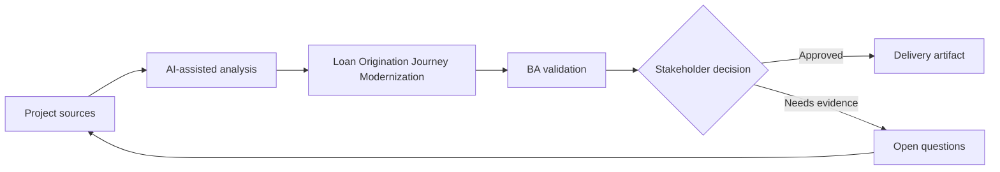

# Loan Origination Journey Modernization

<div class="case-meta">
  <span>Domain project scenarios</span>
  <span>Banking and lending</span>
  <span>Project use case</span>
</div>

## Project context

A bank modernizes loan origination for small business customers. The project covers eligibility, document upload, risk assessment, approval workflow, customer notifications, and audit evidence. In a real delivery environment, this work usually appears under time pressure: stakeholders want clarity, delivery needs a backlog, QA needs testable behavior, and operations needs a process that can survive exceptions. The BA uses AI here to accelerate analysis and synthesis, but the BA remains accountable for evidence, business meaning, stakeholder decisioning, and artifact quality.

## BA challenge

The BA must coordinate regulated requirements across customer experience, credit policy, compliance, operations, and technology. AI can accelerate analysis, but every rule must be source-backed and every automated decision must have review and audit controls. The practical difficulty is that AI can make early material look more complete than it is. A strong BA keeps the output reviewable by separating source-backed facts, assumptions, unsupported claims, decision gaps, and recommended next actions. The objective is not to make the document longer; it is to make the project decision clearer and safer.

## Where AI fits

<div class="ba-workbench-panel">
AI is useful in this use case when it is constrained to analysis support, pattern detection, structured drafting, and critique. It should not approve scope, invent policy, decide business trade-offs, or replace accountable stakeholder judgment.
</div>

- Map the end-to-end customer and operations journey.
- Extract credit policy rules and document requirements.
- Generate exception scenarios for manual review and escalation.
- Draft traceable requirements for eligibility, notifications, and audit.

## Inputs to prepare

- Credit policy
- Loan application forms
- Operations SOP
- Regulatory guidance
- Customer complaint themes

A BA should label these inputs before using AI: source owner, source date, approval status, sensitivity level, and whether the source is fact, opinion, policy, draft, or historical evidence. This preparation prevents the model from treating every input as equally current and authoritative.

## BA workflow

1. Build a journey map across customer, system, credit analyst, and operations roles.
2. Ask AI to extract policy rules and required documents with source IDs.
3. Identify decision points that need human review or audit.
4. Draft requirements for eligibility checks, document intake, status visibility, and notifications.
5. Review policy and compliance claims with accountable owners.
6. Create acceptance criteria and traceability for regulated decisions.

The workflow works best as a staged AI collaboration: first organize the evidence, then ask for analysis, then create the artifact, then run a critique pass. The BA should keep a visible decision log throughout the process so that AI-generated suggestions do not silently become approved scope.

## Diagram



## Deliverables

| Deliverable | What it contains | Owner | Done signal |
| --- | --- | --- | --- |
| Loan journey map | Customer steps, system steps, credit review, exceptions, and status messages | BA | All actors and handoffs are visible |
| Policy rule matrix | Rule, source, threshold, decision owner, and automation eligibility | Credit policy owner | Rules are source-backed |
| Exception workflow | Manual review trigger, queue, SLA, and customer communication | Operations | Risky cases have human path |
| Audit requirement set | Evidence captured, retention, reviewer, and decision trace | Compliance | Auditors can reconstruct decisions |

These deliverables should be treated as BA-owned artifacts. AI can draft them, but the BA must validate source support, stakeholder meaning, traceability, and whether the artifact is ready for handoff.

## Prompt to try

```text
Act as a senior AI-aware Business Analyst. Help me apply the "Loan Origination Journey Modernization" use case to my project. First ask for source evidence and constraints. Then create a structured analysis with project context, assumptions, AI-fit boundary, workflow steps, deliverables, risks, controls, open questions, and stakeholder decisions. Do not invent policy, thresholds, or approvals.
```

## Review checklist

- Every AI-produced statement is tied to a source, assumption, or validation question.
- The BA has separated drafting assistance from business approval.
- Workflow steps identify the human owner for decisions, review, and exceptions.
- Deliverables are traceable to project inputs and can be reviewed by QA, product, or operations.
- Risk controls are practical enough to be used in a real project meeting.
- Success metric: The modernized loan journey is faster for customers while credit decisions remain explainable and compliant.

## Risks and controls

| Risk | Why it matters | BA control |
| --- | --- | --- |
| Regulatory misinterpretation | AI may paraphrase policy incorrectly | Use exact source references and compliance validation |
| Unfair automation | Eligibility rules may affect customers materially | Define human review and appeal path |
| Document friction | Customers may fail due to unclear upload requirements | Specify guidance, status, and resubmission flow |
| Audit gap | Decisions may not be explainable later | Capture evidence, source, and reviewer |

The key control is to make uncertainty visible. If evidence is weak, the output should create a validation question or decision item, not a final requirement. If the artifact influences delivery, release, compliance, customer experience, or operational workload, the BA should require explicit human review before handoff.
