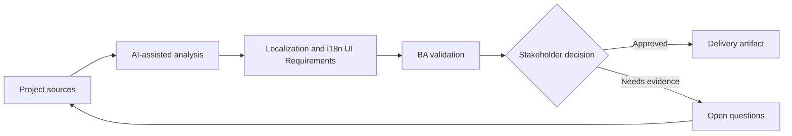

# Localization and i18n UI Requirements

<div class="case-meta">
  <span>Frontend, UI, and UX</span>
  <span>Localization</span>
  <span>Project use case</span>
</div>

## Project context

A SaaS product expands to multiple markets. The same screens must handle translated copy, locale-specific date formats, currencies, addresses, names, pluralization, and regulatory text. In a real delivery environment, this work usually appears under time pressure: stakeholders want clarity, delivery needs a backlog, QA needs testable behavior, and operations needs a process that can survive exceptions. The BA uses AI here to accelerate analysis and synthesis, but the BA remains accountable for evidence, business meaning, stakeholder decisioning, and artifact quality.

## BA challenge

The BA must capture localization requirements before UI and backend assumptions become hardcoded. This includes content length, formatting rules, legal copy, timezone behavior, and user locale selection. The practical difficulty is that AI can make early material look more complete than it is. A strong BA keeps the output reviewable by separating source-backed facts, assumptions, unsupported claims, decision gaps, and recommended next actions. The objective is not to make the document longer; it is to make the project decision clearer and safer.

## Where AI fits

<div class="ba-workbench-panel">
AI is useful in this use case when it is constrained to analysis support, pattern detection, structured drafting, and critique. It should not approve scope, invent policy, decide business trade-offs, or replace accountable stakeholder judgment.
</div>

- Generate localization risk checklist from UI copy and data fields.
- Identify locale-sensitive formats and backend dependencies.
- Draft i18n acceptance criteria for frontend components.
- Review translated copy risks such as length, tone, and regulatory terms.

## Inputs to prepare

- UI copy catalog
- Market list
- Data field definitions
- Legal text requirements
- Locale and timezone rules

A BA should label these inputs before using AI: source owner, source date, approval status, sensitivity level, and whether the source is fact, opinion, policy, draft, or historical evidence. This preparation prevents the model from treating every input as equally current and authoritative.

## BA workflow

1. List markets, locales, formats, and regulatory copy differences.
2. Ask AI to find UI elements likely to break when translated.
3. Define formatting requirements for date, number, currency, address, name, and timezone.
4. Review backend storage and display responsibilities.
5. Write acceptance criteria for locale switching and fallback behavior.
6. Create QA matrix for high-risk locales and long translations.

The workflow works best as a staged AI collaboration: first organize the evidence, then ask for analysis, then create the artifact, then run a critique pass. The BA should keep a visible decision log throughout the process so that AI-generated suggestions do not silently become approved scope.

## Diagram



## Deliverables

| Deliverable | What it contains | Owner | Done signal |
| --- | --- | --- | --- |
| Localization requirement matrix | Field, locale rule, UI behavior, backend dependency, and owner | BA | Locale-sensitive behavior is explicit |
| Copy expansion risk list | Component, source text, length risk, and fallback | UX and localization | UI can handle translation |
| Formatting rule table | Date, currency, address, number, name, and timezone rules | Backend and frontend | Formatting ownership is clear |
| i18n QA matrix | Locale, viewport, data example, and expected output | QA | Key locales are tested |

These deliverables should be treated as BA-owned artifacts. AI can draft them, but the BA must validate source support, stakeholder meaning, traceability, and whether the artifact is ready for handoff.

## Prompt to try

```text
Act as a senior AI-aware Business Analyst. Help me apply the "Localization and i18n UI Requirements" use case to my project. First ask for source evidence and constraints. Then create a structured analysis with project context, assumptions, AI-fit boundary, workflow steps, deliverables, risks, controls, open questions, and stakeholder decisions. Do not invent policy, thresholds, or approvals.
```

## Review checklist

- Every AI-produced statement is tied to a source, assumption, or validation question.
- The BA has separated drafting assistance from business approval.
- Workflow steps identify the human owner for decisions, review, and exceptions.
- Deliverables are traceable to project inputs and can be reviewed by QA, product, or operations.
- Risk controls are practical enough to be used in a real project meeting.
- Success metric: Localized UI behavior is testable before market rollout and avoids hardcoded assumptions.

## Risks and controls

| Risk | Why it matters | BA control |
| --- | --- | --- |
| Hardcoded locale | UI may fail in target markets | Specify locale-sensitive rules early |
| Copy overflow | Translated text may break layout | Test long translations and responsive behavior |
| Regulatory copy error | Legal text may vary by market | Require legal review per market |
| Timezone confusion | Dates may be shown incorrectly | Define storage and display timezone rules |

The key control is to make uncertainty visible. If evidence is weak, the output should create a validation question or decision item, not a final requirement. If the artifact influences delivery, release, compliance, customer experience, or operational workload, the BA should require explicit human review before handoff.
