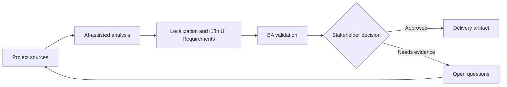

# Localization and i18n UI Requirements

<div class="case-meta">
  <span>Frontend, UI, and UX</span>
  <span>Localization</span>
  <span>Frontend/UI refinement</span>
  <span>Practitioner</span>
  <span>Localization requirement matrix</span>
  <span>Project use case</span>
</div>

## Project context

A SaaS product expands to multiple markets. The same screens must handle translated copy, locale-specific date formats, currencies, addresses, names, pluralization, and regulatory text. In Localization, this work usually starts when screen behavior, accessibility, design states, analytics, and user feedback must become implementable requirements. The BA should treat UI copy catalog and Market list as evidence to organize, not as raw material for an unconstrained AI answer. The goal is to make the next decision clearer for the people who own the outcome.

## BA challenge

The BA must capture localization requirements before UI and backend assumptions become hardcoded. This includes content length, formatting rules, legal copy, timezone behavior, and user locale selection. For Localization and i18n UI Requirements, the practical difficulty is missing states and unmeasurable UX. AI can accelerate UI-state analysis, content critique, accessibility review, event taxonomy, and edge-case discovery, but the BA must still expose assumptions, missing approvals, and the point where stakeholder judgment is required.

## Where AI fits

<div class="ba-workbench-panel">
AI fits this Frontend, UI, and UX use case when it is constrained to UI-state analysis, content critique, accessibility review, event taxonomy, and edge-case discovery. A useful first AI task is: Generate localization risk checklist from UI copy and data fields. AI should not approve scope, invent policy, bypass wireframes, design tokens, user journeys, analytics questions, and accessibility expectations, or turn a draft into a final decision.
</div>

- Generate localization risk checklist from UI copy and data fields.
- Identify locale-sensitive formats and backend dependencies.
- Draft i18n acceptance criteria for frontend components.
- Review translated copy risks such as length, tone, and regulatory terms.

## Inputs to prepare

- UI copy catalog
- Market list
- Data field definitions
- Legal text requirements
- Locale and timezone rules

Before prompting for Localization and i18n UI Requirements, label each input by owner, date, approval status, sensitivity, and role in the decision. The most important evidence lens is wireframes, design tokens, user journeys, analytics questions, and accessibility expectations; without it, AI may rank old notes, draft designs, and approved rules as if they had equal authority.

## BA workflow

1. List markets, locales, formats, and regulatory copy differences.
2. Ask AI to find UI elements likely to break when translated.
3. Define formatting requirements for date, number, currency, address, name, and timezone.
4. Review backend storage and display responsibilities.
5. Write acceptance criteria for locale switching and fallback behavior.
6. Create QA matrix for high-risk locales and long translations.

Run the workflow as screen-state review before frontend build: start with "List markets, locales, formats, and regulatory copy differences.", then keep a visible decision log as the artifact moves toward Localization requirement matrix. This prevents AI suggestions from silently becoming backlog, design, release, or operational commitments.

## Diagram



## Deliverables

| Deliverable | What it contains | Owner | Done signal |
| --- | --- | --- | --- |
| Localization requirement matrix | Field, locale rule, UI behavior, backend dependency, and owner | BA | Locale-sensitive behavior is explicit |
| Copy expansion risk list | Component, source text, length risk, and fallback | UX and localization | UI can handle translation |
| Formatting rule table | Date, currency, address, number, name, and timezone rules | Backend and frontend | Formatting ownership is clear |
| i18n QA matrix | Locale, viewport, data example, and expected output | QA | Key locales are tested |

Treat Localization requirement matrix as a BA-owned frontend requirement specification. AI may draft structure, but the BA must validate whether "Locale-sensitive behavior is explicit" is actually true, whether the artifact is traceable to source evidence, and whether the receiving team can act on it.

## Prompt to try

```text
Act as a senior AI-aware Business Analyst. Help me apply the "Localization and i18n UI Requirements" use case to my project. First ask for source evidence and constraints. Then create a structured analysis with project context, assumptions, AI-fit boundary, workflow steps, deliverables, risks, controls, open questions, and stakeholder decisions. Do not invent policy, thresholds, or approvals.
```

## Review checklist

- UI copy catalog is labeled with owner, date, approval status, and sensitivity.
- Localization requirement matrix traces to source evidence and has a named human owner.
- The AI task stays inside UI-state analysis, content critique, accessibility review, event taxonomy, and edge-case discovery and does not approve scope or policy.
- The "Hardcoded locale" risk has a practical control: Specify locale-sensitive rules early.
- Open assumptions are converted into validation questions or stakeholder decisions.
- Success metric: Localized UI behavior is testable before market rollout and avoids hardcoded assumptions.

## Risks and controls

| Risk | Why it matters | BA control |
| --- | --- | --- |
| Hardcoded locale | UI may fail in target markets | Specify locale-sensitive rules early |
| Copy overflow | Translated text may break layout | Test long translations and responsive behavior |
| Regulatory copy error | Legal text may vary by market | Require legal review per market |
| Timezone confusion | Dates may be shown incorrectly | Define storage and display timezone rules |

The main control for the "Hardcoded locale" risk is explicit human accountability: Specify locale-sensitive rules early. If evidence is weak, the output should create a validation question or decision item, not a final requirement.
