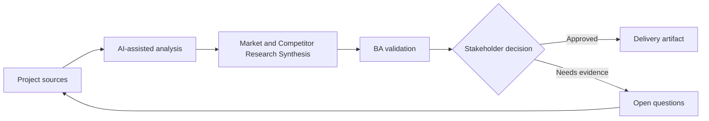

# Market and Competitor Research Synthesis

<div class="case-meta">
  <span>Discovery and alignment</span>
  <span>Product strategy</span>
  <span>Project use case</span>
</div>

## Project context

A SaaS team explores whether to add workflow automation features. Product leadership collects competitor pages, analyst reports, customer feedback, and sales notes, then asks the BA to synthesize implications for the roadmap. In a real delivery environment, this work usually appears under time pressure: stakeholders want clarity, delivery needs a backlog, QA needs testable behavior, and operations needs a process that can survive exceptions. The BA uses AI here to accelerate analysis and synthesis, but the BA remains accountable for evidence, business meaning, stakeholder decisioning, and artifact quality.

## BA challenge

The BA must turn broad market signals into product-relevant hypotheses, capability themes, customer segments, differentiation options, and validation questions. AI can summarize sources quickly, but it can also blur evidence quality and overstate weak market claims. The practical difficulty is that AI can make early material look more complete than it is. A strong BA keeps the output reviewable by separating source-backed facts, assumptions, unsupported claims, decision gaps, and recommended next actions. The objective is not to make the document longer; it is to make the project decision clearer and safer.

## Where AI fits

<div class="ba-workbench-panel">
AI is useful in this use case when it is constrained to analysis support, pattern detection, structured drafting, and critique. It should not approve scope, invent policy, decide business trade-offs, or replace accountable stakeholder judgment.
</div>

- Summarize competitor capabilities by source.
- Cluster customer pains and market claims into capability themes.
- Separate observed evidence from analyst opinion and sales anecdote.
- Generate roadmap hypotheses and validation experiments.

## Inputs to prepare

- Competitor pages
- Analyst notes
- Win-loss notes
- Customer feedback
- Current product capability map

A BA should label these inputs before using AI: source owner, source date, approval status, sensitivity level, and whether the source is fact, opinion, policy, draft, or historical evidence. This preparation prevents the model from treating every input as equally current and authoritative.

## BA workflow

1. Create a source inventory with evidence type and freshness.
2. Ask AI to summarize each source separately before synthesis.
3. Cluster capabilities by user problem, not competitor feature name.
4. Map themes to current product gaps and strategic options.
5. Identify claims that require customer validation.
6. Produce a decision memo for roadmap discussion.

The workflow works best as a staged AI collaboration: first organize the evidence, then ask for analysis, then create the artifact, then run a critique pass. The BA should keep a visible decision log throughout the process so that AI-generated suggestions do not silently become approved scope.

## Diagram



## Deliverables

| Deliverable | What it contains | Owner | Done signal |
| --- | --- | --- | --- |
| Research synthesis memo | Themes, evidence strength, sources, and product implications | BA | Each claim is tied to source type |
| Capability comparison | Competitor capability, user problem, current product support, and gap | Product manager | Comparison avoids feature-name copying |
| Hypothesis backlog | Roadmap hypotheses, evidence needed, and validation method | Product owner | High-value hypotheses have experiment plan |
| Decision memo | Options, trade-offs, risks, and recommendation | Product leadership | Recommendation separates evidence from assumption |

These deliverables should be treated as BA-owned artifacts. AI can draft them, but the BA must validate source support, stakeholder meaning, traceability, and whether the artifact is ready for handoff.

## Prompt to try

```text
Act as a senior AI-aware Business Analyst. Help me apply the "Market and Competitor Research Synthesis" use case to my project. First ask for source evidence and constraints. Then create a structured analysis with project context, assumptions, AI-fit boundary, workflow steps, deliverables, risks, controls, open questions, and stakeholder decisions. Do not invent policy, thresholds, or approvals.
```

## Review checklist

- Every AI-produced statement is tied to a source, assumption, or validation question.
- The BA has separated drafting assistance from business approval.
- Workflow steps identify the human owner for decisions, review, and exceptions.
- Deliverables are traceable to project inputs and can be reviewed by QA, product, or operations.
- Risk controls are practical enough to be used in a real project meeting.
- Success metric: Roadmap discussion uses validated hypotheses and evidence strength instead of generic competitor feature lists.

## Risks and controls

| Risk | Why it matters | BA control |
| --- | --- | --- |
| Source overreach | AI may treat marketing copy as proven capability | Label source type and evidence strength |
| Copycat roadmap | Team may copy competitor features without user problem fit | Map every theme to target segment and user outcome |
| Confirmation bias | Leadership may prefer evidence supporting an existing idea | Include disconfirming signals and open risks |
| Stale research | Competitor pages and reports change quickly | Record source date and freshness confidence |

The key control is to make uncertainty visible. If evidence is weak, the output should create a validation question or decision item, not a final requirement. If the artifact influences delivery, release, compliance, customer experience, or operational workload, the BA should require explicit human review before handoff.
