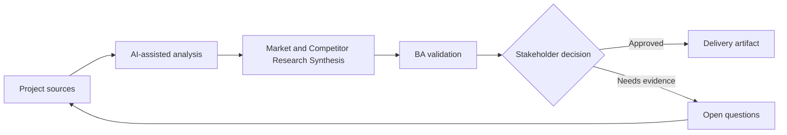

# Market and Competitor Research Synthesis

<div class="case-meta">
  <span>Discovery and alignment</span>
  <span>Product strategy</span>
  <span>Project use case</span>
</div>

## Project context

A SaaS team explores whether to add workflow automation features. Product leadership collects competitor pages, analyst reports, customer feedback, and sales notes, then asks the BA to synthesize implications for the roadmap. In Product strategy, this work usually starts when stakeholders describe the same problem from different incentives and levels of detail. The BA should treat Competitor pages and Analyst notes as evidence to organize, not as raw material for an unconstrained AI answer. The goal is to make the next decision clearer for the people who own the outcome.

## BA challenge

The BA must turn broad market signals into product-relevant hypotheses, capability themes, customer segments, differentiation options, and validation questions. AI can summarize sources quickly, but it can also blur evidence quality and overstate weak market claims. For Market and Competitor Research Synthesis, the practical difficulty is false consensus and invented scope. AI can accelerate sensemaking, contradiction detection, question generation, and workshop preparation, but the BA must still expose assumptions, missing approvals, and the point where stakeholder judgment is required.

## Where AI fits

<div class="ba-workbench-panel">
AI fits this Discovery and alignment use case when it is constrained to sensemaking, contradiction detection, question generation, and workshop preparation. A useful first AI task is: Summarize competitor capabilities by source. AI should not approve scope, invent policy, bypass speaker attribution, decision authority, and source freshness, or turn a draft into a final decision.
</div>

- Summarize competitor capabilities by source.
- Cluster customer pains and market claims into capability themes.
- Separate observed evidence from analyst opinion and sales anecdote.
- Generate roadmap hypotheses and validation experiments.

## Inputs to prepare

- Competitor pages
- Analyst notes
- Win-loss notes
- Customer feedback
- Current product capability map

Before prompting for Market and Competitor Research Synthesis, label each input by owner, date, approval status, sensitivity, and role in the decision. The most important evidence lens is speaker attribution, decision authority, and source freshness; without it, AI may rank old notes, draft designs, and approved rules as if they had equal authority.

## BA workflow

1. Create a source inventory with evidence type and freshness.
2. Ask AI to summarize each source separately before synthesis.
3. Cluster capabilities by user problem, not competitor feature name.
4. Map themes to current product gaps and strategic options.
5. Identify claims that require customer validation.
6. Produce a decision memo for roadmap discussion.

Run the workflow as evidence grouping before solution discussion: start with "Create a source inventory with evidence type and freshness.", then keep a visible decision log as the artifact moves toward Research synthesis memo. This prevents AI suggestions from silently becoming backlog, design, release, or operational commitments.

## Diagram



## Deliverables

| Deliverable | What it contains | Owner | Done signal |
| --- | --- | --- | --- |
| Research synthesis memo | Themes, evidence strength, sources, and product implications | BA | Each claim is tied to source type |
| Capability comparison | Competitor capability, user problem, current product support, and gap | Product manager | Comparison avoids feature-name copying |
| Hypothesis backlog | Roadmap hypotheses, evidence needed, and validation method | Product owner | High-value hypotheses have experiment plan |
| Decision memo | Options, trade-offs, risks, and recommendation | Product leadership | Recommendation separates evidence from assumption |

Treat Research synthesis memo as a BA-owned alignment artifact. AI may draft structure, but the BA must validate whether "Each claim is tied to source type" is actually true, whether the artifact is traceable to source evidence, and whether the receiving team can act on it.

## Prompt to try

```text
Act as a senior AI-aware Business Analyst. Help me apply the "Market and Competitor Research Synthesis" use case to my project. First ask for source evidence and constraints. Then create a structured analysis with project context, assumptions, AI-fit boundary, workflow steps, deliverables, risks, controls, open questions, and stakeholder decisions. Do not invent policy, thresholds, or approvals.
```

## Review checklist

- Competitor pages is labeled with owner, date, approval status, and sensitivity.
- Research synthesis memo traces to source evidence and has a named human owner.
- The AI task stays inside sensemaking, contradiction detection, question generation, and workshop preparation and does not approve scope or policy.
- The "Source overreach" risk has a practical control: Label source type and evidence strength.
- Open assumptions are converted into validation questions or stakeholder decisions.
- Success metric: Roadmap discussion uses validated hypotheses and evidence strength instead of generic competitor feature lists.

## Risks and controls

| Risk | Why it matters | BA control |
| --- | --- | --- |
| Source overreach | AI may treat marketing copy as proven capability | Label source type and evidence strength |
| Copycat roadmap | Team may copy competitor features without user problem fit | Map every theme to target segment and user outcome |
| Confirmation bias | Leadership may prefer evidence supporting an existing idea | Include disconfirming signals and open risks |
| Stale research | Competitor pages and reports change quickly | Record source date and freshness confidence |

The main control for the "Source overreach" risk is explicit human accountability: Label source type and evidence strength. If evidence is weak, the output should create a validation question or decision item, not a final requirement.
