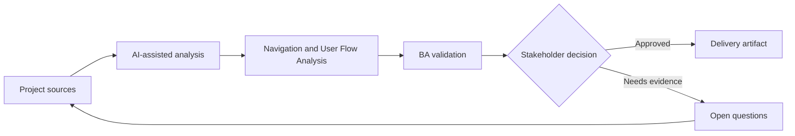

# Navigation and User Flow Analysis

<div class="case-meta">
  <span>Frontend, UI, and UX</span>
  <span>User flows</span>
  <span>Project use case</span>
</div>

## Project context

A customer portal adds new sections for billing, documents, support cases, and settings. Stakeholders disagree about navigation labels, entry points, and which tasks should be one click away. In User flows, this work usually starts when screen behavior, accessibility, design states, analytics, and user feedback must become implementable requirements. The BA should treat User journey map and Task inventory as evidence to organize, not as raw material for an unconstrained AI answer. The goal is to make the next decision clearer for the people who own the outcome.

## BA challenge

The BA must translate user goals into navigation requirements, not just menu labels. The BA needs to define task priority, entry points, breadcrumbs, deep links, permission-based visibility, and failure paths. For Navigation and User Flow Analysis, the practical difficulty is missing states and unmeasurable UX. AI can accelerate UI-state analysis, content critique, accessibility review, event taxonomy, and edge-case discovery, but the BA must still expose assumptions, missing approvals, and the point where stakeholder judgment is required.

## Where AI fits

<div class="ba-workbench-panel">
AI fits this Frontend, UI, and UX use case when it is constrained to UI-state analysis, content critique, accessibility review, event taxonomy, and edge-case discovery. A useful first AI task is: Cluster tasks by user goal and frequency. AI should not approve scope, invent policy, bypass wireframes, design tokens, user journeys, analytics questions, and accessibility expectations, or turn a draft into a final decision.
</div>

- Cluster tasks by user goal and frequency.
- Generate navigation questions and alternative IA structures.
- Identify permission-based navigation differences.
- Draft user-flow diagrams and acceptance criteria.

## Inputs to prepare

- User journey map
- Task inventory
- Analytics or support data
- Permission rules
- Current navigation

Before prompting for Navigation and User Flow Analysis, label each input by owner, date, approval status, sensitivity, and role in the decision. The most important evidence lens is wireframes, design tokens, user journeys, analytics questions, and accessibility expectations; without it, AI may rank old notes, draft designs, and approved rules as if they had equal authority.

## BA workflow

1. Create task inventory with frequency, role, and business value.
2. Ask AI to propose navigation groupings and label risks.
3. Validate labels with user language and domain terminology.
4. Define entry points, deep links, breadcrumbs, and empty permission states.
5. Write acceptance criteria for role-based navigation visibility.
6. Review with UX, product, frontend, and support.

Run the workflow as screen-state review before frontend build: start with "Create task inventory with frequency, role, and business value.", then keep a visible decision log as the artifact moves toward Task-to-navigation map. This prevents AI suggestions from silently becoming backlog, design, release, or operational commitments.

## Diagram



## Deliverables

| Deliverable | What it contains | Owner | Done signal |
| --- | --- | --- | --- |
| Task-to-navigation map | Task, user role, entry point, label, frequency, and priority | BA and UX | Navigation supports priority tasks |
| User flow diagram | Entry, path, decision, permission, and fallback | UX | Flow covers key journeys |
| Navigation acceptance criteria | Role visibility, deep link, breadcrumb, and redirect behavior | BA | Frontend can implement safely |
| Label decision log | Label options, rationale, evidence, and owner | Product owner | Naming decisions are explicit |

Treat Task-to-navigation map as a BA-owned frontend requirement specification. AI may draft structure, but the BA must validate whether "Navigation supports priority tasks" is actually true, whether the artifact is traceable to source evidence, and whether the receiving team can act on it.

## Prompt to try

```text
Act as a senior AI-aware Business Analyst. Help me apply the "Navigation and User Flow Analysis" use case to my project. First ask for source evidence and constraints. Then create a structured analysis with project context, assumptions, AI-fit boundary, workflow steps, deliverables, risks, controls, open questions, and stakeholder decisions. Do not invent policy, thresholds, or approvals.
```

## Review checklist

- User journey map is labeled with owner, date, approval status, and sensitivity.
- Task-to-navigation map traces to source evidence and has a named human owner.
- The AI task stays inside UI-state analysis, content critique, accessibility review, event taxonomy, and edge-case discovery and does not approve scope or policy.
- The "Org-chart navigation" risk has a practical control: Cluster by user task and language.
- Open assumptions are converted into validation questions or stakeholder decisions.
- Success metric: Navigation choices are backed by user tasks, role rules, and testable flow behavior.

## Risks and controls

| Risk | Why it matters | BA control |
| --- | --- | --- |
| Org-chart navigation | Menus may reflect internal teams instead of user goals | Cluster by user task and language |
| Permission dead end | Users may see links they cannot use | Specify role visibility and redirects |
| Deep link failure | Shared links may break for unauthorized users | Define access and fallback behavior |
| Label ambiguity | Users may not understand menu terms | Validate labels with user language |

The main control for the "Org-chart navigation" risk is explicit human accountability: Cluster by user task and language. If evidence is weak, the output should create a validation question or decision item, not a final requirement.
