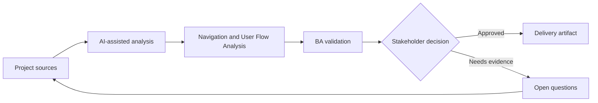

# Navigation and User Flow Analysis

<div class="case-meta">
  <span>Frontend, UI, and UX</span>
  <span>User flows</span>
  <span>Project use case</span>
</div>

## Project context

A customer portal adds new sections for billing, documents, support cases, and settings. Stakeholders disagree about navigation labels, entry points, and which tasks should be one click away. In a real delivery environment, this work usually appears under time pressure: stakeholders want clarity, delivery needs a backlog, QA needs testable behavior, and operations needs a process that can survive exceptions. The BA uses AI here to accelerate analysis and synthesis, but the BA remains accountable for evidence, business meaning, stakeholder decisioning, and artifact quality.

## BA challenge

The BA must translate user goals into navigation requirements, not just menu labels. The BA needs to define task priority, entry points, breadcrumbs, deep links, permission-based visibility, and failure paths. The practical difficulty is that AI can make early material look more complete than it is. A strong BA keeps the output reviewable by separating source-backed facts, assumptions, unsupported claims, decision gaps, and recommended next actions. The objective is not to make the document longer; it is to make the project decision clearer and safer.

## Where AI fits

<div class="ba-workbench-panel">
AI is useful in this use case when it is constrained to analysis support, pattern detection, structured drafting, and critique. It should not approve scope, invent policy, decide business trade-offs, or replace accountable stakeholder judgment.
</div>

- Cluster tasks by user goal and frequency.
- Generate navigation questions and alternative IA structures.
- Identify permission-based navigation differences.
- Draft user-flow diagrams and acceptance criteria.

## Inputs to prepare

- User journey map
- Task inventory
- Analytics or support data
- Permission rules
- Current navigation

A BA should label these inputs before using AI: source owner, source date, approval status, sensitivity level, and whether the source is fact, opinion, policy, draft, or historical evidence. This preparation prevents the model from treating every input as equally current and authoritative.

## BA workflow

1. Create task inventory with frequency, role, and business value.
2. Ask AI to propose navigation groupings and label risks.
3. Validate labels with user language and domain terminology.
4. Define entry points, deep links, breadcrumbs, and empty permission states.
5. Write acceptance criteria for role-based navigation visibility.
6. Review with UX, product, frontend, and support.

The workflow works best as a staged AI collaboration: first organize the evidence, then ask for analysis, then create the artifact, then run a critique pass. The BA should keep a visible decision log throughout the process so that AI-generated suggestions do not silently become approved scope.

## Diagram



## Deliverables

| Deliverable | What it contains | Owner | Done signal |
| --- | --- | --- | --- |
| Task-to-navigation map | Task, user role, entry point, label, frequency, and priority | BA and UX | Navigation supports priority tasks |
| User flow diagram | Entry, path, decision, permission, and fallback | UX | Flow covers key journeys |
| Navigation acceptance criteria | Role visibility, deep link, breadcrumb, and redirect behavior | BA | Frontend can implement safely |
| Label decision log | Label options, rationale, evidence, and owner | Product owner | Naming decisions are explicit |

These deliverables should be treated as BA-owned artifacts. AI can draft them, but the BA must validate source support, stakeholder meaning, traceability, and whether the artifact is ready for handoff.

## Prompt to try

```text
Act as a senior AI-aware Business Analyst. Help me apply the "Navigation and User Flow Analysis" use case to my project. First ask for source evidence and constraints. Then create a structured analysis with project context, assumptions, AI-fit boundary, workflow steps, deliverables, risks, controls, open questions, and stakeholder decisions. Do not invent policy, thresholds, or approvals.
```

## Review checklist

- Every AI-produced statement is tied to a source, assumption, or validation question.
- The BA has separated drafting assistance from business approval.
- Workflow steps identify the human owner for decisions, review, and exceptions.
- Deliverables are traceable to project inputs and can be reviewed by QA, product, or operations.
- Risk controls are practical enough to be used in a real project meeting.
- Success metric: Navigation choices are backed by user tasks, role rules, and testable flow behavior.

## Risks and controls

| Risk | Why it matters | BA control |
| --- | --- | --- |
| Org-chart navigation | Menus may reflect internal teams instead of user goals | Cluster by user task and language |
| Permission dead end | Users may see links they cannot use | Specify role visibility and redirects |
| Deep link failure | Shared links may break for unauthorized users | Define access and fallback behavior |
| Label ambiguity | Users may not understand menu terms | Validate labels with user language |

The key control is to make uncertainty visible. If evidence is weak, the output should create a validation question or decision item, not a final requirement. If the artifact influences delivery, release, compliance, customer experience, or operational workload, the BA should require explicit human review before handoff.
