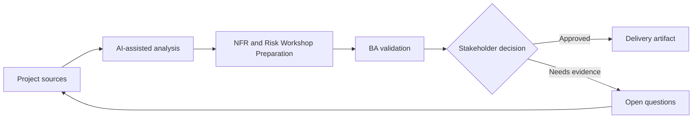

# NFR and Risk Workshop Preparation

<div class="case-meta">
  <span>Requirements and backlog</span>
  <span>Quality attributes</span>
  <span>Project use case</span>
</div>

## Project context

A team is building a self-service customer portal. Functional scope is clear, but performance, availability, security, accessibility, audit, and support expectations are not documented before architecture decisions. In a real delivery environment, this work usually appears under time pressure: stakeholders want clarity, delivery needs a backlog, QA needs testable behavior, and operations needs a process that can survive exceptions. The BA uses AI here to accelerate analysis and synthesis, but the BA remains accountable for evidence, business meaning, stakeholder decisioning, and artifact quality.

## BA challenge

The BA must prepare an NFR workshop that helps stakeholders make quality trade-offs explicit. AI can propose NFR categories and scenarios, but the BA must translate them into measurable thresholds and business risks. The practical difficulty is that AI can make early material look more complete than it is. A strong BA keeps the output reviewable by separating source-backed facts, assumptions, unsupported claims, decision gaps, and recommended next actions. The objective is not to make the document longer; it is to make the project decision clearer and safer.

## Where AI fits

<div class="ba-workbench-panel">
AI is useful in this use case when it is constrained to analysis support, pattern detection, structured drafting, and critique. It should not approve scope, invent policy, decide business trade-offs, or replace accountable stakeholder judgment.
</div>

- Generate NFR elicitation questions by quality attribute.
- Create risk scenarios and user impact statements.
- Draft measurable candidate thresholds for discussion.
- Map NFRs to acceptance criteria and monitoring signals.

## Inputs to prepare

- Feature scope
- User segments
- Business criticality
- Compliance constraints
- Current system performance notes

A BA should label these inputs before using AI: source owner, source date, approval status, sensitivity level, and whether the source is fact, opinion, policy, draft, or historical evidence. This preparation prevents the model from treating every input as equally current and authoritative.

## BA workflow

1. Ask AI to propose NFR categories relevant to the product context.
2. Convert generic attributes into risk scenarios and user harm.
3. Prepare workshop questions that force trade-off decisions.
4. Draft candidate thresholds and mark them as assumptions.
5. Validate thresholds with business, architecture, security, and support owners.
6. Publish NFR decisions with acceptance and monitoring implications.

The workflow works best as a staged AI collaboration: first organize the evidence, then ask for analysis, then create the artifact, then run a critique pass. The BA should keep a visible decision log throughout the process so that AI-generated suggestions do not silently become approved scope.

## Diagram



## Deliverables

| Deliverable | What it contains | Owner | Done signal |
| --- | --- | --- | --- |
| NFR workshop pack | Quality attributes, risk scenarios, and decision questions | BA | Stakeholders discuss trade-offs |
| NFR requirement table | Attribute, scenario, threshold, owner, and measurement method | BA | Every NFR is measurable |
| Risk register | Risk, impact, likelihood, mitigation, and owner | Project manager | High risks have controls |
| Monitoring map | NFR to operational signal and alert owner | Operations owner | Critical NFRs have monitoring path |

These deliverables should be treated as BA-owned artifacts. AI can draft them, but the BA must validate source support, stakeholder meaning, traceability, and whether the artifact is ready for handoff.

## Prompt to try

```text
Act as a senior AI-aware Business Analyst. Help me apply the "NFR and Risk Workshop Preparation" use case to my project. First ask for source evidence and constraints. Then create a structured analysis with project context, assumptions, AI-fit boundary, workflow steps, deliverables, risks, controls, open questions, and stakeholder decisions. Do not invent policy, thresholds, or approvals.
```

## Review checklist

- Every AI-produced statement is tied to a source, assumption, or validation question.
- The BA has separated drafting assistance from business approval.
- Workflow steps identify the human owner for decisions, review, and exceptions.
- Deliverables are traceable to project inputs and can be reviewed by QA, product, or operations.
- Risk controls are practical enough to be used in a real project meeting.
- Success metric: Quality attributes become measurable requirements and design inputs before architecture is committed.

## Risks and controls

| Risk | Why it matters | BA control |
| --- | --- | --- |
| Vague NFRs | Fast, secure, and reliable are not testable | Use measurable thresholds and scenarios |
| Late quality decisions | Architecture may be chosen before NFRs are known | Run workshop before design lock |
| Stakeholder avoidance | Teams may avoid trade-offs because they are uncomfortable | Frame NFRs as business risk decisions |
| Monitoring gap | A requirement may pass test but fail in production | Map NFRs to operational metrics |

The key control is to make uncertainty visible. If evidence is weak, the output should create a validation question or decision item, not a final requirement. If the artifact influences delivery, release, compliance, customer experience, or operational workload, the BA should require explicit human review before handoff.
