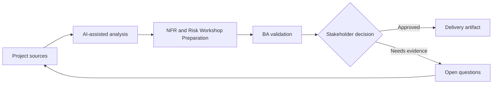

# NFR and Risk Workshop Preparation

<div class="case-meta">
  <span>Requirements and backlog</span>
  <span>Quality attributes</span>
  <span>Refinement</span>
  <span>Core</span>
  <span>NFR workshop pack</span>
  <span>Project use case</span>
</div>

## Project context

A team is building a self-service customer portal. Functional scope is clear, but performance, availability, security, accessibility, audit, and support expectations are not documented before architecture decisions. In Quality attributes, this work usually starts when stories must become testable without losing business rules, exceptions, data needs, or NFRs. The BA should treat Feature scope and User segments as evidence to organize, not as raw material for an unconstrained AI answer. The goal is to make the next decision clearer for the people who own the outcome.

## BA challenge

The BA must prepare an NFR workshop that helps stakeholders make quality trade-offs explicit. AI can propose NFR categories and scenarios, but the BA must translate them into measurable thresholds and business risks. For NFR and Risk Workshop Preparation, the practical difficulty is vague criteria and unowned assumptions. AI can accelerate gap finding, rewrite critique, edge-case expansion, and acceptance-criteria drafting, but the BA must still expose assumptions, missing approvals, and the point where stakeholder judgment is required.

## Where AI fits

<div class="ba-workbench-panel">
AI fits this Requirements and backlog use case when it is constrained to gap finding, rewrite critique, edge-case expansion, and acceptance-criteria drafting. A useful first AI task is: Generate NFR elicitation questions by quality attribute. AI should not approve scope, invent policy, bypass approved rules, examples, edge cases, and QA expectations, or turn a draft into a final decision.
</div>

- Generate NFR elicitation questions by quality attribute.
- Create risk scenarios and user impact statements.
- Draft measurable candidate thresholds for discussion.
- Map NFRs to acceptance criteria and monitoring signals.

## Inputs to prepare

- Feature scope
- User segments
- Business criticality
- Compliance constraints
- Current system performance notes

Before prompting for NFR and Risk Workshop Preparation, label each input by owner, date, approval status, sensitivity, and role in the decision. The most important evidence lens is approved rules, examples, edge cases, and QA expectations; without it, AI may rank old notes, draft designs, and approved rules as if they had equal authority.

## BA workflow

1. Ask AI to propose NFR categories relevant to the product context.
2. Convert generic attributes into risk scenarios and user harm.
3. Prepare workshop questions that force trade-off decisions.
4. Draft candidate thresholds and mark them as assumptions.
5. Validate thresholds with business, architecture, security, and support owners.
6. Publish NFR decisions with acceptance and monitoring implications.

Run the workflow as requirement clarification before sprint commitment: start with "Ask AI to propose NFR categories relevant to the product context.", then keep a visible decision log as the artifact moves toward NFR workshop pack. This prevents AI suggestions from silently becoming backlog, design, release, or operational commitments.

## Diagram



## Deliverables

| Deliverable | What it contains | Owner | Done signal |
| --- | --- | --- | --- |
| NFR workshop pack | Quality attributes, risk scenarios, and decision questions | BA | Stakeholders discuss trade-offs |
| NFR requirement table | Attribute, scenario, threshold, owner, and measurement method | BA | Every NFR is measurable |
| Risk register | Risk, impact, likelihood, mitigation, and owner | Project manager | High risks have controls |
| Monitoring map | NFR to operational signal and alert owner | Operations owner | Critical NFRs have monitoring path |

Treat NFR workshop pack as a BA-owned delivery-ready backlog artifact. AI may draft structure, but the BA must validate whether "Stakeholders discuss trade-offs" is actually true, whether the artifact is traceable to source evidence, and whether the receiving team can act on it.

## Prompt to try

```text
Act as a senior AI-aware Business Analyst. Help me apply the "NFR and Risk Workshop Preparation" use case to my project. First ask for source evidence and constraints. Then create a structured analysis with project context, assumptions, AI-fit boundary, workflow steps, deliverables, risks, controls, open questions, and stakeholder decisions. Do not invent policy, thresholds, or approvals.
```

## Review checklist

- Feature scope is labeled with owner, date, approval status, and sensitivity.
- NFR workshop pack traces to source evidence and has a named human owner.
- The AI task stays inside gap finding, rewrite critique, edge-case expansion, and acceptance-criteria drafting and does not approve scope or policy.
- The "Vague NFRs" risk has a practical control: Use measurable thresholds and scenarios.
- Open assumptions are converted into validation questions or stakeholder decisions.
- Success metric: Quality attributes become measurable requirements and design inputs before architecture is committed.

## Risks and controls

| Risk | Why it matters | BA control |
| --- | --- | --- |
| Vague NFRs | Fast, secure, and reliable are not testable | Use measurable thresholds and scenarios |
| Late quality decisions | Architecture may be chosen before NFRs are known | Run workshop before design lock |
| Stakeholder avoidance | Teams may avoid trade-offs because they are uncomfortable | Frame NFRs as business risk decisions |
| Monitoring gap | A requirement may pass test but fail in production | Map NFRs to operational metrics |

The main control for the "Vague NFRs" risk is explicit human accountability: Use measurable thresholds and scenarios. If evidence is weak, the output should create a validation question or decision item, not a final requirement.
