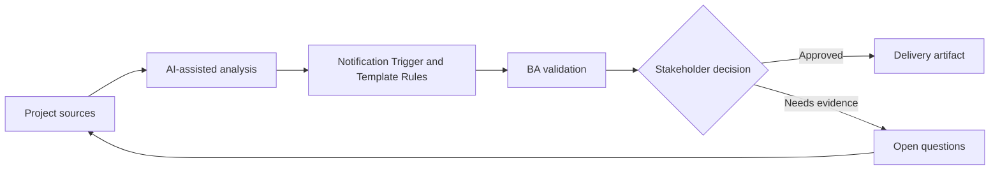

# Notification Trigger and Template Rules

<div class="case-meta">
  <span>Data and Integration</span>
  <span>Notifications</span>
  <span>Project use case</span>
</div>

## Project context

A workflow sends email, SMS, and in-app notifications for approvals, missing documents, status changes, and SLA breaches. Stakeholders disagree about timing and message content. In a real delivery environment, this work usually appears under time pressure: stakeholders want clarity, delivery needs a backlog, QA needs testable behavior, and operations needs a process that can survive exceptions. The BA uses AI here to accelerate analysis and synthesis, but the BA remains accountable for evidence, business meaning, stakeholder decisioning, and artifact quality.

## BA challenge

The BA must define notification rules that connect event triggers, recipients, channels, templates, personalization, suppression, retries, and audit evidence. The practical difficulty is that AI can make early material look more complete than it is. A strong BA keeps the output reviewable by separating source-backed facts, assumptions, unsupported claims, decision gaps, and recommended next actions. The objective is not to make the document longer; it is to make the project decision clearer and safer.

## Where AI fits

<div class="ba-workbench-panel">
AI is useful in this use case when it is constrained to analysis support, pattern detection, structured drafting, and critique. It should not approve scope, invent policy, decide business trade-offs, or replace accountable stakeholder judgment.
</div>

- Generate notification trigger matrix from workflow states.
- Draft template variants and personalization fields.
- Identify duplicate, suppression, and escalation scenarios.
- Create acceptance criteria for channel and retry behavior.

## Inputs to prepare

- Workflow states
- Recipient roles
- Communication policy
- Template drafts
- Channel capabilities

A BA should label these inputs before using AI: source owner, source date, approval status, sensitivity level, and whether the source is fact, opinion, policy, draft, or historical evidence. This preparation prevents the model from treating every input as equally current and authoritative.

## BA workflow

1. Map workflow events and recipient needs.
2. Ask AI to draft trigger-channel-recipient matrix.
3. Define template content, variables, localization, and legal copy constraints.
4. Specify suppression, duplicate prevention, retry, and escalation behavior.
5. Review with product, support, legal, and operations.
6. Add QA cases for event timing, channel failure, and personalization.

The workflow works best as a staged AI collaboration: first organize the evidence, then ask for analysis, then create the artifact, then run a critique pass. The BA should keep a visible decision log throughout the process so that AI-generated suggestions do not silently become approved scope.

## Diagram



## Deliverables

| Deliverable | What it contains | Owner | Done signal |
| --- | --- | --- | --- |
| Notification rule matrix | Trigger, recipient, channel, timing, suppression, and owner | BA | Every event has rule |
| Template catalog | Template, variable, copy, localization, and approval status | UX/legal | Messages are approved |
| Retry and fallback rules | Channel failure, retry count, fallback channel, and alert | Operations | Failures have path |
| Notification QA scenarios | Trigger, duplicate, suppression, retry, and personalization cases | QA | Notifications are testable |

These deliverables should be treated as BA-owned artifacts. AI can draft them, but the BA must validate source support, stakeholder meaning, traceability, and whether the artifact is ready for handoff.

## Prompt to try

```text
Act as a senior AI-aware Business Analyst. Help me apply the "Notification Trigger and Template Rules" use case to my project. First ask for source evidence and constraints. Then create a structured analysis with project context, assumptions, AI-fit boundary, workflow steps, deliverables, risks, controls, open questions, and stakeholder decisions. Do not invent policy, thresholds, or approvals.
```

## Review checklist

- Every AI-produced statement is tied to a source, assumption, or validation question.
- The BA has separated drafting assistance from business approval.
- Workflow steps identify the human owner for decisions, review, and exceptions.
- Deliverables are traceable to project inputs and can be reviewed by QA, product, or operations.
- Risk controls are practical enough to be used in a real project meeting.
- Success metric: Notifications are triggered, worded, routed, and monitored according to clear business rules.

## Risks and controls

| Risk | Why it matters | BA control |
| --- | --- | --- |
| Notification spam | Users may receive duplicates or too many messages | Define suppression and duplicate prevention |
| Wrong recipient | Sensitive information may go to the wrong role | Map recipients and permissions |
| Template drift | Copy may become inconsistent across channels | Maintain template catalog |
| Channel failure | Important messages may not send | Define retry and fallback channel |

The key control is to make uncertainty visible. If evidence is weak, the output should create a validation question or decision item, not a final requirement. If the artifact influences delivery, release, compliance, customer experience, or operational workload, the BA should require explicit human review before handoff.
