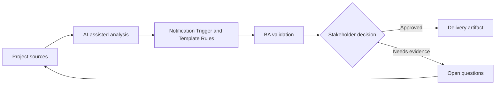

# Notification Trigger and Template Rules

<div class="case-meta">
  <span>Data and Integration</span>
  <span>Notifications</span>
  <span>Project use case</span>
</div>

## Project context

A workflow sends email, SMS, and in-app notifications for approvals, missing documents, status changes, and SLA breaches. Stakeholders disagree about timing and message content. In Notifications, this work usually starts when data movement, mapping, reconciliation, privacy, and lineage decisions affect multiple systems and owners. The BA should treat Workflow states and Recipient roles as evidence to organize, not as raw material for an unconstrained AI answer. The goal is to make the next decision clearer for the people who own the outcome.

## BA challenge

The BA must define notification rules that connect event triggers, recipients, channels, templates, personalization, suppression, retries, and audit evidence. For Notification Trigger and Template Rules, the practical difficulty is silent data loss and weak lineage. AI can accelerate field mapping, rule comparison, reconciliation design, lineage review, and exception analysis, but the BA must still expose assumptions, missing approvals, and the point where stakeholder judgment is required.

## Where AI fits

<div class="ba-workbench-panel">
AI fits this Data and Integration use case when it is constrained to field mapping, rule comparison, reconciliation design, lineage review, and exception analysis. A useful first AI task is: Generate notification trigger matrix from workflow states. AI should not approve scope, invent policy, bypass source schemas, sample payloads, mapping rules, data-quality reports, and ownership matrix, or turn a draft into a final decision.
</div>

- Generate notification trigger matrix from workflow states.
- Draft template variants and personalization fields.
- Identify duplicate, suppression, and escalation scenarios.
- Create acceptance criteria for channel and retry behavior.

## Inputs to prepare

- Workflow states
- Recipient roles
- Communication policy
- Template drafts
- Channel capabilities

Before prompting for Notification Trigger and Template Rules, label each input by owner, date, approval status, sensitivity, and role in the decision. The most important evidence lens is source schemas, sample payloads, mapping rules, data-quality reports, and ownership matrix; without it, AI may rank old notes, draft designs, and approved rules as if they had equal authority.

## BA workflow

1. Map workflow events and recipient needs.
2. Ask AI to draft trigger-channel-recipient matrix.
3. Define template content, variables, localization, and legal copy constraints.
4. Specify suppression, duplicate prevention, retry, and escalation behavior.
5. Review with product, support, legal, and operations.
6. Add QA cases for event timing, channel failure, and personalization.

Run the workflow as data contract review before integration build: start with "Map workflow events and recipient needs.", then keep a visible decision log as the artifact moves toward Notification rule matrix. This prevents AI suggestions from silently becoming backlog, design, release, or operational commitments.

## Diagram



## Deliverables

| Deliverable | What it contains | Owner | Done signal |
| --- | --- | --- | --- |
| Notification rule matrix | Trigger, recipient, channel, timing, suppression, and owner | BA | Every event has rule |
| Template catalog | Template, variable, copy, localization, and approval status | UX/legal | Messages are approved |
| Retry and fallback rules | Channel failure, retry count, fallback channel, and alert | Operations | Failures have path |
| Notification QA scenarios | Trigger, duplicate, suppression, retry, and personalization cases | QA | Notifications are testable |

Treat Notification rule matrix as a BA-owned data and integration control pack. AI may draft structure, but the BA must validate whether "Every event has rule" is actually true, whether the artifact is traceable to source evidence, and whether the receiving team can act on it.

## Prompt to try

```text
Act as a senior AI-aware Business Analyst. Help me apply the "Notification Trigger and Template Rules" use case to my project. First ask for source evidence and constraints. Then create a structured analysis with project context, assumptions, AI-fit boundary, workflow steps, deliverables, risks, controls, open questions, and stakeholder decisions. Do not invent policy, thresholds, or approvals.
```

## Review checklist

- Workflow states is labeled with owner, date, approval status, and sensitivity.
- Notification rule matrix traces to source evidence and has a named human owner.
- The AI task stays inside field mapping, rule comparison, reconciliation design, lineage review, and exception analysis and does not approve scope or policy.
- The "Notification spam" risk has a practical control: Define suppression and duplicate prevention.
- Open assumptions are converted into validation questions or stakeholder decisions.
- Success metric: Notifications are triggered, worded, routed, and monitored according to clear business rules.

## Risks and controls

| Risk | Why it matters | BA control |
| --- | --- | --- |
| Notification spam | Users may receive duplicates or too many messages | Define suppression and duplicate prevention |
| Wrong recipient | Sensitive information may go to the wrong role | Map recipients and permissions |
| Template drift | Copy may become inconsistent across channels | Maintain template catalog |
| Channel failure | Important messages may not send | Define retry and fallback channel |

The main control for the "Notification spam" risk is explicit human accountability: Define suppression and duplicate prevention. If evidence is weak, the output should create a validation question or decision item, not a final requirement.
