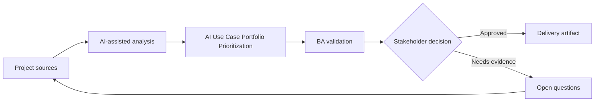

# AI Use Case Portfolio Prioritization

<div class="case-meta">
  <span>Governance and adoption</span>
  <span>Portfolio management</span>
  <span>Project use case</span>
</div>

## Project context

Leadership has a long list of AI ideas: meeting summaries, requirements drafting, policy assistant, ticket triage, document extraction, sales recommendations, and customer chatbot. The team needs a rational way to prioritize. In Portfolio management, this work usually starts when AI usage must scale across teams without leaking sensitive data or creating unreviewable decisions. The BA should treat AI idea backlog and Business goals as evidence to organize, not as raw material for an unconstrained AI answer. The goal is to make the next decision clearer for the people who own the outcome.

## BA challenge

The BA lead must compare ideas by business value, feasibility, data readiness, risk, user impact, governance cost, and measurement clarity. AI can structure the portfolio, but prioritization remains a business decision. For AI Use Case Portfolio Prioritization, the practical difficulty is shadow AI use and weak accountability. AI can accelerate portfolio analysis, policy drafting, risk-tiering, playbook creation, and adoption measurement, but the BA must still expose assumptions, missing approvals, and the point where stakeholder judgment is required.

## Where AI fits

<div class="ba-workbench-panel">
AI fits this Governance and adoption use case when it is constrained to portfolio analysis, policy drafting, risk-tiering, playbook creation, and adoption measurement. A useful first AI task is: Classify ideas by AI pattern and problem type. AI should not approve scope, invent policy, bypass data policy, approved tools, risk appetite, audit need, and team capability, or turn a draft into a final decision.
</div>

- Classify ideas by AI pattern and problem type.
- Generate value-risk-feasibility scoring criteria.
- Identify missing data, controls, and evaluation needs.
- Draft pilot roadmap options and decision memo.

## Inputs to prepare

- AI idea backlog
- Business goals
- Data readiness notes
- Risk policy
- Delivery capacity

Before prompting for AI Use Case Portfolio Prioritization, label each input by owner, date, approval status, sensitivity, and role in the decision. The most important evidence lens is data policy, approved tools, risk appetite, audit need, and team capability; without it, AI may rank old notes, draft designs, and approved rules as if they had equal authority.

## BA workflow

1. Normalize each idea into problem, user, decision, outcome, and AI pattern.
2. Ask AI to score each idea using transparent criteria and evidence gaps.
3. Review scores with business, technology, data, security, and operations stakeholders.
4. Separate quick wins from high-risk strategic bets.
5. Define pilots with success metrics, controls, and owners.
6. Publish a portfolio roadmap with rationale and rejected ideas.

Run the workflow as governance design before broad rollout: start with "Normalize each idea into problem, user, decision, outcome, and AI pattern.", then keep a visible decision log as the artifact moves toward Use-case scoring matrix. This prevents AI suggestions from silently becoming backlog, design, release, or operational commitments.

## Diagram



## Deliverables

| Deliverable | What it contains | Owner | Done signal |
| --- | --- | --- | --- |
| Use-case scoring matrix | Idea, value, feasibility, data readiness, risk, governance cost, and score | BA lead | Scores are explainable |
| AI pattern classification | GenAI, RAG, predictive AI, rules automation, or hybrid | BA | Solution category fits problem |
| Pilot roadmap | Use case, phase, owner, metric, control, and decision gate | Sponsor | Pilots can be evaluated |
| Decision memo | Recommendation, trade-offs, rejected ideas, and evidence gaps | Leadership | Portfolio choices are explicit |

Treat Use-case scoring matrix as a BA-owned AI adoption control pack. AI may draft structure, but the BA must validate whether "Scores are explainable" is actually true, whether the artifact is traceable to source evidence, and whether the receiving team can act on it.

## Prompt to try

```text
Act as a senior AI-aware Business Analyst. Help me apply the "AI Use Case Portfolio Prioritization" use case to my project. First ask for source evidence and constraints. Then create a structured analysis with project context, assumptions, AI-fit boundary, workflow steps, deliverables, risks, controls, open questions, and stakeholder decisions. Do not invent policy, thresholds, or approvals.
```

## Review checklist

- AI idea backlog is labeled with owner, date, approval status, and sensitivity.
- Use-case scoring matrix traces to source evidence and has a named human owner.
- The AI task stays inside portfolio analysis, policy drafting, risk-tiering, playbook creation, and adoption measurement and does not approve scope or policy.
- The "Hype prioritization" risk has a practical control: Use transparent scoring and evidence gaps.
- Open assumptions are converted into validation questions or stakeholder decisions.
- Success metric: Leadership funds AI pilots based on value, feasibility, data readiness, and risk, not hype.

## Risks and controls

| Risk | Why it matters | BA control |
| --- | --- | --- |
| Hype prioritization | Ideas may win because they sound innovative | Use transparent scoring and evidence gaps |
| Data readiness blind spot | High-value ideas may fail without usable data | Score data availability and ownership |
| Risk underestimation | Customer-facing AI may need more controls | Include governance cost and harm potential |
| Pilot sprawl | Too many pilots dilute learning | Limit pilots and define decision gates |

The main control for the "Hype prioritization" risk is explicit human accountability: Use transparent scoring and evidence gaps. If evidence is weak, the output should create a validation question or decision item, not a final requirement.
