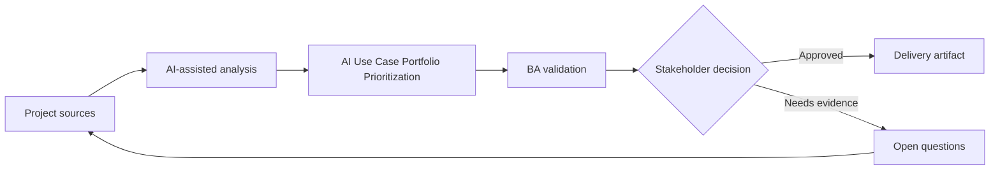

# AI Use Case Portfolio Prioritization

<div class="case-meta">
  <span>Governance and adoption</span>
  <span>Portfolio management</span>
  <span>Project use case</span>
</div>

## Project context

Leadership has a long list of AI ideas: meeting summaries, requirements drafting, policy assistant, ticket triage, document extraction, sales recommendations, and customer chatbot. The team needs a rational way to prioritize. In a real delivery environment, this work usually appears under time pressure: stakeholders want clarity, delivery needs a backlog, QA needs testable behavior, and operations needs a process that can survive exceptions. The BA uses AI here to accelerate analysis and synthesis, but the BA remains accountable for evidence, business meaning, stakeholder decisioning, and artifact quality.

## BA challenge

The BA lead must compare ideas by business value, feasibility, data readiness, risk, user impact, governance cost, and measurement clarity. AI can structure the portfolio, but prioritization remains a business decision. The practical difficulty is that AI can make early material look more complete than it is. A strong BA keeps the output reviewable by separating source-backed facts, assumptions, unsupported claims, decision gaps, and recommended next actions. The objective is not to make the document longer; it is to make the project decision clearer and safer.

## Where AI fits

<div class="ba-workbench-panel">
AI is useful in this use case when it is constrained to analysis support, pattern detection, structured drafting, and critique. It should not approve scope, invent policy, decide business trade-offs, or replace accountable stakeholder judgment.
</div>

- Classify ideas by AI pattern and problem type.
- Generate value-risk-feasibility scoring criteria.
- Identify missing data, controls, and evaluation needs.
- Draft pilot roadmap options and decision memo.

## Inputs to prepare

- AI idea backlog
- Business goals
- Data readiness notes
- Risk policy
- Delivery capacity

A BA should label these inputs before using AI: source owner, source date, approval status, sensitivity level, and whether the source is fact, opinion, policy, draft, or historical evidence. This preparation prevents the model from treating every input as equally current and authoritative.

## BA workflow

1. Normalize each idea into problem, user, decision, outcome, and AI pattern.
2. Ask AI to score each idea using transparent criteria and evidence gaps.
3. Review scores with business, technology, data, security, and operations stakeholders.
4. Separate quick wins from high-risk strategic bets.
5. Define pilots with success metrics, controls, and owners.
6. Publish a portfolio roadmap with rationale and rejected ideas.

The workflow works best as a staged AI collaboration: first organize the evidence, then ask for analysis, then create the artifact, then run a critique pass. The BA should keep a visible decision log throughout the process so that AI-generated suggestions do not silently become approved scope.

## Diagram



## Deliverables

| Deliverable | What it contains | Owner | Done signal |
| --- | --- | --- | --- |
| Use-case scoring matrix | Idea, value, feasibility, data readiness, risk, governance cost, and score | BA lead | Scores are explainable |
| AI pattern classification | GenAI, RAG, predictive AI, rules automation, or hybrid | BA | Solution category fits problem |
| Pilot roadmap | Use case, phase, owner, metric, control, and decision gate | Sponsor | Pilots can be evaluated |
| Decision memo | Recommendation, trade-offs, rejected ideas, and evidence gaps | Leadership | Portfolio choices are explicit |

These deliverables should be treated as BA-owned artifacts. AI can draft them, but the BA must validate source support, stakeholder meaning, traceability, and whether the artifact is ready for handoff.

## Prompt to try

```text
Act as a senior AI-aware Business Analyst. Help me apply the "AI Use Case Portfolio Prioritization" use case to my project. First ask for source evidence and constraints. Then create a structured analysis with project context, assumptions, AI-fit boundary, workflow steps, deliverables, risks, controls, open questions, and stakeholder decisions. Do not invent policy, thresholds, or approvals.
```

## Review checklist

- Every AI-produced statement is tied to a source, assumption, or validation question.
- The BA has separated drafting assistance from business approval.
- Workflow steps identify the human owner for decisions, review, and exceptions.
- Deliverables are traceable to project inputs and can be reviewed by QA, product, or operations.
- Risk controls are practical enough to be used in a real project meeting.
- Success metric: Leadership funds AI pilots based on value, feasibility, data readiness, and risk, not hype.

## Risks and controls

| Risk | Why it matters | BA control |
| --- | --- | --- |
| Hype prioritization | Ideas may win because they sound innovative | Use transparent scoring and evidence gaps |
| Data readiness blind spot | High-value ideas may fail without usable data | Score data availability and ownership |
| Risk underestimation | Customer-facing AI may need more controls | Include governance cost and harm potential |
| Pilot sprawl | Too many pilots dilute learning | Limit pilots and define decision gates |

The key control is to make uncertainty visible. If evidence is weak, the output should create a validation question or decision item, not a final requirement. If the artifact influences delivery, release, compliance, customer experience, or operational workload, the BA should require explicit human review before handoff.
