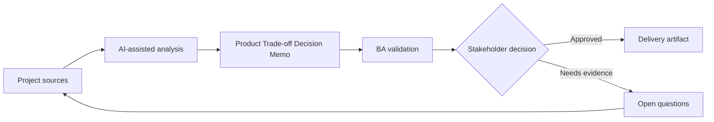

# Product Trade-off Decision Memo

<div class="case-meta">
  <span>Cross-functional BA Collaboration</span>
  <span>Product decisions</span>
  <span>Cross-functional alignment</span>
  <span>Practitioner</span>
  <span>Decision memo</span>
  <span>Project use case</span>
</div>

## Project context

A product owner must choose between faster release with manual review, delayed release with full automation, or partial rollout to a smaller user segment. In Product decisions, this work usually starts when different roles need different artifacts, but the BA must keep decisions consistent across product, design, engineering, QA, data, and operations. The BA should treat Decision options and Delivery estimates as evidence to organize, not as raw material for an unconstrained AI answer. The goal is to make the next decision clearer for the people who own the outcome.

## BA challenge

The BA must present trade-offs clearly across user value, delivery cost, risk, operational effort, compliance, and learning value. AI can structure options, but the decision belongs to accountable stakeholders. For Product Trade-off Decision Memo, the practical difficulty is role misalignment and hidden trade-offs. AI can accelerate role-specific synthesis, decision memo drafting, conflict surfacing, and shared artifact critique, but the BA must still expose assumptions, missing approvals, and the point where stakeholder judgment is required.

## Where AI fits

<div class="ba-workbench-panel">
AI fits this Cross-functional BA Collaboration use case when it is constrained to role-specific synthesis, decision memo drafting, conflict surfacing, and shared artifact critique. A useful first AI task is: Generate decision options and trade-off dimensions. AI should not approve scope, invent policy, bypass role feedback, decision log, design notes, technical constraints, test concerns, and support needs, or turn a draft into a final decision.
</div>

- Generate decision options and trade-off dimensions.
- Draft impact analysis across product, engineering, QA, operations, and compliance.
- Identify missing evidence and assumptions.
- Create a concise recommendation memo.

## Inputs to prepare

- Decision options
- Delivery estimates
- Risk register
- User impact notes
- Operational constraints

Before prompting for Product Trade-off Decision Memo, label each input by owner, date, approval status, sensitivity, and role in the decision. The most important evidence lens is role feedback, decision log, design notes, technical constraints, test concerns, and support needs; without it, AI may rank old notes, draft designs, and approved rules as if they had equal authority.

## BA workflow

1. Define the decision and options in neutral language.
2. Ask AI to build comparison dimensions and missing evidence list.
3. Fill evidence from project sources and mark assumptions.
4. Review impact with functional owners.
5. Draft recommendation and rejected alternatives.
6. Record decision, rationale, owner, and follow-up measures.

Run the workflow as cross-role decision alignment before handoff: start with "Define the decision and options in neutral language.", then keep a visible decision log as the artifact moves toward Decision memo. This prevents AI suggestions from silently becoming backlog, design, release, or operational commitments.

## Diagram



## Deliverables

| Deliverable | What it contains | Owner | Done signal |
| --- | --- | --- | --- |
| Decision memo | Decision, options, evidence, trade-offs, recommendation, and owner | BA | Decision is clear |
| Trade-off matrix | Option, user value, cost, risk, operations, compliance, and learning | Product owner | Options are comparable |
| Assumption list | Assumption, confidence, validation action, and owner | BA | Uncertainty is visible |
| Decision log update | Chosen option, rationale, date, owner, and follow-up metric | Product owner | Decision can be traced |

Treat Decision memo as a BA-owned collaboration decision artifact. AI may draft structure, but the BA must validate whether "Decision is clear" is actually true, whether the artifact is traceable to source evidence, and whether the receiving team can act on it.

## Prompt to try

```text
Act as a senior AI-aware Business Analyst. Help me apply the "Product Trade-off Decision Memo" use case to my project. First ask for source evidence and constraints. Then create a structured analysis with project context, assumptions, AI-fit boundary, workflow steps, deliverables, risks, controls, open questions, and stakeholder decisions. Do not invent policy, thresholds, or approvals.
```

## Review checklist

- Decision options is labeled with owner, date, approval status, and sensitivity.
- Decision memo traces to source evidence and has a named human owner.
- The AI task stays inside role-specific synthesis, decision memo drafting, conflict surfacing, and shared artifact critique and does not approve scope or policy.
- The "Biased recommendation" risk has a practical control: Separate evidence and assumption.
- Open assumptions are converted into validation questions or stakeholder decisions.
- Success metric: Product trade-offs become explicit, evidence-backed, and traceable to follow-up metrics.

## Risks and controls

| Risk | Why it matters | BA control |
| --- | --- | --- |
| Biased recommendation | AI or BA may favor one option without evidence | Separate evidence and assumption |
| Hidden operations cost | Manual review may burden teams | Include operations impact |
| Compliance blind spot | Fast release may create control gaps | Review with compliance owner |
| Decision drift | Teams may forget why option was chosen | Record rationale and metric |

The main control for the "Biased recommendation" risk is explicit human accountability: Separate evidence and assumption. If evidence is weak, the output should create a validation question or decision item, not a final requirement.
