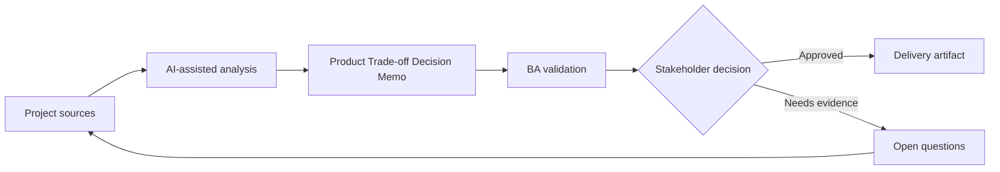

# Product Trade-off Decision Memo

<div class="case-meta">
  <span>Cross-functional BA Collaboration</span>
  <span>Product decisions</span>
  <span>Project use case</span>
</div>

## Project context

A product owner must choose between faster release with manual review, delayed release with full automation, or partial rollout to a smaller user segment. In a real delivery environment, this work usually appears under time pressure: stakeholders want clarity, delivery needs a backlog, QA needs testable behavior, and operations needs a process that can survive exceptions. The BA uses AI here to accelerate analysis and synthesis, but the BA remains accountable for evidence, business meaning, stakeholder decisioning, and artifact quality.

## BA challenge

The BA must present trade-offs clearly across user value, delivery cost, risk, operational effort, compliance, and learning value. AI can structure options, but the decision belongs to accountable stakeholders. The practical difficulty is that AI can make early material look more complete than it is. A strong BA keeps the output reviewable by separating source-backed facts, assumptions, unsupported claims, decision gaps, and recommended next actions. The objective is not to make the document longer; it is to make the project decision clearer and safer.

## Where AI fits

<div class="ba-workbench-panel">
AI is useful in this use case when it is constrained to analysis support, pattern detection, structured drafting, and critique. It should not approve scope, invent policy, decide business trade-offs, or replace accountable stakeholder judgment.
</div>

- Generate decision options and trade-off dimensions.
- Draft impact analysis across product, engineering, QA, operations, and compliance.
- Identify missing evidence and assumptions.
- Create a concise recommendation memo.

## Inputs to prepare

- Decision options
- Delivery estimates
- Risk register
- User impact notes
- Operational constraints

A BA should label these inputs before using AI: source owner, source date, approval status, sensitivity level, and whether the source is fact, opinion, policy, draft, or historical evidence. This preparation prevents the model from treating every input as equally current and authoritative.

## BA workflow

1. Define the decision and options in neutral language.
2. Ask AI to build comparison dimensions and missing evidence list.
3. Fill evidence from project sources and mark assumptions.
4. Review impact with functional owners.
5. Draft recommendation and rejected alternatives.
6. Record decision, rationale, owner, and follow-up measures.

The workflow works best as a staged AI collaboration: first organize the evidence, then ask for analysis, then create the artifact, then run a critique pass. The BA should keep a visible decision log throughout the process so that AI-generated suggestions do not silently become approved scope.

## Diagram



## Deliverables

| Deliverable | What it contains | Owner | Done signal |
| --- | --- | --- | --- |
| Decision memo | Decision, options, evidence, trade-offs, recommendation, and owner | BA | Decision is clear |
| Trade-off matrix | Option, user value, cost, risk, operations, compliance, and learning | Product owner | Options are comparable |
| Assumption list | Assumption, confidence, validation action, and owner | BA | Uncertainty is visible |
| Decision log update | Chosen option, rationale, date, owner, and follow-up metric | Product owner | Decision can be traced |

These deliverables should be treated as BA-owned artifacts. AI can draft them, but the BA must validate source support, stakeholder meaning, traceability, and whether the artifact is ready for handoff.

## Prompt to try

```text
Act as a senior AI-aware Business Analyst. Help me apply the "Product Trade-off Decision Memo" use case to my project. First ask for source evidence and constraints. Then create a structured analysis with project context, assumptions, AI-fit boundary, workflow steps, deliverables, risks, controls, open questions, and stakeholder decisions. Do not invent policy, thresholds, or approvals.
```

## Review checklist

- Every AI-produced statement is tied to a source, assumption, or validation question.
- The BA has separated drafting assistance from business approval.
- Workflow steps identify the human owner for decisions, review, and exceptions.
- Deliverables are traceable to project inputs and can be reviewed by QA, product, or operations.
- Risk controls are practical enough to be used in a real project meeting.
- Success metric: Product trade-offs become explicit, evidence-backed, and traceable to follow-up metrics.

## Risks and controls

| Risk | Why it matters | BA control |
| --- | --- | --- |
| Biased recommendation | AI or BA may favor one option without evidence | Separate evidence and assumption |
| Hidden operations cost | Manual review may burden teams | Include operations impact |
| Compliance blind spot | Fast release may create control gaps | Review with compliance owner |
| Decision drift | Teams may forget why option was chosen | Record rationale and metric |

The key control is to make uncertainty visible. If evidence is weak, the output should create a validation question or decision item, not a final requirement. If the artifact influences delivery, release, compliance, customer experience, or operational workload, the BA should require explicit human review before handoff.
