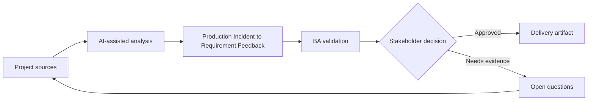

# Production Incident to Requirement Feedback

<div class="case-meta">
  <span>Delivery and QA</span>
  <span>Continuous improvement</span>
  <span>Project use case</span>
</div>

## Project context

After launch, customers report that notification preferences behave unexpectedly when account ownership changes. Support tickets show confusion, engineering sees no defect in code, and product suspects the requirement missed an ownership scenario. In a real delivery environment, this work usually appears under time pressure: stakeholders want clarity, delivery needs a backlog, QA needs testable behavior, and operations needs a process that can survive exceptions. The BA uses AI here to accelerate analysis and synthesis, but the BA remains accountable for evidence, business meaning, stakeholder decisioning, and artifact quality.

## BA challenge

The BA must convert production signals into requirement learning. AI can summarize incidents and tickets, but the BA must separate defect, requirement gap, UX confusion, data issue, and training need before changing backlog scope. The practical difficulty is that AI can make early material look more complete than it is. A strong BA keeps the output reviewable by separating source-backed facts, assumptions, unsupported claims, decision gaps, and recommended next actions. The objective is not to make the document longer; it is to make the project decision clearer and safer.

## Where AI fits

<div class="ba-workbench-panel">
AI is useful in this use case when it is constrained to analysis support, pattern detection, structured drafting, and critique. It should not approve scope, invent policy, decide business trade-offs, or replace accountable stakeholder judgment.
</div>

- Cluster incidents by user journey and symptom.
- Map incidents to requirements, criteria, and release decisions.
- Identify missing scenarios and ambiguous wording.
- Draft backlog updates and stakeholder validation questions.

## Inputs to prepare

- Incident report
- Support tickets
- Release requirements
- Audit logs
- User journey notes

A BA should label these inputs before using AI: source owner, source date, approval status, sensitivity level, and whether the source is fact, opinion, policy, draft, or historical evidence. This preparation prevents the model from treating every input as equally current and authoritative.

## BA workflow

1. Collect incident evidence and preserve customer examples.
2. Ask AI to cluster symptoms and map them to original requirements.
3. Review whether behavior matches requirement, test, and user expectation.
4. Classify each finding as defect, requirement gap, UX confusion, data issue, or training need.
5. Draft backlog changes with impact and evidence.
6. Update lessons learned and prevention checklist.

The workflow works best as a staged AI collaboration: first organize the evidence, then ask for analysis, then create the artifact, then run a critique pass. The BA should keep a visible decision log throughout the process so that AI-generated suggestions do not silently become approved scope.

## Diagram



## Deliverables

| Deliverable | What it contains | Owner | Done signal |
| --- | --- | --- | --- |
| Incident synthesis | Symptoms, affected users, evidence, and journey step | BA | Patterns are source-backed |
| Requirement gap analysis | Original requirement, missing scenario, impact, and proposed update | BA | Gaps are actionable |
| Backlog update pack | Story, acceptance criteria, test notes, and priority | Product owner | Updates include evidence and severity |
| Prevention checklist | Questions to ask in future refinement | BA practice | Learning feeds future analysis |

These deliverables should be treated as BA-owned artifacts. AI can draft them, but the BA must validate source support, stakeholder meaning, traceability, and whether the artifact is ready for handoff.

## Prompt to try

```text
Act as a senior AI-aware Business Analyst. Help me apply the "Production Incident to Requirement Feedback" use case to my project. First ask for source evidence and constraints. Then create a structured analysis with project context, assumptions, AI-fit boundary, workflow steps, deliverables, risks, controls, open questions, and stakeholder decisions. Do not invent policy, thresholds, or approvals.
```

## Review checklist

- Every AI-produced statement is tied to a source, assumption, or validation question.
- The BA has separated drafting assistance from business approval.
- Workflow steps identify the human owner for decisions, review, and exceptions.
- Deliverables are traceable to project inputs and can be reviewed by QA, product, or operations.
- Risk controls are practical enough to be used in a real project meeting.
- Success metric: Production incidents become evidence-backed backlog improvements and better future requirement questions.

## Risks and controls

| Risk | Why it matters | BA control |
| --- | --- | --- |
| Ticket summary bias | AI may flatten customer-specific context | Keep representative examples and source IDs |
| Wrong category | Requirement gap may be treated as code defect | Compare actual behavior to approved requirement |
| Overreaction | A rare issue may trigger too much scope | Use frequency, severity, and user impact |
| Lost learning | Fix may happen without improving BA process | Add prevention questions to refinement checklist |

The key control is to make uncertainty visible. If evidence is weak, the output should create a validation question or decision item, not a final requirement. If the artifact influences delivery, release, compliance, customer experience, or operational workload, the BA should require explicit human review before handoff.
