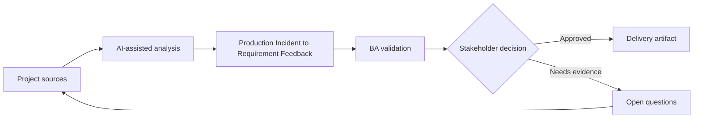

# Production Incident to Requirement Feedback

<div class="case-meta">
  <span>Delivery and QA</span>
  <span>Continuous improvement</span>
  <span>Project use case</span>
</div>

## Project context

After launch, customers report that notification preferences behave unexpectedly when account ownership changes. Support tickets show confusion, engineering sees no defect in code, and product suspects the requirement missed an ownership scenario. In Continuous improvement, this work usually starts when delivery decisions, test evidence, and release readiness need to stay connected to original intent. The BA should treat Incident report and Support tickets as evidence to organize, not as raw material for an unconstrained AI answer. The goal is to make the next decision clearer for the people who own the outcome.

## BA challenge

The BA must convert production signals into requirement learning. AI can summarize incidents and tickets, but the BA must separate defect, requirement gap, UX confusion, data issue, and training need before changing backlog scope. For Production Incident to Requirement Feedback, the practical difficulty is optimistic status and late requirement discovery. AI can accelerate scenario generation, defect triage support, readiness synthesis, and risk surfacing, but the BA must still expose assumptions, missing approvals, and the point where stakeholder judgment is required.

## Where AI fits

<div class="ba-workbench-panel">
AI fits this Delivery and QA use case when it is constrained to scenario generation, defect triage support, readiness synthesis, and risk surfacing. A useful first AI task is: Cluster incidents by user journey and symptom. AI should not approve scope, invent policy, bypass requirement baseline, test results, defect history, and release decisions, or turn a draft into a final decision.
</div>

- Cluster incidents by user journey and symptom.
- Map incidents to requirements, criteria, and release decisions.
- Identify missing scenarios and ambiguous wording.
- Draft backlog updates and stakeholder validation questions.

## Inputs to prepare

- Incident report
- Support tickets
- Release requirements
- Audit logs
- User journey notes

Before prompting for Production Incident to Requirement Feedback, label each input by owner, date, approval status, sensitivity, and role in the decision. The most important evidence lens is requirement baseline, test results, defect history, and release decisions; without it, AI may rank old notes, draft designs, and approved rules as if they had equal authority.

## BA workflow

1. Collect incident evidence and preserve customer examples.
2. Ask AI to cluster symptoms and map them to original requirements.
3. Review whether behavior matches requirement, test, and user expectation.
4. Classify each finding as defect, requirement gap, UX confusion, data issue, or training need.
5. Draft backlog changes with impact and evidence.
6. Update lessons learned and prevention checklist.

Run the workflow as quality review before release or rework decision: start with "Collect incident evidence and preserve customer examples.", then keep a visible decision log as the artifact moves toward Incident synthesis. This prevents AI suggestions from silently becoming backlog, design, release, or operational commitments.

## Diagram



## Deliverables

| Deliverable | What it contains | Owner | Done signal |
| --- | --- | --- | --- |
| Incident synthesis | Symptoms, affected users, evidence, and journey step | BA | Patterns are source-backed |
| Requirement gap analysis | Original requirement, missing scenario, impact, and proposed update | BA | Gaps are actionable |
| Backlog update pack | Story, acceptance criteria, test notes, and priority | Product owner | Updates include evidence and severity |
| Prevention checklist | Questions to ask in future refinement | BA practice | Learning feeds future analysis |

Treat Incident synthesis as a BA-owned QA and delivery handoff artifact. AI may draft structure, but the BA must validate whether "Patterns are source-backed" is actually true, whether the artifact is traceable to source evidence, and whether the receiving team can act on it.

## Prompt to try

```text
Act as a senior AI-aware Business Analyst. Help me apply the "Production Incident to Requirement Feedback" use case to my project. First ask for source evidence and constraints. Then create a structured analysis with project context, assumptions, AI-fit boundary, workflow steps, deliverables, risks, controls, open questions, and stakeholder decisions. Do not invent policy, thresholds, or approvals.
```

## Review checklist

- Incident report is labeled with owner, date, approval status, and sensitivity.
- Incident synthesis traces to source evidence and has a named human owner.
- The AI task stays inside scenario generation, defect triage support, readiness synthesis, and risk surfacing and does not approve scope or policy.
- The "Ticket summary bias" risk has a practical control: Keep representative examples and source IDs.
- Open assumptions are converted into validation questions or stakeholder decisions.
- Success metric: Production incidents become evidence-backed backlog improvements and better future requirement questions.

## Risks and controls

| Risk | Why it matters | BA control |
| --- | --- | --- |
| Ticket summary bias | AI may flatten customer-specific context | Keep representative examples and source IDs |
| Wrong category | Requirement gap may be treated as code defect | Compare actual behavior to approved requirement |
| Overreaction | A rare issue may trigger too much scope | Use frequency, severity, and user impact |
| Lost learning | Fix may happen without improving BA process | Add prevention questions to refinement checklist |

The main control for the "Ticket summary bias" risk is explicit human accountability: Keep representative examples and source IDs. If evidence is weak, the output should create a validation question or decision item, not a final requirement.
