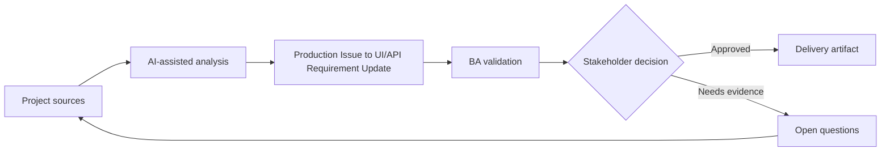

# Production Issue to UI/API Requirement Update

<div class="case-meta">
  <span>Cross-functional BA Collaboration</span>
  <span>Production feedback</span>
  <span>Project use case</span>
</div>

## Project context

After release, users report that a save button appears successful even when the backend rejects one field. The issue spans UI messaging, API error behavior, validation, and support scripts. In a real delivery environment, this work usually appears under time pressure: stakeholders want clarity, delivery needs a backlog, QA needs testable behavior, and operations needs a process that can survive exceptions. The BA uses AI here to accelerate analysis and synthesis, but the BA remains accountable for evidence, business meaning, stakeholder decisioning, and artifact quality.

## BA challenge

The BA must convert production evidence into updated requirements across UI and API. The work is not only fixing a bug; it is clarifying expected behavior and preventing repeat ambiguity. The practical difficulty is that AI can make early material look more complete than it is. A strong BA keeps the output reviewable by separating source-backed facts, assumptions, unsupported claims, decision gaps, and recommended next actions. The objective is not to make the document longer; it is to make the project decision clearer and safer.

## Where AI fits

<div class="ba-workbench-panel">
AI is useful in this use case when it is constrained to analysis support, pattern detection, structured drafting, and critique. It should not approve scope, invent policy, decide business trade-offs, or replace accountable stakeholder judgment.
</div>

- Cluster incident evidence and identify affected requirement areas.
- Draft UI/API behavior gap analysis.
- Generate updated acceptance criteria and regression scenarios.
- Create support communication and release note questions.

## Inputs to prepare

- Production issue reports
- API logs
- Original story
- Support tickets
- Current UI behavior

A BA should label these inputs before using AI: source owner, source date, approval status, sensitivity level, and whether the source is fact, opinion, policy, draft, or historical evidence. This preparation prevents the model from treating every input as equally current and authoritative.

## BA workflow

1. Collect evidence from support, logs, users, and reproduction steps.
2. Ask AI to map issue to UI behavior, API error, validation, and test gaps.
3. Classify as defect, requirement gap, or both.
4. Draft updated UI/API requirements and acceptance criteria.
5. Review with frontend, backend, QA, support, and product.
6. Update backlog, regression suite, and support scripts.

The workflow works best as a staged AI collaboration: first organize the evidence, then ask for analysis, then create the artifact, then run a critique pass. The BA should keep a visible decision log throughout the process so that AI-generated suggestions do not silently become approved scope.

## Diagram



## Deliverables

| Deliverable | What it contains | Owner | Done signal |
| --- | --- | --- | --- |
| Issue-to-requirement analysis | Evidence, affected behavior, root cause type, and requirement gap | BA | Problem is framed clearly |
| Updated UI/API behavior spec | Expected UI state, API error, validation, copy, and support path | BA and engineers | Behavior is aligned |
| Regression scenarios | Original failure, related edge cases, and expected results | QA | Issue does not recur |
| Support update | Known issue, customer explanation, workaround, and fix status | Support | Support can respond consistently |

These deliverables should be treated as BA-owned artifacts. AI can draft them, but the BA must validate source support, stakeholder meaning, traceability, and whether the artifact is ready for handoff.

## Prompt to try

```text
Act as a senior AI-aware Business Analyst. Help me apply the "Production Issue to UI/API Requirement Update" use case to my project. First ask for source evidence and constraints. Then create a structured analysis with project context, assumptions, AI-fit boundary, workflow steps, deliverables, risks, controls, open questions, and stakeholder decisions. Do not invent policy, thresholds, or approvals.
```

## Review checklist

- Every AI-produced statement is tied to a source, assumption, or validation question.
- The BA has separated drafting assistance from business approval.
- Workflow steps identify the human owner for decisions, review, and exceptions.
- Deliverables are traceable to project inputs and can be reviewed by QA, product, or operations.
- Risk controls are practical enough to be used in a real project meeting.
- Success metric: Production issues become clearer UI/API requirements and stronger regression coverage.

## Risks and controls

| Risk | Why it matters | BA control |
| --- | --- | --- |
| Bug-only fix | Team may patch code without clarifying requirements | Update UI/API behavior spec |
| Evidence loss | Production context may disappear | Preserve logs and user examples |
| Regression miss | Related states may remain broken | Add regression scenarios |
| Support inconsistency | Agents may explain issue differently | Update support script |

The key control is to make uncertainty visible. If evidence is weak, the output should create a validation question or decision item, not a final requirement. If the artifact influences delivery, release, compliance, customer experience, or operational workload, the BA should require explicit human review before handoff.
