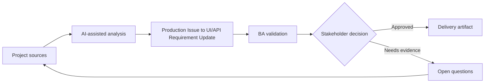

# Production Issue to UI/API Requirement Update

<div class="case-meta">
  <span>Cross-functional BA Collaboration</span>
  <span>Production feedback</span>
  <span>Cross-functional alignment</span>
  <span>Practitioner</span>
  <span>Issue-to-requirement analysis</span>
  <span>Project use case</span>
</div>

## Project context

After release, users report that a save button appears successful even when the backend rejects one field. The issue spans UI messaging, API error behavior, validation, and support scripts. In Production feedback, this work usually starts when different roles need different artifacts, but the BA must keep decisions consistent across product, design, engineering, QA, data, and operations. The BA should treat Production issue reports and API logs as evidence to organize, not as raw material for an unconstrained AI answer. The goal is to make the next decision clearer for the people who own the outcome.

## BA challenge

The BA must convert production evidence into updated requirements across UI and API. The work is not only fixing a bug; it is clarifying expected behavior and preventing repeat ambiguity. For Production Issue to UI/API Requirement Update, the practical difficulty is role misalignment and hidden trade-offs. AI can accelerate role-specific synthesis, decision memo drafting, conflict surfacing, and shared artifact critique, but the BA must still expose assumptions, missing approvals, and the point where stakeholder judgment is required.

## Where AI fits

<div class="ba-workbench-panel">
AI fits this Cross-functional BA Collaboration use case when it is constrained to role-specific synthesis, decision memo drafting, conflict surfacing, and shared artifact critique. A useful first AI task is: Cluster incident evidence and identify affected requirement areas. AI should not approve scope, invent policy, bypass role feedback, decision log, design notes, technical constraints, test concerns, and support needs, or turn a draft into a final decision.
</div>

- Cluster incident evidence and identify affected requirement areas.
- Draft UI/API behavior gap analysis.
- Generate updated acceptance criteria and regression scenarios.
- Create support communication and release note questions.

## Inputs to prepare

- Production issue reports
- API logs
- Original story
- Support tickets
- Current UI behavior

Before prompting for Production Issue to UI/API Requirement Update, label each input by owner, date, approval status, sensitivity, and role in the decision. The most important evidence lens is role feedback, decision log, design notes, technical constraints, test concerns, and support needs; without it, AI may rank old notes, draft designs, and approved rules as if they had equal authority.

## BA workflow

1. Collect evidence from support, logs, users, and reproduction steps.
2. Ask AI to map issue to UI behavior, API error, validation, and test gaps.
3. Classify as defect, requirement gap, or both.
4. Draft updated UI/API requirements and acceptance criteria.
5. Review with frontend, backend, QA, support, and product.
6. Update backlog, regression suite, and support scripts.

Run the workflow as cross-role decision alignment before handoff: start with "Collect evidence from support, logs, users, and reproduction steps.", then keep a visible decision log as the artifact moves toward Issue-to-requirement analysis. This prevents AI suggestions from silently becoming backlog, design, release, or operational commitments.

## Diagram



## Deliverables

| Deliverable | What it contains | Owner | Done signal |
| --- | --- | --- | --- |
| Issue-to-requirement analysis | Evidence, affected behavior, root cause type, and requirement gap | BA | Problem is framed clearly |
| Updated UI/API behavior spec | Expected UI state, API error, validation, copy, and support path | BA and engineers | Behavior is aligned |
| Regression scenarios | Original failure, related edge cases, and expected results | QA | Issue does not recur |
| Support update | Known issue, customer explanation, workaround, and fix status | Support | Support can respond consistently |

Treat Issue-to-requirement analysis as a BA-owned collaboration decision artifact. AI may draft structure, but the BA must validate whether "Problem is framed clearly" is actually true, whether the artifact is traceable to source evidence, and whether the receiving team can act on it.

## Prompt to try

```text
Act as a senior AI-aware Business Analyst. Help me apply the "Production Issue to UI/API Requirement Update" use case to my project. First ask for source evidence and constraints. Then create a structured analysis with project context, assumptions, AI-fit boundary, workflow steps, deliverables, risks, controls, open questions, and stakeholder decisions. Do not invent policy, thresholds, or approvals.
```

## Review checklist

- Production issue reports is labeled with owner, date, approval status, and sensitivity.
- Issue-to-requirement analysis traces to source evidence and has a named human owner.
- The AI task stays inside role-specific synthesis, decision memo drafting, conflict surfacing, and shared artifact critique and does not approve scope or policy.
- The "Bug-only fix" risk has a practical control: Update UI/API behavior spec.
- Open assumptions are converted into validation questions or stakeholder decisions.
- Success metric: Production issues become clearer UI/API requirements and stronger regression coverage.

## Risks and controls

| Risk | Why it matters | BA control |
| --- | --- | --- |
| Bug-only fix | Team may patch code without clarifying requirements | Update UI/API behavior spec |
| Evidence loss | Production context may disappear | Preserve logs and user examples |
| Regression miss | Related states may remain broken | Add regression scenarios |
| Support inconsistency | Agents may explain issue differently | Update support script |

The main control for the "Bug-only fix" risk is explicit human accountability: Update UI/API behavior spec. If evidence is weak, the output should create a validation question or decision item, not a final requirement.
