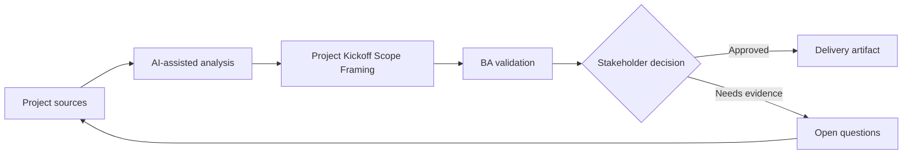

# Project Kickoff Scope Framing

<div class="case-meta">
  <span>Discovery and alignment</span>
  <span>Project initiation</span>
  <span>Project use case</span>
</div>

## Project context

A new internal platform project starts with a broad mandate: modernize the request intake experience. Executives expect quick progress, delivery teams need scope boundaries, and operations worries that existing manual exceptions will be ignored. In a real delivery environment, this work usually appears under time pressure: stakeholders want clarity, delivery needs a backlog, QA needs testable behavior, and operations needs a process that can survive exceptions. The BA uses AI here to accelerate analysis and synthesis, but the BA remains accountable for evidence, business meaning, stakeholder decisioning, and artifact quality.

## BA challenge

The BA must convert a vague mandate into a shared problem statement, measurable outcomes, scope in, scope out, assumptions, dependencies, and first-release decision criteria. AI can help draft structure, but the BA must stop it from inventing strategy. The practical difficulty is that AI can make early material look more complete than it is. A strong BA keeps the output reviewable by separating source-backed facts, assumptions, unsupported claims, decision gaps, and recommended next actions. The objective is not to make the document longer; it is to make the project decision clearer and safer.

## Where AI fits

<div class="ba-workbench-panel">
AI is useful in this use case when it is constrained to analysis support, pattern detection, structured drafting, and critique. It should not approve scope, invent policy, decide business trade-offs, or replace accountable stakeholder judgment.
</div>

- Generate a scope framing canvas from raw kickoff notes.
- Identify missing stakeholders, dependencies, and decision rights.
- Draft measurable outcomes and anti-goals for discussion.
- Create a risk-ranked assumption backlog.

## Inputs to prepare

- Kickoff notes
- Executive goals
- Current pain points
- Known constraints
- Initial roadmap or budget window

A BA should label these inputs before using AI: source owner, source date, approval status, sensitivity level, and whether the source is fact, opinion, policy, draft, or historical evidence. This preparation prevents the model from treating every input as equally current and authoritative.

## BA workflow

1. Summarize the mandate into business outcomes and user outcomes.
2. Ask AI to propose scope boundaries and mark assumptions.
3. Review each boundary with product, operations, technology, and compliance owners.
4. Translate fuzzy goals into measurable success indicators.
5. Create a decision log for items that cannot be settled in kickoff.
6. Publish a one-page scope framing artifact before solution design starts.

The workflow works best as a staged AI collaboration: first organize the evidence, then ask for analysis, then create the artifact, then run a critique pass. The BA should keep a visible decision log throughout the process so that AI-generated suggestions do not silently become approved scope.

## Diagram



## Deliverables

| Deliverable | What it contains | Owner | Done signal |
| --- | --- | --- | --- |
| Scope framing canvas | Problem statement, outcomes, scope in, scope out, assumptions, and constraints | BA | Stakeholders can tell what is not included |
| Outcome metric table | Business metric, baseline, target, owner, and measurement source | Product owner | At least one metric is measurable before build |
| Assumption backlog | Unvalidated assumptions ranked by risk and dependency | BA | High-risk assumptions have validation actions |
| Decision log | Open decisions, options, impacts, owner, and due date | Sponsor | No major scope item lacks owner |

These deliverables should be treated as BA-owned artifacts. AI can draft them, but the BA must validate source support, stakeholder meaning, traceability, and whether the artifact is ready for handoff.

## Prompt to try

```text
Act as a senior AI-aware Business Analyst. Help me apply the "Project Kickoff Scope Framing" use case to my project. First ask for source evidence and constraints. Then create a structured analysis with project context, assumptions, AI-fit boundary, workflow steps, deliverables, risks, controls, open questions, and stakeholder decisions. Do not invent policy, thresholds, or approvals.
```

## Review checklist

- Every AI-produced statement is tied to a source, assumption, or validation question.
- The BA has separated drafting assistance from business approval.
- Workflow steps identify the human owner for decisions, review, and exceptions.
- Deliverables are traceable to project inputs and can be reviewed by QA, product, or operations.
- Risk controls are practical enough to be used in a real project meeting.
- Success metric: The project kickoff produces a signed scope frame that delivery, product, and operations can use for prioritization.

## Risks and controls

| Risk | Why it matters | BA control |
| --- | --- | --- |
| Mandate becomes solution | The team may jump to features before agreeing on outcomes | Separate problem, outcome, and solution sections |
| Scope creep | Everything related to intake may be pulled into release one | Define scope out and anti-goals explicitly |
| Metric theater | Success measures may sound good but cannot be measured | Name baseline and data source for every metric |
| Hidden dependency | Manual exception processes may block launch | Use AI to ask dependency discovery questions |

The key control is to make uncertainty visible. If evidence is weak, the output should create a validation question or decision item, not a final requirement. If the artifact influences delivery, release, compliance, customer experience, or operational workload, the BA should require explicit human review before handoff.
