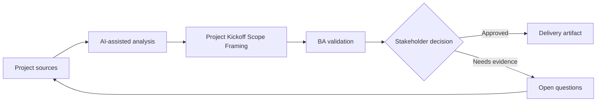

# Project Kickoff Scope Framing

<div class="case-meta">
  <span>Discovery and alignment</span>
  <span>Project initiation</span>
  <span>Project use case</span>
</div>

## Project context

A new internal platform project starts with a broad mandate: modernize the request intake experience. Executives expect quick progress, delivery teams need scope boundaries, and operations worries that existing manual exceptions will be ignored. In Project initiation, this work usually starts when stakeholders describe the same problem from different incentives and levels of detail. The BA should treat Kickoff notes and Executive goals as evidence to organize, not as raw material for an unconstrained AI answer. The goal is to make the next decision clearer for the people who own the outcome.

## BA challenge

The BA must convert a vague mandate into a shared problem statement, measurable outcomes, scope in, scope out, assumptions, dependencies, and first-release decision criteria. AI can help draft structure, but the BA must stop it from inventing strategy. For Project Kickoff Scope Framing, the practical difficulty is false consensus and invented scope. AI can accelerate sensemaking, contradiction detection, question generation, and workshop preparation, but the BA must still expose assumptions, missing approvals, and the point where stakeholder judgment is required.

## Where AI fits

<div class="ba-workbench-panel">
AI fits this Discovery and alignment use case when it is constrained to sensemaking, contradiction detection, question generation, and workshop preparation. A useful first AI task is: Generate a scope framing canvas from raw kickoff notes. AI should not approve scope, invent policy, bypass speaker attribution, decision authority, and source freshness, or turn a draft into a final decision.
</div>

- Generate a scope framing canvas from raw kickoff notes.
- Identify missing stakeholders, dependencies, and decision rights.
- Draft measurable outcomes and anti-goals for discussion.
- Create a risk-ranked assumption backlog.

## Inputs to prepare

- Kickoff notes
- Executive goals
- Current pain points
- Known constraints
- Initial roadmap or budget window

Before prompting for Project Kickoff Scope Framing, label each input by owner, date, approval status, sensitivity, and role in the decision. The most important evidence lens is speaker attribution, decision authority, and source freshness; without it, AI may rank old notes, draft designs, and approved rules as if they had equal authority.

## BA workflow

1. Summarize the mandate into business outcomes and user outcomes.
2. Ask AI to propose scope boundaries and mark assumptions.
3. Review each boundary with product, operations, technology, and compliance owners.
4. Translate fuzzy goals into measurable success indicators.
5. Create a decision log for items that cannot be settled in kickoff.
6. Publish a one-page scope framing artifact before solution design starts.

Run the workflow as evidence grouping before solution discussion: start with "Summarize the mandate into business outcomes and user outcomes.", then keep a visible decision log as the artifact moves toward Scope framing canvas. This prevents AI suggestions from silently becoming backlog, design, release, or operational commitments.

## Diagram



## Deliverables

| Deliverable | What it contains | Owner | Done signal |
| --- | --- | --- | --- |
| Scope framing canvas | Problem statement, outcomes, scope in, scope out, assumptions, and constraints | BA | Stakeholders can tell what is not included |
| Outcome metric table | Business metric, baseline, target, owner, and measurement source | Product owner | At least one metric is measurable before build |
| Assumption backlog | Unvalidated assumptions ranked by risk and dependency | BA | High-risk assumptions have validation actions |
| Decision log | Open decisions, options, impacts, owner, and due date | Sponsor | No major scope item lacks owner |

Treat Scope framing canvas as a BA-owned alignment artifact. AI may draft structure, but the BA must validate whether "Stakeholders can tell what is not included" is actually true, whether the artifact is traceable to source evidence, and whether the receiving team can act on it.

## Prompt to try

```text
Act as a senior AI-aware Business Analyst. Help me apply the "Project Kickoff Scope Framing" use case to my project. First ask for source evidence and constraints. Then create a structured analysis with project context, assumptions, AI-fit boundary, workflow steps, deliverables, risks, controls, open questions, and stakeholder decisions. Do not invent policy, thresholds, or approvals.
```

## Review checklist

- Kickoff notes is labeled with owner, date, approval status, and sensitivity.
- Scope framing canvas traces to source evidence and has a named human owner.
- The AI task stays inside sensemaking, contradiction detection, question generation, and workshop preparation and does not approve scope or policy.
- The "Mandate becomes solution" risk has a practical control: Separate problem, outcome, and solution sections.
- Open assumptions are converted into validation questions or stakeholder decisions.
- Success metric: The project kickoff produces a signed scope frame that delivery, product, and operations can use for prioritization.

## Risks and controls

| Risk | Why it matters | BA control |
| --- | --- | --- |
| Mandate becomes solution | The team may jump to features before agreeing on outcomes | Separate problem, outcome, and solution sections |
| Scope creep | Everything related to intake may be pulled into release one | Define scope out and anti-goals explicitly |
| Metric theater | Success measures may sound good but cannot be measured | Name baseline and data source for every metric |
| Hidden dependency | Manual exception processes may block launch | Use AI to ask dependency discovery questions |

The main control for the "Mandate becomes solution" risk is explicit human accountability: Separate problem, outcome, and solution sections. If evidence is weak, the output should create a validation question or decision item, not a final requirement.
