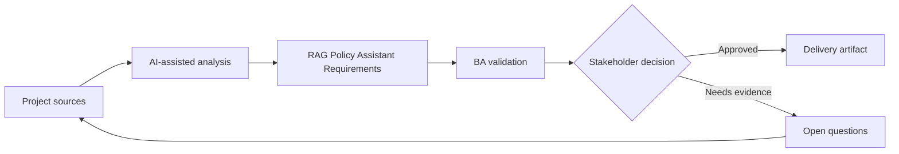

# RAG Policy Assistant Requirements

<div class="case-meta">
  <span>AI-enabled product use cases</span>
  <span>Knowledge assistant</span>
  <span>Project use case</span>
</div>

## Project context

HR wants an internal assistant that answers employee policy questions using approved documents. Users include employees, managers, and HR advisors, each with different access levels and escalation paths. In Knowledge assistant, this work usually starts when AI behavior affects users directly and must include uncertainty, fallback, evaluation, and human review. The BA should treat Policy repository and Legacy handbook as evidence to organize, not as raw material for an unconstrained AI answer. The goal is to make the next decision clearer for the people who own the outcome.

## BA challenge

The BA must specify a RAG assistant beyond chatbot UX: source authority, freshness, permissions, citation behavior, conflict handling, fallback, evaluation, and operational ownership. For RAG Policy Assistant Requirements, the practical difficulty is over-automation and unsafe confidence. AI can accelerate AI task framing, output contract drafting, evaluation planning, and safety-control critique, but the BA must still expose assumptions, missing approvals, and the point where stakeholder judgment is required.

## Where AI fits

<div class="ba-workbench-panel">
AI fits this AI-enabled product use cases use case when it is constrained to AI task framing, output contract drafting, evaluation planning, and safety-control critique. A useful first AI task is: Inventory authoritative knowledge sources and metadata needs. AI should not approve scope, invent policy, bypass approved sources, model limits, evaluation cases, and human decision triggers, or turn a draft into a final decision.
</div>

- Inventory authoritative knowledge sources and metadata needs.
- Draft retrieval and answer requirements.
- Generate fallback scenarios for weak or conflicting evidence.
- Create evaluation cases for retrieval quality and answer grounding.

## Inputs to prepare

- Policy repository
- Legacy handbook
- Role access rules
- HR escalation process
- Common employee questions

Before prompting for RAG Policy Assistant Requirements, label each input by owner, date, approval status, sensitivity, and role in the decision. The most important evidence lens is approved sources, model limits, evaluation cases, and human decision triggers; without it, AI may rank old notes, draft designs, and approved rules as if they had equal authority.

## BA workflow

1. Define approved sources, owners, effective dates, and access rules.
2. Ask AI to draft a knowledge contract and identify source conflicts.
3. Specify answer behavior: citation, confidence, refusal, and escalation.
4. Create evaluation questions for common, edge, and conflict cases.
5. Review privacy and access controls with security and HR.
6. Publish requirements with retrieval metrics and monitoring events.

Run the workflow as AI operating contract before build: start with "Define approved sources, owners, effective dates, and access rules.", then keep a visible decision log as the artifact moves toward Knowledge contract. This prevents AI suggestions from silently becoming backlog, design, release, or operational commitments.

## Diagram



## Deliverables

| Deliverable | What it contains | Owner | Done signal |
| --- | --- | --- | --- |
| Knowledge contract | Sources, owner, authority, freshness, metadata, and access | BA and HR owner | Every source has authority status |
| RAG requirement set | Retrieval, citation, fallback, conflict, and permission requirements | BA | Requirements cover retrieval and generation |
| Evaluation case set | Question, expected source, expected answer behavior, and risk | QA and BA | Evaluation covers common and edge cases |
| Operational playbook | Fallback, escalation, correction capture, and monitoring | HR operations | Assistant has owner after launch |

Treat Knowledge contract as a BA-owned AI behavior specification. AI may draft structure, but the BA must validate whether "Every source has authority status" is actually true, whether the artifact is traceable to source evidence, and whether the receiving team can act on it.

## Prompt to try

```text
Act as a senior AI-aware Business Analyst. Help me apply the "RAG Policy Assistant Requirements" use case to my project. First ask for source evidence and constraints. Then create a structured analysis with project context, assumptions, AI-fit boundary, workflow steps, deliverables, risks, controls, open questions, and stakeholder decisions. Do not invent policy, thresholds, or approvals.
```

## Review checklist

- Policy repository is labeled with owner, date, approval status, and sensitivity.
- Knowledge contract traces to source evidence and has a named human owner.
- The AI task stays inside AI task framing, output contract drafting, evaluation planning, and safety-control critique and does not approve scope or policy.
- The "Stale policy" risk has a practical control: Require effective date metadata and source priority.
- Open assumptions are converted into validation questions or stakeholder decisions.
- Success metric: The assistant answers only from trusted sources, cites evidence, respects access, and escalates safely.

## Risks and controls

| Risk | Why it matters | BA control |
| --- | --- | --- |
| Stale policy | Assistant may cite old documents | Require effective date metadata and source priority |
| Access leakage | Manager-only content may appear to employees | Permission-aware retrieval and security tests |
| Citation theater | Answer may cite a source that does not support the claim | Evaluate claim-source support |
| No fallback | Assistant may invent when evidence is weak | Require refusal and escalation behavior |

The main control for the "Stale policy" risk is explicit human accountability: Require effective date metadata and source priority. If evidence is weak, the output should create a validation question or decision item, not a final requirement.
