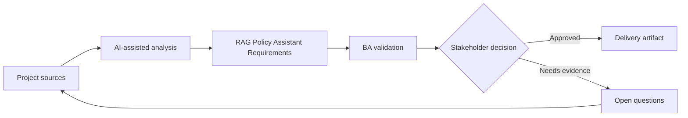

# RAG Policy Assistant Requirements

<div class="case-meta">
  <span>AI-enabled product use cases</span>
  <span>Knowledge assistant</span>
  <span>Project use case</span>
</div>

## Project context

HR wants an internal assistant that answers employee policy questions using approved documents. Users include employees, managers, and HR advisors, each with different access levels and escalation paths. In a real delivery environment, this work usually appears under time pressure: stakeholders want clarity, delivery needs a backlog, QA needs testable behavior, and operations needs a process that can survive exceptions. The BA uses AI here to accelerate analysis and synthesis, but the BA remains accountable for evidence, business meaning, stakeholder decisioning, and artifact quality.

## BA challenge

The BA must specify a RAG assistant beyond chatbot UX: source authority, freshness, permissions, citation behavior, conflict handling, fallback, evaluation, and operational ownership. The practical difficulty is that AI can make early material look more complete than it is. A strong BA keeps the output reviewable by separating source-backed facts, assumptions, unsupported claims, decision gaps, and recommended next actions. The objective is not to make the document longer; it is to make the project decision clearer and safer.

## Where AI fits

<div class="ba-workbench-panel">
AI is useful in this use case when it is constrained to analysis support, pattern detection, structured drafting, and critique. It should not approve scope, invent policy, decide business trade-offs, or replace accountable stakeholder judgment.
</div>

- Inventory authoritative knowledge sources and metadata needs.
- Draft retrieval and answer requirements.
- Generate fallback scenarios for weak or conflicting evidence.
- Create evaluation cases for retrieval quality and answer grounding.

## Inputs to prepare

- Policy repository
- Legacy handbook
- Role access rules
- HR escalation process
- Common employee questions

A BA should label these inputs before using AI: source owner, source date, approval status, sensitivity level, and whether the source is fact, opinion, policy, draft, or historical evidence. This preparation prevents the model from treating every input as equally current and authoritative.

## BA workflow

1. Define approved sources, owners, effective dates, and access rules.
2. Ask AI to draft a knowledge contract and identify source conflicts.
3. Specify answer behavior: citation, confidence, refusal, and escalation.
4. Create evaluation questions for common, edge, and conflict cases.
5. Review privacy and access controls with security and HR.
6. Publish requirements with retrieval metrics and monitoring events.

The workflow works best as a staged AI collaboration: first organize the evidence, then ask for analysis, then create the artifact, then run a critique pass. The BA should keep a visible decision log throughout the process so that AI-generated suggestions do not silently become approved scope.

## Diagram



## Deliverables

| Deliverable | What it contains | Owner | Done signal |
| --- | --- | --- | --- |
| Knowledge contract | Sources, owner, authority, freshness, metadata, and access | BA and HR owner | Every source has authority status |
| RAG requirement set | Retrieval, citation, fallback, conflict, and permission requirements | BA | Requirements cover retrieval and generation |
| Evaluation case set | Question, expected source, expected answer behavior, and risk | QA and BA | Evaluation covers common and edge cases |
| Operational playbook | Fallback, escalation, correction capture, and monitoring | HR operations | Assistant has owner after launch |

These deliverables should be treated as BA-owned artifacts. AI can draft them, but the BA must validate source support, stakeholder meaning, traceability, and whether the artifact is ready for handoff.

## Prompt to try

```text
Act as a senior AI-aware Business Analyst. Help me apply the "RAG Policy Assistant Requirements" use case to my project. First ask for source evidence and constraints. Then create a structured analysis with project context, assumptions, AI-fit boundary, workflow steps, deliverables, risks, controls, open questions, and stakeholder decisions. Do not invent policy, thresholds, or approvals.
```

## Review checklist

- Every AI-produced statement is tied to a source, assumption, or validation question.
- The BA has separated drafting assistance from business approval.
- Workflow steps identify the human owner for decisions, review, and exceptions.
- Deliverables are traceable to project inputs and can be reviewed by QA, product, or operations.
- Risk controls are practical enough to be used in a real project meeting.
- Success metric: The assistant answers only from trusted sources, cites evidence, respects access, and escalates safely.

## Risks and controls

| Risk | Why it matters | BA control |
| --- | --- | --- |
| Stale policy | Assistant may cite old documents | Require effective date metadata and source priority |
| Access leakage | Manager-only content may appear to employees | Permission-aware retrieval and security tests |
| Citation theater | Answer may cite a source that does not support the claim | Evaluate claim-source support |
| No fallback | Assistant may invent when evidence is weak | Require refusal and escalation behavior |

The key control is to make uncertainty visible. If evidence is weak, the output should create a validation question or decision item, not a final requirement. If the artifact influences delivery, release, compliance, customer experience, or operational workload, the BA should require explicit human review before handoff.
