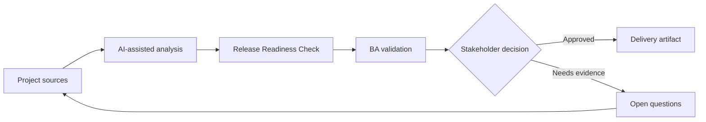

# Release Readiness Check

<div class="case-meta">
  <span>Delivery and QA</span>
  <span>Release management</span>
  <span>Project use case</span>
</div>

## Project context

A customer-facing release is close to go-live. Development is mostly complete, but there are open defects, unresolved support process questions, incomplete training notes, and uncertainty about rollback communication. In Release management, this work usually starts when delivery decisions, test evidence, and release readiness need to stay connected to original intent. The BA should treat Release scope and Traceability matrix as evidence to organize, not as raw material for an unconstrained AI answer. The goal is to make the next decision clearer for the people who own the outcome.

## BA challenge

The BA must help create a release readiness view that integrates requirements, test results, defects, operational readiness, training, communication, rollback, and business sign-off. AI can summarize status but cannot make the go-live decision. For Release Readiness Check, the practical difficulty is optimistic status and late requirement discovery. AI can accelerate scenario generation, defect triage support, readiness synthesis, and risk surfacing, but the BA must still expose assumptions, missing approvals, and the point where stakeholder judgment is required.

## Where AI fits

<div class="ba-workbench-panel">
AI fits this Delivery and QA use case when it is constrained to scenario generation, defect triage support, readiness synthesis, and risk surfacing. A useful first AI task is: Summarize readiness evidence from multiple project artifacts. AI should not approve scope, invent policy, bypass requirement baseline, test results, defect history, and release decisions, or turn a draft into a final decision.
</div>

- Summarize readiness evidence from multiple project artifacts.
- Identify missing operational, training, and support readiness items.
- Create a go-live risk summary and exception list.
- Draft stakeholder-specific sign-off questions.

## Inputs to prepare

- Release scope
- Traceability matrix
- Test summary
- Defect list
- Operations and support readiness notes

Before prompting for Release Readiness Check, label each input by owner, date, approval status, sensitivity, and role in the decision. The most important evidence lens is requirement baseline, test results, defect history, and release decisions; without it, AI may rank old notes, draft designs, and approved rules as if they had equal authority.

## BA workflow

1. Collect readiness evidence from delivery, QA, support, operations, and product.
2. Ask AI to organize evidence by readiness dimension.
3. Identify exceptions and classify by go-live risk.
4. Verify defect and test status with QA and engineering.
5. Create decision options: go, go with exceptions, delay, or partial rollout.
6. Publish a readiness brief for the sign-off meeting.

Run the workflow as quality review before release or rework decision: start with "Collect readiness evidence from delivery, QA, support, operations, and product.", then keep a visible decision log as the artifact moves toward Readiness dashboard. This prevents AI suggestions from silently becoming backlog, design, release, or operational commitments.

## Diagram



## Deliverables

| Deliverable | What it contains | Owner | Done signal |
| --- | --- | --- | --- |
| Readiness dashboard | Scope, testing, defects, operations, training, communication, and rollback status | BA | Every dimension has status and owner |
| Exception register | Open issue, risk, decision needed, owner, and due date | Project manager | No exception lacks decision path |
| Go-live decision brief | Options, risks, mitigations, and recommendation | Product owner | Decision makers can compare trade-offs |
| Support readiness checklist | Known issues, scripts, escalation, and customer communication | Support lead | Support can handle launch questions |

Treat Readiness dashboard as a BA-owned QA and delivery handoff artifact. AI may draft structure, but the BA must validate whether "Every dimension has status and owner" is actually true, whether the artifact is traceable to source evidence, and whether the receiving team can act on it.

## Prompt to try

```text
Act as a senior AI-aware Business Analyst. Help me apply the "Release Readiness Check" use case to my project. First ask for source evidence and constraints. Then create a structured analysis with project context, assumptions, AI-fit boundary, workflow steps, deliverables, risks, controls, open questions, and stakeholder decisions. Do not invent policy, thresholds, or approvals.
```

## Review checklist

- Release scope is labeled with owner, date, approval status, and sensitivity.
- Readiness dashboard traces to source evidence and has a named human owner.
- The AI task stays inside scenario generation, defect triage support, readiness synthesis, and risk surfacing and does not approve scope or policy.
- The "Green status bias" risk has a practical control: Ask for source evidence and owner confirmation.
- Open assumptions are converted into validation questions or stakeholder decisions.
- Success metric: The go-live meeting uses a shared evidence-based readiness brief instead of fragmented status updates.

## Risks and controls

| Risk | Why it matters | BA control |
| --- | --- | --- |
| Green status bias | Teams may report optimistic status without evidence | Ask for source evidence and owner confirmation |
| Operational blind spot | Training and support may be incomplete even when code is ready | Include non-technical readiness dimensions |
| Exception ambiguity | Open issues may lack go-live decision | Assign decision owner and accepted-risk status |
| Rollback confusion | Users may be affected if rollback plan is unclear | Include rollback and communication requirements |

The main control for the "Green status bias" risk is explicit human accountability: Ask for source evidence and owner confirmation. If evidence is weak, the output should create a validation question or decision item, not a final requirement.
