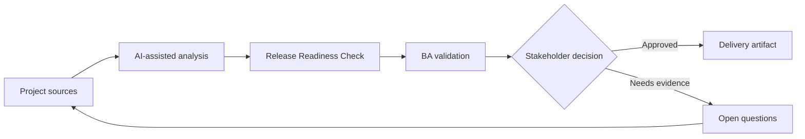

# Release Readiness Check

<div class="case-meta">
  <span>Delivery and QA</span>
  <span>Release management</span>
  <span>Project use case</span>
</div>

## Project context

A customer-facing release is close to go-live. Development is mostly complete, but there are open defects, unresolved support process questions, incomplete training notes, and uncertainty about rollback communication. In a real delivery environment, this work usually appears under time pressure: stakeholders want clarity, delivery needs a backlog, QA needs testable behavior, and operations needs a process that can survive exceptions. The BA uses AI here to accelerate analysis and synthesis, but the BA remains accountable for evidence, business meaning, stakeholder decisioning, and artifact quality.

## BA challenge

The BA must help create a release readiness view that integrates requirements, test results, defects, operational readiness, training, communication, rollback, and business sign-off. AI can summarize status but cannot make the go-live decision. The practical difficulty is that AI can make early material look more complete than it is. A strong BA keeps the output reviewable by separating source-backed facts, assumptions, unsupported claims, decision gaps, and recommended next actions. The objective is not to make the document longer; it is to make the project decision clearer and safer.

## Where AI fits

<div class="ba-workbench-panel">
AI is useful in this use case when it is constrained to analysis support, pattern detection, structured drafting, and critique. It should not approve scope, invent policy, decide business trade-offs, or replace accountable stakeholder judgment.
</div>

- Summarize readiness evidence from multiple project artifacts.
- Identify missing operational, training, and support readiness items.
- Create a go-live risk summary and exception list.
- Draft stakeholder-specific sign-off questions.

## Inputs to prepare

- Release scope
- Traceability matrix
- Test summary
- Defect list
- Operations and support readiness notes

A BA should label these inputs before using AI: source owner, source date, approval status, sensitivity level, and whether the source is fact, opinion, policy, draft, or historical evidence. This preparation prevents the model from treating every input as equally current and authoritative.

## BA workflow

1. Collect readiness evidence from delivery, QA, support, operations, and product.
2. Ask AI to organize evidence by readiness dimension.
3. Identify exceptions and classify by go-live risk.
4. Verify defect and test status with QA and engineering.
5. Create decision options: go, go with exceptions, delay, or partial rollout.
6. Publish a readiness brief for the sign-off meeting.

The workflow works best as a staged AI collaboration: first organize the evidence, then ask for analysis, then create the artifact, then run a critique pass. The BA should keep a visible decision log throughout the process so that AI-generated suggestions do not silently become approved scope.

## Diagram



## Deliverables

| Deliverable | What it contains | Owner | Done signal |
| --- | --- | --- | --- |
| Readiness dashboard | Scope, testing, defects, operations, training, communication, and rollback status | BA | Every dimension has status and owner |
| Exception register | Open issue, risk, decision needed, owner, and due date | Project manager | No exception lacks decision path |
| Go-live decision brief | Options, risks, mitigations, and recommendation | Product owner | Decision makers can compare trade-offs |
| Support readiness checklist | Known issues, scripts, escalation, and customer communication | Support lead | Support can handle launch questions |

These deliverables should be treated as BA-owned artifacts. AI can draft them, but the BA must validate source support, stakeholder meaning, traceability, and whether the artifact is ready for handoff.

## Prompt to try

```text
Act as a senior AI-aware Business Analyst. Help me apply the "Release Readiness Check" use case to my project. First ask for source evidence and constraints. Then create a structured analysis with project context, assumptions, AI-fit boundary, workflow steps, deliverables, risks, controls, open questions, and stakeholder decisions. Do not invent policy, thresholds, or approvals.
```

## Review checklist

- Every AI-produced statement is tied to a source, assumption, or validation question.
- The BA has separated drafting assistance from business approval.
- Workflow steps identify the human owner for decisions, review, and exceptions.
- Deliverables are traceable to project inputs and can be reviewed by QA, product, or operations.
- Risk controls are practical enough to be used in a real project meeting.
- Success metric: The go-live meeting uses a shared evidence-based readiness brief instead of fragmented status updates.

## Risks and controls

| Risk | Why it matters | BA control |
| --- | --- | --- |
| Green status bias | Teams may report optimistic status without evidence | Ask for source evidence and owner confirmation |
| Operational blind spot | Training and support may be incomplete even when code is ready | Include non-technical readiness dimensions |
| Exception ambiguity | Open issues may lack go-live decision | Assign decision owner and accepted-risk status |
| Rollback confusion | Users may be affected if rollback plan is unclear | Include rollback and communication requirements |

The key control is to make uncertainty visible. If evidence is weak, the output should create a validation question or decision item, not a final requirement. If the artifact influences delivery, release, compliance, customer experience, or operational workload, the BA should require explicit human review before handoff.
