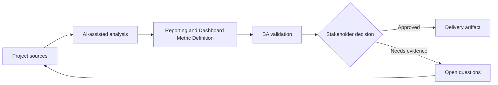

# Reporting and Dashboard Metric Definition

<div class="case-meta">
  <span>Data and Integration</span>
  <span>Reporting</span>
  <span>Project use case</span>
</div>

## Project context

Leadership wants a dashboard for onboarding cycle time, conversion, support contact rate, and document rejection reasons. Teams disagree on metric definitions and data sources. In a real delivery environment, this work usually appears under time pressure: stakeholders want clarity, delivery needs a backlog, QA needs testable behavior, and operations needs a process that can survive exceptions. The BA uses AI here to accelerate analysis and synthesis, but the BA remains accountable for evidence, business meaning, stakeholder decisioning, and artifact quality.

## BA challenge

The BA must define metrics so dashboards do not create false decisions. Each metric needs definition, denominator, numerator, filters, data source, freshness, owner, and known limitations. The practical difficulty is that AI can make early material look more complete than it is. A strong BA keeps the output reviewable by separating source-backed facts, assumptions, unsupported claims, decision gaps, and recommended next actions. The objective is not to make the document longer; it is to make the project decision clearer and safer.

## Where AI fits

<div class="ba-workbench-panel">
AI is useful in this use case when it is constrained to analysis support, pattern detection, structured drafting, and critique. It should not approve scope, invent policy, decide business trade-offs, or replace accountable stakeholder judgment.
</div>

- Draft metric definition table from business questions.
- Identify ambiguous numerator, denominator, and filter logic.
- Generate dashboard acceptance criteria and data quality checks.
- Create stakeholder questions for metric ownership.

## Inputs to prepare

- Business questions
- Data source list
- Event taxonomy
- Current reports
- Stakeholder decisions

A BA should label these inputs before using AI: source owner, source date, approval status, sensitivity level, and whether the source is fact, opinion, policy, draft, or historical evidence. This preparation prevents the model from treating every input as equally current and authoritative.

## BA workflow

1. Start with decisions the dashboard should support.
2. Ask AI to draft metric definitions and ambiguity questions.
3. Define numerator, denominator, filters, grain, freshness, and owner.
4. Validate data source availability and quality with data team.
5. Create acceptance criteria for calculation and display behavior.
6. Add caveats and known limitations to dashboard requirements.

The workflow works best as a staged AI collaboration: first organize the evidence, then ask for analysis, then create the artifact, then run a critique pass. The BA should keep a visible decision log throughout the process so that AI-generated suggestions do not silently become approved scope.

## Diagram



## Deliverables

| Deliverable | What it contains | Owner | Done signal |
| --- | --- | --- | --- |
| Metric definition catalog | Metric, purpose, numerator, denominator, filter, grain, source, and owner | BA and data owner | Metrics are unambiguous |
| Dashboard requirement spec | Visualization, interaction, filter, export, and access behavior | BA and product | Dashboard behavior is testable |
| Data quality checklist | Completeness, freshness, reconciliation, and known limitation | Data team | Quality risk is visible |
| Decision-use map | Metric to decision, stakeholder, and action threshold | Product owner | Dashboard supports decisions |

These deliverables should be treated as BA-owned artifacts. AI can draft them, but the BA must validate source support, stakeholder meaning, traceability, and whether the artifact is ready for handoff.

## Prompt to try

```text
Act as a senior AI-aware Business Analyst. Help me apply the "Reporting and Dashboard Metric Definition" use case to my project. First ask for source evidence and constraints. Then create a structured analysis with project context, assumptions, AI-fit boundary, workflow steps, deliverables, risks, controls, open questions, and stakeholder decisions. Do not invent policy, thresholds, or approvals.
```

## Review checklist

- Every AI-produced statement is tied to a source, assumption, or validation question.
- The BA has separated drafting assistance from business approval.
- Workflow steps identify the human owner for decisions, review, and exceptions.
- Deliverables are traceable to project inputs and can be reviewed by QA, product, or operations.
- Risk controls are practical enough to be used in a real project meeting.
- Success metric: Dashboard metrics become decision-ready because definitions, sources, and limitations are explicit.

## Risks and controls

| Risk | Why it matters | BA control |
| --- | --- | --- |
| Metric ambiguity | Different teams may calculate same metric differently | Define numerator, denominator, filters, and grain |
| False precision | Dashboard may look accurate with poor data quality | Show caveats and quality checks |
| Decision disconnect | Metric may not support any action | Map metric to decision |
| Stale data | Leaders may act on outdated values | Define freshness and update time |

The key control is to make uncertainty visible. If evidence is weak, the output should create a validation question or decision item, not a final requirement. If the artifact influences delivery, release, compliance, customer experience, or operational workload, the BA should require explicit human review before handoff.
