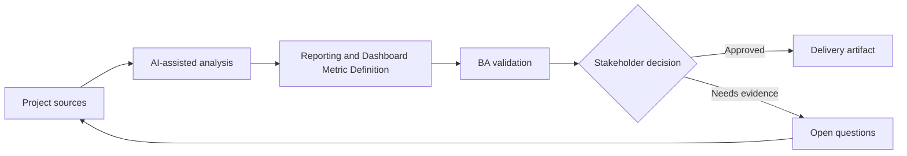

# Reporting and Dashboard Metric Definition

<div class="case-meta">
  <span>Data and Integration</span>
  <span>Reporting</span>
  <span>Data and integration</span>
  <span>Advanced</span>
  <span>Metric definition catalog</span>
  <span>Project use case</span>
</div>

## Project context

Leadership wants a dashboard for onboarding cycle time, conversion, support contact rate, and document rejection reasons. Teams disagree on metric definitions and data sources. In Reporting, this work usually starts when data movement, mapping, reconciliation, privacy, and lineage decisions affect multiple systems and owners. The BA should treat Business questions and Data source list as evidence to organize, not as raw material for an unconstrained AI answer. The goal is to make the next decision clearer for the people who own the outcome.

## BA challenge

The BA must define metrics so dashboards do not create false decisions. Each metric needs definition, denominator, numerator, filters, data source, freshness, owner, and known limitations. For Reporting and Dashboard Metric Definition, the practical difficulty is silent data loss and weak lineage. AI can accelerate field mapping, rule comparison, reconciliation design, lineage review, and exception analysis, but the BA must still expose assumptions, missing approvals, and the point where stakeholder judgment is required.

## Where AI fits

<div class="ba-workbench-panel">
AI fits this Data and Integration use case when it is constrained to field mapping, rule comparison, reconciliation design, lineage review, and exception analysis. A useful first AI task is: Draft metric definition table from business questions. AI should not approve scope, invent policy, bypass source schemas, sample payloads, mapping rules, data-quality reports, and ownership matrix, or turn a draft into a final decision.
</div>

- Draft metric definition table from business questions.
- Identify ambiguous numerator, denominator, and filter logic.
- Generate dashboard acceptance criteria and data quality checks.
- Create stakeholder questions for metric ownership.

## Inputs to prepare

- Business questions
- Data source list
- Event taxonomy
- Current reports
- Stakeholder decisions

Before prompting for Reporting and Dashboard Metric Definition, label each input by owner, date, approval status, sensitivity, and role in the decision. The most important evidence lens is source schemas, sample payloads, mapping rules, data-quality reports, and ownership matrix; without it, AI may rank old notes, draft designs, and approved rules as if they had equal authority.

## BA workflow

1. Start with decisions the dashboard should support.
2. Ask AI to draft metric definitions and ambiguity questions.
3. Define numerator, denominator, filters, grain, freshness, and owner.
4. Validate data source availability and quality with data team.
5. Create acceptance criteria for calculation and display behavior.
6. Add caveats and known limitations to dashboard requirements.

Run the workflow as data contract review before integration build: start with "Start with decisions the dashboard should support.", then keep a visible decision log as the artifact moves toward Metric definition catalog. This prevents AI suggestions from silently becoming backlog, design, release, or operational commitments.

## Diagram



## Deliverables

| Deliverable | What it contains | Owner | Done signal |
| --- | --- | --- | --- |
| Metric definition catalog | Metric, purpose, numerator, denominator, filter, grain, source, and owner | BA and data owner | Metrics are unambiguous |
| Dashboard requirement spec | Visualization, interaction, filter, export, and access behavior | BA and product | Dashboard behavior is testable |
| Data quality checklist | Completeness, freshness, reconciliation, and known limitation | Data team | Quality risk is visible |
| Decision-use map | Metric to decision, stakeholder, and action threshold | Product owner | Dashboard supports decisions |

Treat Metric definition catalog as a BA-owned data and integration control pack. AI may draft structure, but the BA must validate whether "Metrics are unambiguous" is actually true, whether the artifact is traceable to source evidence, and whether the receiving team can act on it.

## Prompt to try

```text
Act as a senior AI-aware Business Analyst. Help me apply the "Reporting and Dashboard Metric Definition" use case to my project. First ask for source evidence and constraints. Then create a structured analysis with project context, assumptions, AI-fit boundary, workflow steps, deliverables, risks, controls, open questions, and stakeholder decisions. Do not invent policy, thresholds, or approvals.
```

## Review checklist

- Business questions is labeled with owner, date, approval status, and sensitivity.
- Metric definition catalog traces to source evidence and has a named human owner.
- The AI task stays inside field mapping, rule comparison, reconciliation design, lineage review, and exception analysis and does not approve scope or policy.
- The "Metric ambiguity" risk has a practical control: Define numerator, denominator, filters, and grain.
- Open assumptions are converted into validation questions or stakeholder decisions.
- Success metric: Dashboard metrics become decision-ready because definitions, sources, and limitations are explicit.

## Risks and controls

| Risk | Why it matters | BA control |
| --- | --- | --- |
| Metric ambiguity | Different teams may calculate same metric differently | Define numerator, denominator, filters, and grain |
| False precision | Dashboard may look accurate with poor data quality | Show caveats and quality checks |
| Decision disconnect | Metric may not support any action | Map metric to decision |
| Stale data | Leaders may act on outdated values | Define freshness and update time |

The main control for the "Metric ambiguity" risk is explicit human accountability: Define numerator, denominator, filters, and grain. If evidence is weak, the output should create a validation question or decision item, not a final requirement.
