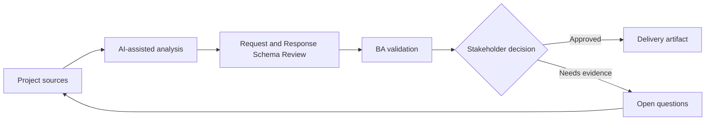

# Request and Response Schema Review

<div class="case-meta">
  <span>Backend and API</span>
  <span>Schema design</span>
  <span>Project use case</span>
</div>

## Project context

A backend team drafts request and response schemas for a partner onboarding API. Product stakeholders cannot tell whether optional fields, null values, nested objects, and identifiers match business rules. In Schema design, this work usually starts when API contracts, permissions, errors, audit, and operational behavior must be explicit enough for backend delivery. The BA should treat OpenAPI draft and Business glossary as evidence to organize, not as raw material for an unconstrained AI answer. The goal is to make the next decision clearer for the people who own the outcome.

## BA challenge

The BA must review schema semantics with business owners. The goal is to ensure fields, nullability, defaults, enums, IDs, and nested structures represent real business concepts and lifecycle states. For Request and Response Schema Review, the practical difficulty is ambiguous service behavior and security gaps. AI can accelerate contract critique, rule extraction, error taxonomy, permission review, and NFR gap detection, but the BA must still expose assumptions, missing approvals, and the point where stakeholder judgment is required.

## Where AI fits

<div class="ba-workbench-panel">
AI fits this Backend and API use case when it is constrained to contract critique, rule extraction, error taxonomy, permission review, and NFR gap detection. A useful first AI task is: Explain schema fields in business language. AI should not approve scope, invent policy, bypass API draft, data model, auth rules, error samples, audit policy, and integration needs, or turn a draft into a final decision.
</div>

- Explain schema fields in business language.
- Identify unclear nullability, enum, and nested object rules.
- Generate business questions for schema review.
- Draft schema examples for common and edge scenarios.

## Inputs to prepare

- OpenAPI draft
- Business glossary
- Entity lifecycle
- Validation policy
- Example payloads

Before prompting for Request and Response Schema Review, label each input by owner, date, approval status, sensitivity, and role in the decision. The most important evidence lens is API draft, data model, auth rules, error samples, audit policy, and integration needs; without it, AI may rank old notes, draft designs, and approved rules as if they had equal authority.

## BA workflow

1. Load schema fields into a field review table.
2. Ask AI to translate technical schema into business meaning.
3. Identify fields without source rule, unclear optionality, or ambiguous enum values.
4. Create example payloads for common, boundary, and invalid cases.
5. Review with backend, product, QA, and data owners.
6. Update schema decisions and validation requirements.

Run the workflow as contract validation before implementation: start with "Load schema fields into a field review table.", then keep a visible decision log as the artifact moves toward Schema review table. This prevents AI suggestions from silently becoming backlog, design, release, or operational commitments.

## Diagram



## Deliverables

| Deliverable | What it contains | Owner | Done signal |
| --- | --- | --- | --- |
| Schema review table | Field, meaning, required status, nullability, enum, default, and source rule | BA | Business owners can review schema |
| Payload examples | Common, edge, invalid, and backwards-compatible examples | Backend and QA | Examples cover real scenarios |
| Schema question log | Ambiguity, decision owner, option, and resolution | BA | Unclear fields are resolved |
| Validation alignment matrix | Schema rule, business rule, API validation, and UI validation | BA and QA | Validation is consistent |

Treat Schema review table as a BA-owned backend behavior contract. AI may draft structure, but the BA must validate whether "Business owners can review schema" is actually true, whether the artifact is traceable to source evidence, and whether the receiving team can act on it.

## Prompt to try

```text
Act as a senior AI-aware Business Analyst. Help me apply the "Request and Response Schema Review" use case to my project. First ask for source evidence and constraints. Then create a structured analysis with project context, assumptions, AI-fit boundary, workflow steps, deliverables, risks, controls, open questions, and stakeholder decisions. Do not invent policy, thresholds, or approvals.
```

## Review checklist

- OpenAPI draft is labeled with owner, date, approval status, and sensitivity.
- Schema review table traces to source evidence and has a named human owner.
- The AI task stays inside contract critique, rule extraction, error taxonomy, permission review, and NFR gap detection and does not approve scope or policy.
- The "Optionality confusion" risk has a practical control: Define nullability and absence semantics.
- Open assumptions are converted into validation questions or stakeholder decisions.
- Success metric: API schema fields are understandable, testable, and aligned to business concepts.

## Risks and controls

| Risk | Why it matters | BA control |
| --- | --- | --- |
| Optionality confusion | Null and omitted values may mean different business states | Define nullability and absence semantics |
| Enum drift | Enum values may not match business language | Review enum labels and lifecycle states |
| Identifier ambiguity | IDs may be reused incorrectly across systems | Define ID source and uniqueness |
| Example shortage | Teams cannot test schema edge cases | Create payload examples |

The main control for the "Optionality confusion" risk is explicit human accountability: Define nullability and absence semantics. If evidence is weak, the output should create a validation question or decision item, not a final requirement.
