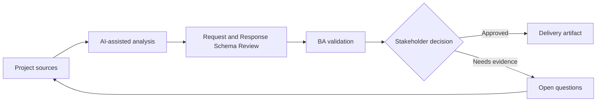

# Request and Response Schema Review

<div class="case-meta">
  <span>Backend and API</span>
  <span>Schema design</span>
  <span>Project use case</span>
</div>

## Project context

A backend team drafts request and response schemas for a partner onboarding API. Product stakeholders cannot tell whether optional fields, null values, nested objects, and identifiers match business rules. In a real delivery environment, this work usually appears under time pressure: stakeholders want clarity, delivery needs a backlog, QA needs testable behavior, and operations needs a process that can survive exceptions. The BA uses AI here to accelerate analysis and synthesis, but the BA remains accountable for evidence, business meaning, stakeholder decisioning, and artifact quality.

## BA challenge

The BA must review schema semantics with business owners. The goal is to ensure fields, nullability, defaults, enums, IDs, and nested structures represent real business concepts and lifecycle states. The practical difficulty is that AI can make early material look more complete than it is. A strong BA keeps the output reviewable by separating source-backed facts, assumptions, unsupported claims, decision gaps, and recommended next actions. The objective is not to make the document longer; it is to make the project decision clearer and safer.

## Where AI fits

<div class="ba-workbench-panel">
AI is useful in this use case when it is constrained to analysis support, pattern detection, structured drafting, and critique. It should not approve scope, invent policy, decide business trade-offs, or replace accountable stakeholder judgment.
</div>

- Explain schema fields in business language.
- Identify unclear nullability, enum, and nested object rules.
- Generate business questions for schema review.
- Draft schema examples for common and edge scenarios.

## Inputs to prepare

- OpenAPI draft
- Business glossary
- Entity lifecycle
- Validation policy
- Example payloads

A BA should label these inputs before using AI: source owner, source date, approval status, sensitivity level, and whether the source is fact, opinion, policy, draft, or historical evidence. This preparation prevents the model from treating every input as equally current and authoritative.

## BA workflow

1. Load schema fields into a field review table.
2. Ask AI to translate technical schema into business meaning.
3. Identify fields without source rule, unclear optionality, or ambiguous enum values.
4. Create example payloads for common, boundary, and invalid cases.
5. Review with backend, product, QA, and data owners.
6. Update schema decisions and validation requirements.

The workflow works best as a staged AI collaboration: first organize the evidence, then ask for analysis, then create the artifact, then run a critique pass. The BA should keep a visible decision log throughout the process so that AI-generated suggestions do not silently become approved scope.

## Diagram



## Deliverables

| Deliverable | What it contains | Owner | Done signal |
| --- | --- | --- | --- |
| Schema review table | Field, meaning, required status, nullability, enum, default, and source rule | BA | Business owners can review schema |
| Payload examples | Common, edge, invalid, and backwards-compatible examples | Backend and QA | Examples cover real scenarios |
| Schema question log | Ambiguity, decision owner, option, and resolution | BA | Unclear fields are resolved |
| Validation alignment matrix | Schema rule, business rule, API validation, and UI validation | BA and QA | Validation is consistent |

These deliverables should be treated as BA-owned artifacts. AI can draft them, but the BA must validate source support, stakeholder meaning, traceability, and whether the artifact is ready for handoff.

## Prompt to try

```text
Act as a senior AI-aware Business Analyst. Help me apply the "Request and Response Schema Review" use case to my project. First ask for source evidence and constraints. Then create a structured analysis with project context, assumptions, AI-fit boundary, workflow steps, deliverables, risks, controls, open questions, and stakeholder decisions. Do not invent policy, thresholds, or approvals.
```

## Review checklist

- Every AI-produced statement is tied to a source, assumption, or validation question.
- The BA has separated drafting assistance from business approval.
- Workflow steps identify the human owner for decisions, review, and exceptions.
- Deliverables are traceable to project inputs and can be reviewed by QA, product, or operations.
- Risk controls are practical enough to be used in a real project meeting.
- Success metric: API schema fields are understandable, testable, and aligned to business concepts.

## Risks and controls

| Risk | Why it matters | BA control |
| --- | --- | --- |
| Optionality confusion | Null and omitted values may mean different business states | Define nullability and absence semantics |
| Enum drift | Enum values may not match business language | Review enum labels and lifecycle states |
| Identifier ambiguity | IDs may be reused incorrectly across systems | Define ID source and uniqueness |
| Example shortage | Teams cannot test schema edge cases | Create payload examples |

The key control is to make uncertainty visible. If evidence is weak, the output should create a validation question or decision item, not a final requirement. If the artifact influences delivery, release, compliance, customer experience, or operational workload, the BA should require explicit human review before handoff.
