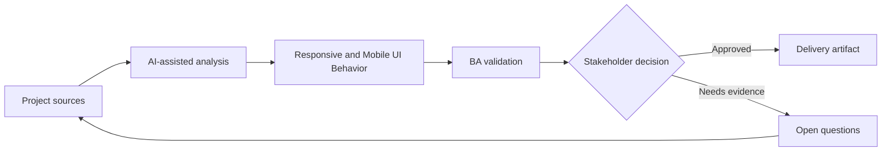

# Responsive and Mobile UI Behavior

<div class="case-meta">
  <span>Frontend, UI, and UX</span>
  <span>Responsive design</span>
  <span>Project use case</span>
</div>

## Project context

A desktop-first admin workflow must also work on tablets and mobile devices for field operations. The design has desktop screens, but mobile breakpoints, priority content, and touch interactions are undefined. In Responsive design, this work usually starts when screen behavior, accessibility, design states, analytics, and user feedback must become implementable requirements. The BA should treat Desktop design and Target device list as evidence to organize, not as raw material for an unconstrained AI answer. The goal is to make the next decision clearer for the people who own the outcome.

## BA challenge

The BA must specify responsive behavior as requirements, not leave it as CSS interpretation. The BA needs to define content priority, hidden or collapsed controls, mobile action patterns, table behavior, and acceptance criteria across viewports. For Responsive and Mobile UI Behavior, the practical difficulty is missing states and unmeasurable UX. AI can accelerate UI-state analysis, content critique, accessibility review, event taxonomy, and edge-case discovery, but the BA must still expose assumptions, missing approvals, and the point where stakeholder judgment is required.

## Where AI fits

<div class="ba-workbench-panel">
AI fits this Frontend, UI, and UX use case when it is constrained to UI-state analysis, content critique, accessibility review, event taxonomy, and edge-case discovery. A useful first AI task is: Generate responsive behavior questions from desktop design. AI should not approve scope, invent policy, bypass wireframes, design tokens, user journeys, analytics questions, and accessibility expectations, or turn a draft into a final decision.
</div>

- Generate responsive behavior questions from desktop design.
- Draft content priority and mobile state matrix.
- Identify risky components such as tables, filters, modals, and bulk actions.
- Create viewport-based acceptance criteria.

## Inputs to prepare

- Desktop design
- Target device list
- User journey
- Component library rules
- Usage analytics

Before prompting for Responsive and Mobile UI Behavior, label each input by owner, date, approval status, sensitivity, and role in the decision. The most important evidence lens is wireframes, design tokens, user journeys, analytics questions, and accessibility expectations; without it, AI may rank old notes, draft designs, and approved rules as if they had equal authority.

## BA workflow

1. Confirm target devices, breakpoints, and primary mobile tasks.
2. Ask AI to identify elements likely to fail on small screens.
3. Define content priority, stacking order, collapsed controls, and table behavior.
4. Review touch, keyboard, and accessibility implications.
5. Write acceptance criteria by viewport and role.
6. Add QA checklist for real devices and browser combinations.

Run the workflow as screen-state review before frontend build: start with "Confirm target devices, breakpoints, and primary mobile tasks.", then keep a visible decision log as the artifact moves toward Responsive behavior matrix. This prevents AI suggestions from silently becoming backlog, design, release, or operational commitments.

## Diagram



## Deliverables

| Deliverable | What it contains | Owner | Done signal |
| --- | --- | --- | --- |
| Responsive behavior matrix | Viewport, content priority, layout, control behavior, and exception | BA and UX | Breakpoints have rules |
| Mobile task checklist | Critical tasks, device, interaction, and acceptance signal | Product owner | Mobile tasks are viable |
| Component risk list | Tables, modals, filters, bulk actions, and overflow risks | Frontend | Risky components are designed |
| Viewport QA plan | Desktop, tablet, mobile, keyboard, and touch scenarios | QA | Responsive behavior is tested |

Treat Responsive behavior matrix as a BA-owned frontend requirement specification. AI may draft structure, but the BA must validate whether "Breakpoints have rules" is actually true, whether the artifact is traceable to source evidence, and whether the receiving team can act on it.

## Prompt to try

```text
Act as a senior AI-aware Business Analyst. Help me apply the "Responsive and Mobile UI Behavior" use case to my project. First ask for source evidence and constraints. Then create a structured analysis with project context, assumptions, AI-fit boundary, workflow steps, deliverables, risks, controls, open questions, and stakeholder decisions. Do not invent policy, thresholds, or approvals.
```

## Review checklist

- Desktop design is labeled with owner, date, approval status, and sensitivity.
- Responsive behavior matrix traces to source evidence and has a named human owner.
- The AI task stays inside UI-state analysis, content critique, accessibility review, event taxonomy, and edge-case discovery and does not approve scope or policy.
- The "Desktop assumption" risk has a practical control: Define mobile task coverage.
- Open assumptions are converted into validation questions or stakeholder decisions.
- Success metric: Responsive UI behavior is explicit enough for design, frontend, and QA to validate across devices.

## Risks and controls

| Risk | Why it matters | BA control |
| --- | --- | --- |
| Desktop assumption | Mobile users may not complete critical tasks | Define mobile task coverage |
| Table overflow | Important data may disappear or become unusable | Specify table collapse or horizontal behavior |
| Hidden actions | Collapsed controls may hide required actions | Define priority and discoverability |
| Device testing gap | Browser simulation may miss real device issues | Add real-device QA scenarios |

The main control for the "Desktop assumption" risk is explicit human accountability: Define mobile task coverage. If evidence is weak, the output should create a validation question or decision item, not a final requirement.
