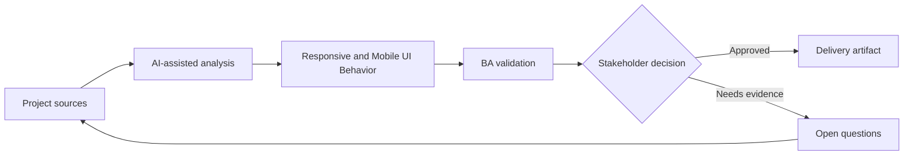

# Responsive and Mobile UI Behavior

<div class="case-meta">
  <span>Frontend, UI, and UX</span>
  <span>Responsive design</span>
  <span>Project use case</span>
</div>

## Project context

A desktop-first admin workflow must also work on tablets and mobile devices for field operations. The design has desktop screens, but mobile breakpoints, priority content, and touch interactions are undefined. In a real delivery environment, this work usually appears under time pressure: stakeholders want clarity, delivery needs a backlog, QA needs testable behavior, and operations needs a process that can survive exceptions. The BA uses AI here to accelerate analysis and synthesis, but the BA remains accountable for evidence, business meaning, stakeholder decisioning, and artifact quality.

## BA challenge

The BA must specify responsive behavior as requirements, not leave it as CSS interpretation. The BA needs to define content priority, hidden or collapsed controls, mobile action patterns, table behavior, and acceptance criteria across viewports. The practical difficulty is that AI can make early material look more complete than it is. A strong BA keeps the output reviewable by separating source-backed facts, assumptions, unsupported claims, decision gaps, and recommended next actions. The objective is not to make the document longer; it is to make the project decision clearer and safer.

## Where AI fits

<div class="ba-workbench-panel">
AI is useful in this use case when it is constrained to analysis support, pattern detection, structured drafting, and critique. It should not approve scope, invent policy, decide business trade-offs, or replace accountable stakeholder judgment.
</div>

- Generate responsive behavior questions from desktop design.
- Draft content priority and mobile state matrix.
- Identify risky components such as tables, filters, modals, and bulk actions.
- Create viewport-based acceptance criteria.

## Inputs to prepare

- Desktop design
- Target device list
- User journey
- Component library rules
- Usage analytics

A BA should label these inputs before using AI: source owner, source date, approval status, sensitivity level, and whether the source is fact, opinion, policy, draft, or historical evidence. This preparation prevents the model from treating every input as equally current and authoritative.

## BA workflow

1. Confirm target devices, breakpoints, and primary mobile tasks.
2. Ask AI to identify elements likely to fail on small screens.
3. Define content priority, stacking order, collapsed controls, and table behavior.
4. Review touch, keyboard, and accessibility implications.
5. Write acceptance criteria by viewport and role.
6. Add QA checklist for real devices and browser combinations.

The workflow works best as a staged AI collaboration: first organize the evidence, then ask for analysis, then create the artifact, then run a critique pass. The BA should keep a visible decision log throughout the process so that AI-generated suggestions do not silently become approved scope.

## Diagram



## Deliverables

| Deliverable | What it contains | Owner | Done signal |
| --- | --- | --- | --- |
| Responsive behavior matrix | Viewport, content priority, layout, control behavior, and exception | BA and UX | Breakpoints have rules |
| Mobile task checklist | Critical tasks, device, interaction, and acceptance signal | Product owner | Mobile tasks are viable |
| Component risk list | Tables, modals, filters, bulk actions, and overflow risks | Frontend | Risky components are designed |
| Viewport QA plan | Desktop, tablet, mobile, keyboard, and touch scenarios | QA | Responsive behavior is tested |

These deliverables should be treated as BA-owned artifacts. AI can draft them, but the BA must validate source support, stakeholder meaning, traceability, and whether the artifact is ready for handoff.

## Prompt to try

```text
Act as a senior AI-aware Business Analyst. Help me apply the "Responsive and Mobile UI Behavior" use case to my project. First ask for source evidence and constraints. Then create a structured analysis with project context, assumptions, AI-fit boundary, workflow steps, deliverables, risks, controls, open questions, and stakeholder decisions. Do not invent policy, thresholds, or approvals.
```

## Review checklist

- Every AI-produced statement is tied to a source, assumption, or validation question.
- The BA has separated drafting assistance from business approval.
- Workflow steps identify the human owner for decisions, review, and exceptions.
- Deliverables are traceable to project inputs and can be reviewed by QA, product, or operations.
- Risk controls are practical enough to be used in a real project meeting.
- Success metric: Responsive UI behavior is explicit enough for design, frontend, and QA to validate across devices.

## Risks and controls

| Risk | Why it matters | BA control |
| --- | --- | --- |
| Desktop assumption | Mobile users may not complete critical tasks | Define mobile task coverage |
| Table overflow | Important data may disappear or become unusable | Specify table collapse or horizontal behavior |
| Hidden actions | Collapsed controls may hide required actions | Define priority and discoverability |
| Device testing gap | Browser simulation may miss real device issues | Add real-device QA scenarios |

The key control is to make uncertainty visible. If evidence is weak, the output should create a validation question or decision item, not a final requirement. If the artifact influences delivery, release, compliance, customer experience, or operational workload, the BA should require explicit human review before handoff.
