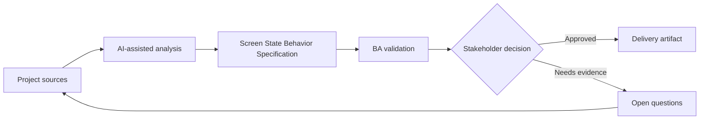

# Screen State Behavior Specification

<div class="case-meta">
  <span>Frontend, UI, and UX</span>
  <span>Screen behavior</span>
  <span>Frontend/UI refinement</span>
  <span>Practitioner</span>
  <span>State-action matrix</span>
  <span>Project use case</span>
</div>

## Project context

A team builds an order management screen with draft, submitted, approved, rejected, cancelled, and archived states. The design shows the happy path but not which actions and fields appear in each state. In Screen behavior, this work usually starts when screen behavior, accessibility, design states, analytics, and user feedback must become implementable requirements. The BA should treat Entity lifecycle model and Screen design as evidence to organize, not as raw material for an unconstrained AI answer. The goal is to make the next decision clearer for the people who own the outcome.

## BA challenge

The BA must specify screen behavior by lifecycle state so frontend, backend, and QA share the same interpretation. The BA needs to define available actions, disabled actions, visible fields, editable fields, messages, and transition rules. For Screen State Behavior Specification, the practical difficulty is missing states and unmeasurable UX. AI can accelerate UI-state analysis, content critique, accessibility review, event taxonomy, and edge-case discovery, but the BA must still expose assumptions, missing approvals, and the point where stakeholder judgment is required.

## Where AI fits

<div class="ba-workbench-panel">
AI fits this Frontend, UI, and UX use case when it is constrained to UI-state analysis, content critique, accessibility review, event taxonomy, and edge-case discovery. A useful first AI task is: Generate a state-action matrix from lifecycle notes. AI should not approve scope, invent policy, bypass wireframes, design tokens, user journeys, analytics questions, and accessibility expectations, or turn a draft into a final decision.
</div>

- Generate a state-action matrix from lifecycle notes.
- Find missing action permissions and transition rules.
- Draft UI state acceptance criteria and negative cases.
- Critique whether disabled actions need explanation or tooltip copy.

## Inputs to prepare

- Entity lifecycle model
- Screen design
- Permission rules
- Workflow policy
- Existing user stories

Before prompting for Screen State Behavior Specification, label each input by owner, date, approval status, sensitivity, and role in the decision. The most important evidence lens is wireframes, design tokens, user journeys, analytics questions, and accessibility expectations; without it, AI may rank old notes, draft designs, and approved rules as if they had equal authority.

## BA workflow

1. List every entity state and user role.
2. Ask AI to create a state-action-field matrix.
3. Review matrix with product for business rules and with frontend for feasibility.
4. Map each transition to backend validation and audit needs.
5. Write acceptance criteria for allowed, blocked, hidden, and disabled actions.
6. Add QA scenarios for each role-state combination.

Run the workflow as screen-state review before frontend build: start with "List every entity state and user role.", then keep a visible decision log as the artifact moves toward State-action matrix. This prevents AI suggestions from silently becoming backlog, design, release, or operational commitments.

## Diagram



## Deliverables

| Deliverable | What it contains | Owner | Done signal |
| --- | --- | --- | --- |
| State-action matrix | State, role, visible action, disabled action, field behavior, and rule | BA | Every action has state rule |
| Transition rule table | From state, to state, trigger, validation, audit, and owner | BA and backend | Backend can enforce transitions |
| UI message catalog | Tooltip, disabled reason, error, and confirmation copy | UX writer | Users understand unavailable actions |
| QA coverage map | Role-state scenarios and expected UI behavior | QA | State combinations are testable |

Treat State-action matrix as a BA-owned frontend requirement specification. AI may draft structure, but the BA must validate whether "Every action has state rule" is actually true, whether the artifact is traceable to source evidence, and whether the receiving team can act on it.

## Prompt to try

```text
Act as a senior AI-aware Business Analyst. Help me apply the "Screen State Behavior Specification" use case to my project. First ask for source evidence and constraints. Then create a structured analysis with project context, assumptions, AI-fit boundary, workflow steps, deliverables, risks, controls, open questions, and stakeholder decisions. Do not invent policy, thresholds, or approvals.
```

## Review checklist

- Entity lifecycle model is labeled with owner, date, approval status, and sensitivity.
- State-action matrix traces to source evidence and has a named human owner.
- The AI task stays inside UI-state analysis, content critique, accessibility review, event taxonomy, and edge-case discovery and does not approve scope or policy.
- The "State mismatch" risk has a practical control: Align UI state matrix with backend transition rules.
- Open assumptions are converted into validation questions or stakeholder decisions.
- Success metric: Frontend, backend, and QA use one shared state behavior matrix for implementation and testing.

## Risks and controls

| Risk | Why it matters | BA control |
| --- | --- | --- |
| State mismatch | Frontend may show actions backend rejects | Align UI state matrix with backend transition rules |
| Hidden business rule | Users may see confusing disabled buttons | Add reason copy for blocked actions |
| Role confusion | Different roles may need different behavior | Include role-state matrix |
| Incomplete QA | Rare states may be untested | Create scenarios for every state transition |

The main control for the "State mismatch" risk is explicit human accountability: Align UI state matrix with backend transition rules. If evidence is weak, the output should create a validation question or decision item, not a final requirement.
