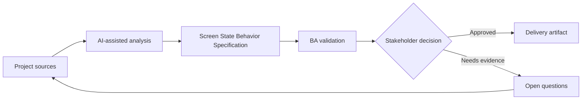

# Screen State Behavior Specification

<div class="case-meta">
  <span>Frontend, UI, and UX</span>
  <span>Screen behavior</span>
  <span>Project use case</span>
</div>

## Project context

A team builds an order management screen with draft, submitted, approved, rejected, cancelled, and archived states. The design shows the happy path but not which actions and fields appear in each state. In a real delivery environment, this work usually appears under time pressure: stakeholders want clarity, delivery needs a backlog, QA needs testable behavior, and operations needs a process that can survive exceptions. The BA uses AI here to accelerate analysis and synthesis, but the BA remains accountable for evidence, business meaning, stakeholder decisioning, and artifact quality.

## BA challenge

The BA must specify screen behavior by lifecycle state so frontend, backend, and QA share the same interpretation. The BA needs to define available actions, disabled actions, visible fields, editable fields, messages, and transition rules. The practical difficulty is that AI can make early material look more complete than it is. A strong BA keeps the output reviewable by separating source-backed facts, assumptions, unsupported claims, decision gaps, and recommended next actions. The objective is not to make the document longer; it is to make the project decision clearer and safer.

## Where AI fits

<div class="ba-workbench-panel">
AI is useful in this use case when it is constrained to analysis support, pattern detection, structured drafting, and critique. It should not approve scope, invent policy, decide business trade-offs, or replace accountable stakeholder judgment.
</div>

- Generate a state-action matrix from lifecycle notes.
- Find missing action permissions and transition rules.
- Draft UI state acceptance criteria and negative cases.
- Critique whether disabled actions need explanation or tooltip copy.

## Inputs to prepare

- Entity lifecycle model
- Screen design
- Permission rules
- Workflow policy
- Existing user stories

A BA should label these inputs before using AI: source owner, source date, approval status, sensitivity level, and whether the source is fact, opinion, policy, draft, or historical evidence. This preparation prevents the model from treating every input as equally current and authoritative.

## BA workflow

1. List every entity state and user role.
2. Ask AI to create a state-action-field matrix.
3. Review matrix with product for business rules and with frontend for feasibility.
4. Map each transition to backend validation and audit needs.
5. Write acceptance criteria for allowed, blocked, hidden, and disabled actions.
6. Add QA scenarios for each role-state combination.

The workflow works best as a staged AI collaboration: first organize the evidence, then ask for analysis, then create the artifact, then run a critique pass. The BA should keep a visible decision log throughout the process so that AI-generated suggestions do not silently become approved scope.

## Diagram



## Deliverables

| Deliverable | What it contains | Owner | Done signal |
| --- | --- | --- | --- |
| State-action matrix | State, role, visible action, disabled action, field behavior, and rule | BA | Every action has state rule |
| Transition rule table | From state, to state, trigger, validation, audit, and owner | BA and backend | Backend can enforce transitions |
| UI message catalog | Tooltip, disabled reason, error, and confirmation copy | UX writer | Users understand unavailable actions |
| QA coverage map | Role-state scenarios and expected UI behavior | QA | State combinations are testable |

These deliverables should be treated as BA-owned artifacts. AI can draft them, but the BA must validate source support, stakeholder meaning, traceability, and whether the artifact is ready for handoff.

## Prompt to try

```text
Act as a senior AI-aware Business Analyst. Help me apply the "Screen State Behavior Specification" use case to my project. First ask for source evidence and constraints. Then create a structured analysis with project context, assumptions, AI-fit boundary, workflow steps, deliverables, risks, controls, open questions, and stakeholder decisions. Do not invent policy, thresholds, or approvals.
```

## Review checklist

- Every AI-produced statement is tied to a source, assumption, or validation question.
- The BA has separated drafting assistance from business approval.
- Workflow steps identify the human owner for decisions, review, and exceptions.
- Deliverables are traceable to project inputs and can be reviewed by QA, product, or operations.
- Risk controls are practical enough to be used in a real project meeting.
- Success metric: Frontend, backend, and QA use one shared state behavior matrix for implementation and testing.

## Risks and controls

| Risk | Why it matters | BA control |
| --- | --- | --- |
| State mismatch | Frontend may show actions backend rejects | Align UI state matrix with backend transition rules |
| Hidden business rule | Users may see confusing disabled buttons | Add reason copy for blocked actions |
| Role confusion | Different roles may need different behavior | Include role-state matrix |
| Incomplete QA | Rare states may be untested | Create scenarios for every state transition |

The key control is to make uncertainty visible. If evidence is weak, the output should create a validation question or decision item, not a final requirement. If the artifact influences delivery, release, compliance, customer experience, or operational workload, the BA should require explicit human review before handoff.
